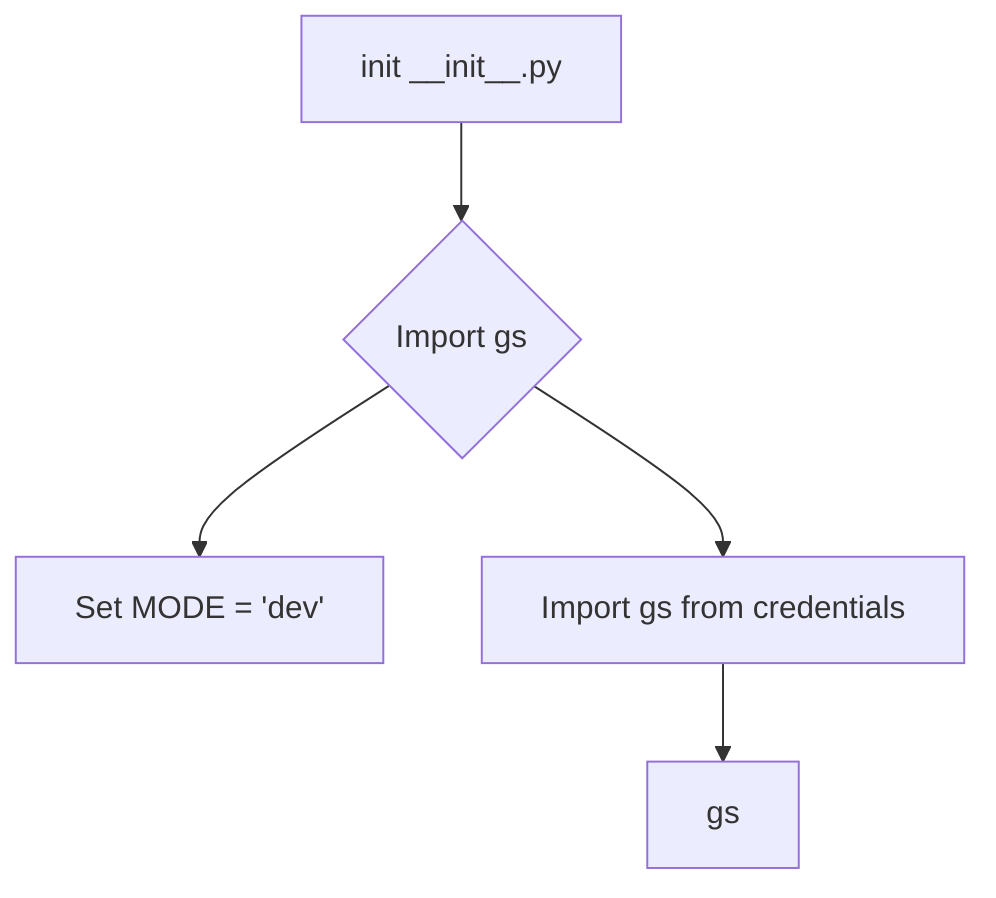

```MD
1. **<input code>**

```python
## \file hypotez/src/__init__.py
# -*- coding: utf-8 -*-
#! venv/Scripts/python.exe
#! venv/bin/python/python3.12

"""
.. module: src 
	:platform: Windows, Unix
	:synopsis:

Root of the project.
========================================================================================

This module provides a structured overview of various modules within the project,
detailing their primary functionalities and roles.

Usage Example
--------------------

.. code-block:: python

    # No usage example available for this module.
"""
MODE = 'dev'

from .credentials import gs
```

2. **<algorithm>**

Этот код представляет собой инициализационную часть модуля `src`.  Алгоритм работы состоит из:

1. **Импорт модуля `gs`:** Из подмодуля `credentials` импортируется переменная или объект `gs`.  Это предполагает, что `gs` определен в файле `hypotez/src/credentials.py`.

2. **Установка константы `MODE`:** В переменную `MODE` записывается строка 'dev'.  Это, вероятно, конфигурационная переменная, которая определяет режим работы проекта (например, `dev`, `prod`).

Данные не перемещаются между функциями в этом коде, так как здесь нет функций, вызывающих друг друга. Данные - это значение константы `MODE` и импортированная переменная `gs`.

3. **<mermaid>**



В данной диаграмме:
- `init __init__.py` - это выполнение модуля `__init__.py`
- `Import gs from credentials` - импортирует `gs` из модуля `credentials.py`.
- `gs` - это объект или переменная, определенная в `credentials.py`.
- `Set MODE = 'dev'` - присваивает значение переменной `MODE`.

4. **<explanation>**

* **Импорты:**
   - `from .credentials import gs`: Этот импорт подключает переменную (или объект) `gs` из модуля `credentials.py`, который находится в подпапке `src`.  Символ `.` перед именем `credentials` указывает, что нужно искать модуль `credentials` внутри текущего директории (в данном случае, в подпапке `src`).  Эта строка является центральным компонентом модуля `__init__.py` для доступа к функциональности из модуля `credentials`.

* **Классы:** В данном коде нет определений классов.

* **Функции:** Нет функций, которые определены в этом коде.

* **Переменные:**
    - `MODE`:  Строковая переменная, которая, скорее всего, используется для определения режима работы приложения (например, `dev` - для разработки, `prod` - для производства). Она объявлена в глобальной области видимости модуля `__init__.py`.
    - `gs`: Переменная, полученная из модуля `credentials`. Ее тип зависит от того, как `gs` определен в `credentials.py` (может быть словарь, список или объект класса).

* **Возможные ошибки или улучшения:**

    - **Отсутствие документации:** Несмотря на присутствие docstring, нет примеров использования. Добавьте примеры использования переменных и модуля, чтобы продемонстрировать, как он используется в других частях приложения.
    - **Неясно назначение `gs`:**  Непонятно, что представляет собой `gs`.  Это может быть переменная, содержащая информацию о подключении к Google Cloud Storage (GS), пути к файлу или какие-то другие конфигурационные данные.  Необходимо добавить пояснения в комментариях или docstring к `gs`.
    - **Возможные пути к `venv`:** `#! venv/Scripts/python.exe` и `#! venv/bin/python/python3.12` вызывают вопросы.  Вполне вероятно, эти строки являются лишними или неправильными.

**Цепочка взаимосвязей:**

Модуль `__init__.py` в директории `src` служит входом для других модулей в проекте `hypotez`, особенно `credentials.py`. При запуске скрипта, использующего `hypotez.src`, интерпретатор Python будет взаимодействовать с `credentials.py`, чтобы получить значение `gs`.