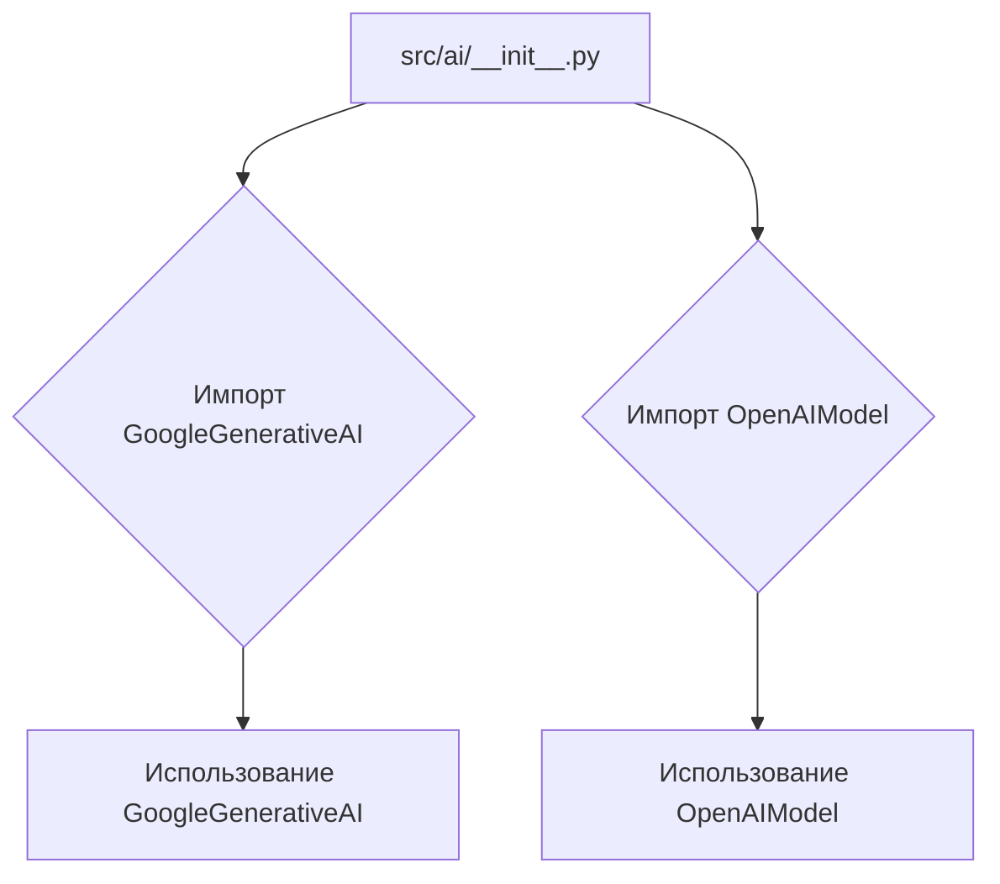
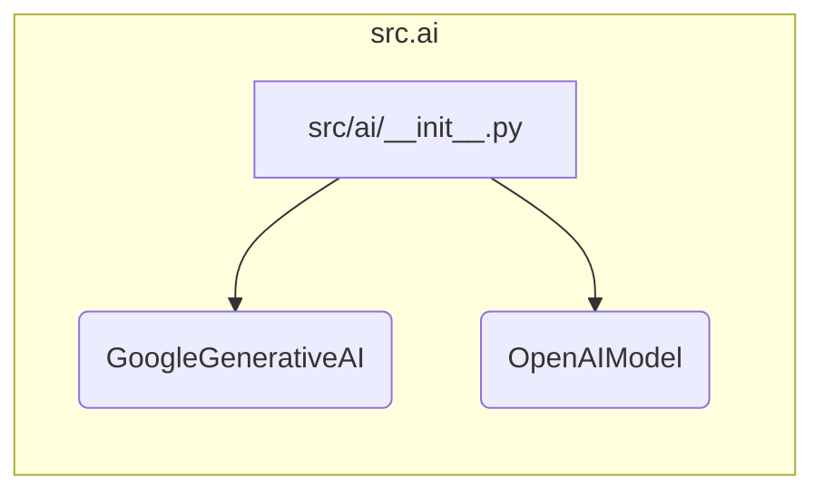

```MD
# Анализ файла src/ai/__init__.py

1. **<input code>**

```python
## \file /src/ai/__init__.py
# -*- coding: utf-8 -*-
#! venv/Scripts/python.exe
#! venv/bin/python/python3.12

"""
module: src.ai
	:platform: Windows, Unix
	:synopsis: Модуль интерфейса моделей ИИ.
	"""
MODE = 'dev'

from .gemini import GoogleGenerativeAI
from .openai import OpenAIModel
```

2. **<algorithm>**

Файл `src/ai/__init__.py` представляет собой инициализационный модуль для пакета `src.ai`. Он не содержит логики выполнения, а лишь импортирует классы из подмодулей `gemini` и `openai`.  

Блок-схема:



Пример использования:

```python
from src.ai import GoogleGenerativeAI, OpenAIModel

# Создание экземпляров моделей
gemini_model = GoogleGenerativeAI()
openai_model = OpenAIModel()

# Пример использования
# ... далее код, который использует gemini_model и openai_model ...
```


3. **<mermaid>**



Этот код не использует внешние зависимости, кроме тех, что импортированы в `src.ai`.


4. **<explanation>**

* **Импорты:**
    * `from .gemini import GoogleGenerativeAI`: Импортирует класс `GoogleGenerativeAI` из подмодуля `gemini` внутри пакета `src.ai`. Это указывает на то, что `gemini` вероятно содержит реализацию интерфейса для взаимодействия с моделью Gemini.
    * `from .openai import OpenAIModel`: Импортирует класс `OpenAIModel` из подмодуля `openai` внутри пакета `src.ai`. Аналогично, этот подмодуль вероятно реализует интерфейс для работы с моделью OpenAI.

* **Классы:**
    * `GoogleGenerativeAI` и `OpenAIModel`:  Представляют собой классы, которые, скорее всего, описывают взаимодействие с моделями Google Gemini и OpenAI соответственно.  Они, вероятно, содержат методы для запроса данных к моделям, обработки ответов и т.д.  Подробности реализации этих классов находятся в файлах `src/ai/gemini.py` и `src/ai/openai.py` соответственно.

* **Функции:**
    * Нет функций в этом файле. Он содержит только импорты классов.

* **Переменные:**
    * `MODE = 'dev'`:  Переменная, вероятно, задаёт режим работы приложения (например, `dev` для разработки, `prod` для производства).  Она может использоваться для настройки дополнительных параметров или включения/выключения определённого функционала.

* **Возможные ошибки или улучшения:**

    *  Не указан путь к интерпретатору Python. `#! venv/Scripts/python.exe` и `#! venv/bin/python/python3.12` - это магические строки, обычно используемые для указания интерпретатора Python в файле, но в данном контексте они не влияют на работу импорта, а скорее указывают на необходимость правильной настройки интерпретатора.


**Цепочка взаимосвязей:**

Файл `src/ai/__init__.py` является точкой входа в пакет `src.ai`.  Далее, для работы с моделями ИИ, необходимо обратиться к реализациям в модулях `gemini.py` и `openai.py` в том же каталоге.  Эти подмодули зависят от наличия библиотек, таких как `google-generative-ai` и `openai`.