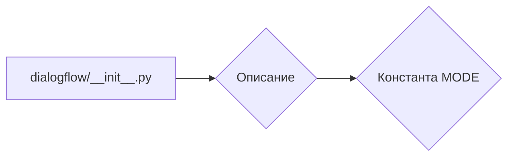

```MD
# Анализ кода hypotez/src/ai/dialogflow/__init__.py

## <input code>

```python
## \file hypotez/src/ai/dialogflow/__init__.py
# -*- coding: utf-8 -*-\
#! venv/Scripts/python.exe
#! venv/bin/python/python3.12

"""
.. module: src.ai.dialogflow 
	:platform: Windows, Unix
	:synopsis:

"""
MODE = 'dev'

"""
	:platform: Windows, Unix
	:synopsis:

"""


"""
	:platform: Windows, Unix
	:synopsis:

"""


"""
  :platform: Windows, Unix

"""
"""
  :platform: Windows, Unix
  :platform: Windows, Unix
  :synopsis:
"""MODE = 'dev'
  
""" module: src.ai.dialogflow """

""" HERE SHOULD BE A DESCRIPTION OF THE MODULE OPERATION ! 
https://habr.com/ru/articles/346606/
"""
```

## <algorithm>

Код представляет собой файл инициализации модуля `dialogflow` в пакете `ai`. Алгоритм работы, в данном случае, отсутствует.  Файл содержит только строковые комментарии и объявление константы `MODE` с неизвестным назначением.  Пошаговая блок-схема не применима.


## <mermaid>



## <explanation>

**Импорты**:  В коде отсутствуют импорты.

**Классы**: Нет объявления классов.

**Функции**: Нет объявления функций.

**Переменные**: Единственная переменная `MODE` имеет строковое значение `'dev'`. Вероятно, эта константа определяет режим работы модуля (например, 'dev' для разработки, 'prod' для производства), но для точного понимания необходима дополнительная информация о контексте проекта.


**Возможные ошибки или области для улучшений**:

* Отсутствие документации. Неясно, какое функциональное назначение имеет `MODE` и как она используется.
* Неясно, зачем присутствуют многочисленные пустые строковые комментарии.
* Не хватает описания того, как этот модуль взаимодействует с другими частями проекта `hypotez` (`src.ai.dialogflow` не содержит логики, предполагается, что она будет реализована в других файлах).  Необходимо проанализировать другие файлы пакета `ai` и, возможно, другие пакеты `hypotez`, чтобы понять, как используется `MODE` и какая функциональность будет реализована в последующем.


**Цепочка взаимосвязей с другими частями проекта**:

Невозможно установить цепочку взаимосвязей, так как этот файл не содержит явной логики.  Чтобы понять взаимодействие с другими частями проекта, необходим анализ остальных файлов в пакете `src.ai` и возможно других пакетов `hypotez`.  Возможно, этот модуль будет отвечать за инициализацию или настройку подключений к API Dialogflow, но для этого необходим более детальный код.