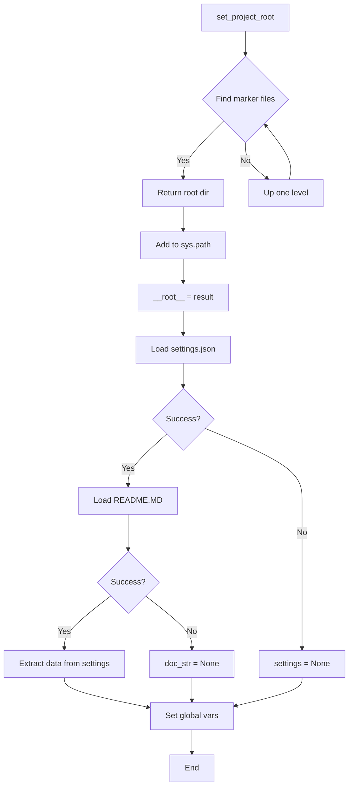

# <input code>

```python
## \file hypotez/src/ai/dialogflow/header.py
# -*- coding: utf-8 -*-\n#! venv/Scripts/python.exe
#! venv/bin/python/python3.12
"""
.. module: src.ai.dialogflow 
	:platform: Windows, Unix
	:synopsis:

"""
MODE = 'dev'

"""
	:platform: Windows, Unix
	:synopsis:

"""


"""
	:platform: Windows, Unix
	:synopsis: Модуль определяющий корневой путь к проекту. Все импорты строятся относительно этого пути.
    :TODO: В дальнейшем перенести в системную переменную

"""


import sys
import json
from packaging.version import Version
from pathlib import Path
def set_project_root(marker_files=('pyproject.toml', 'requirements.txt', '.git')) -> Path:
    """
    Finds the root directory of the project starting from the current file's directory,
    searching upwards and stopping at the first directory containing any of the marker files.

    Args:
        marker_files (tuple): Filenames or directory names to identify the project root.
    
    Returns:
        Path: Path to the root directory if found, otherwise the directory where the script is located.
    """
    __root__:Path
    current_path:Path = Path(__file__).resolve().parent
    __root__ = current_path
    for parent in [current_path] + list(current_path.parents):
        if any((parent / marker).exists() for marker in marker_files):
            __root__ = parent
            break
    if __root__ not in sys.path:
        sys.path.insert(0, str(__root__))
    return __root__


# Get the root directory of the project
__root__ = set_project_root()
"""__root__ (Path): Path to the root directory of the project"""

from src import gs

settings:dict = None
try:
    with open(gs.path.root / 'src' /  'settings.json', 'r') as settings_file:
        settings = json.load(settings_file)
except (FileNotFoundError, json.JSONDecodeError):
    ...

doc_str:str = None
try:
    with open(gs.path.root / 'src' /  'README.MD', 'r') as settings_file:
        doc_str = settings_file.read()
except (FileNotFoundError, json.JSONDecodeError):
    ...


__project_name__ = settings.get("project_name", 'hypotez') if settings  else 'hypotez'
__version__: str = settings.get("version", '')  if settings  else ''
__doc__: str = doc_str if doc_str else ''
__details__: str = ''
__author__: str = settings.get("author", '')  if settings  else ''
__copyright__: str = settings.get("copyrihgnt", '')  if settings  else ''
__cofee__: str = settings.get("cofee", "Treat the developer to a cup of coffee for boosting enthusiasm in development: https://boosty.to/hypo69")  if settings  else "Treat the developer to a cup of coffee for boosting enthusiasm in development: https://boosty.to/hypo69"
```

# <algorithm>

**Шаг 1:**  Функция `set_project_root` ищет корневой каталог проекта.
- Она принимает кортеж `marker_files` с именами файлов или каталогов, указывающих на корень проекта (например, `pyproject.toml`, `requirements.txt`, `.git`).
- Она начинает поиск от текущего каталога и поднимается по родительским каталогам.
- Для каждого родительского каталога она проверяет, существуют ли файлы или каталоги из списка `marker_files`.
- Как только найдена директория, содержащая какой-либо из файлов/каталогов, функция возвращает эту директорию.
- Если ни один из указанных маркеров не найден, возвращает текущий каталог.
- Если найденный корневой каталог отсутствует в пути поиска python, он добавляется в начало.

**Пример:** Если текущий файл находится в `/home/user/project/src/ai/dialogflow`, и корневой каталог `project` содержит `pyproject.toml`, функция вернет `/home/user/project`

**Шаг 2:** Функция `set_project_root` вызывается для получения корневого пути проекта.

**Шаг 3:** Переменная `__root__` присваивается полученный результат.

**Шаг 4:**  Код пытается загрузить данные из файла `src/settings.json` в переменную `settings`. Если файл не найден или содержимое невалидно, обработчик исключения `try...except` обрабатывает ситуацию.

**Шаг 5:** Аналогично, код пытается загрузить документацию из файла `src/README.MD` в переменную `doc_str`. Если файл не найден или содержимое невалидно, обработчик исключения `try...except` обрабатывает ситуацию.

**Шаг 6:** Из словаря `settings` (если он успешно загружен) извлекаются значения для переменных `__project_name__`, `__version__`, `__author__`, `__copyright__`, `__cofee__` или устанавливаются значения по умолчанию, если ключ не найден.

**Шаг 7:**  Переменные `__doc__`, `__details__` получают значения или пустые строки.

В результате, код получает информацию о проекте, например имя, версию, автора,  из файлов в корне проекта и возвращает данные в глобальную область видимости.

# <mermaid>


* **Зависимости:**
    * `sys`: предоставляет доступ к системным переменным, в том числе пути.
    * `json`: используется для работы с JSON-файлами.
    * `packaging.version`: используется для работы с версиями пакетов.
    * `pathlib`: используется для работы с путями к файлам.
    * `src.gs`: вероятно, модуль, определяющий общий доступ к корневому каталогу проекта.


# <explanation>

**Импорты:**

- `sys`: предоставляет доступ к системным переменным Python, в том числе `sys.path`, который используется для поиска модулей при импорте.
- `json`: используется для работы с файлами в формате JSON (например, для чтения настроек проекта).
- `packaging.version`: импортирует класс `Version`, вероятно, для работы с версиями пакетов или для проверки версий.
- `pathlib`: импортирует класс `Path`, который предоставляет объектно-ориентированный способ работы с файловыми путями, что улучшает читаемость и безопасность кода.
- `src.gs`: вероятно, собственный модуль проекта, содержащий полезные функции для работы с файловой системой.


**Классы:**

- Никаких явных классов нет.


**Функции:**

- `set_project_root(marker_files=...)`: Находит корневой каталог проекта.  На вход принимается кортеж `marker_files` с именами файлов/каталогов, которые должны присутствовать в корне проекта. Возвращает объект `Path` с путем к корню проекта.  Это важная функция, которая позволяет импортировать другие модули проекта. Важно, чтобы `marker_files` содержали файлы, которые гарантированно присутствуют в корне.  Примеры файлов - `pyproject.toml`, `requirements.txt`, `.git`. 

**Переменные:**

- `MODE`: Строковая переменная, хранящая значение 'dev'.
- `__root__`:  Переменная, хранящая путь к корневому каталогу проекта.  Инициализируется функцией `set_project_root()`.
- `settings`: Словарь, содержащий настройки проекта, загруженные из файла `settings.json`.
- `doc_str`: Строка, содержащая содержимое файла `README.MD`.
- `__project_name__`, `__version__`, `__doc__`, `__details__`, `__author__`, `__copyright__`, `__cofee__`: Глобальные переменные, содержащие данные о проекте.  Заполняются из `settings`, если доступны, иначе используют значения по умолчанию.


**Возможные ошибки и улучшения:**

- **Обработка ошибок:** Использование блоков `try...except` для обработки `FileNotFoundError` и `json.JSONDecodeError` - хорошее решение.  Возможно, стоит добавить более подробные сообщения об ошибках для отладки.
- **Переменная `__root__`:** Использование `__root__` в качестве переменной для корневого каталога может быть удобным для чтения кода, но лучше назвать ее более описательным именем, например `project_root`.
- **`gs.path.root`:** Непонятно, что делает этот модуль. Важно подробно документировать все части кода, с которыми сложно разобраться, особенно условные `gs` и `path`.
- **Возвращаемое значение `set_project_root`:** Функция `set_project_root` возвращает объект `Path`, который является типом Python и может быть использован во всем коде.  Но если путь не будет использован дальше, это может и не надо.


**Взаимосвязи с другими частями проекта:**

- Модуль `gs` явно связан с файлами проекта (`settings.json`, `README.MD`), и определяет способ доступа к этим файлам.


В целом, код организован хорошо для поиска корневого каталога и доступа к данным проекта.  Подробные комментарии и обработка ошибок делают код более надежным.