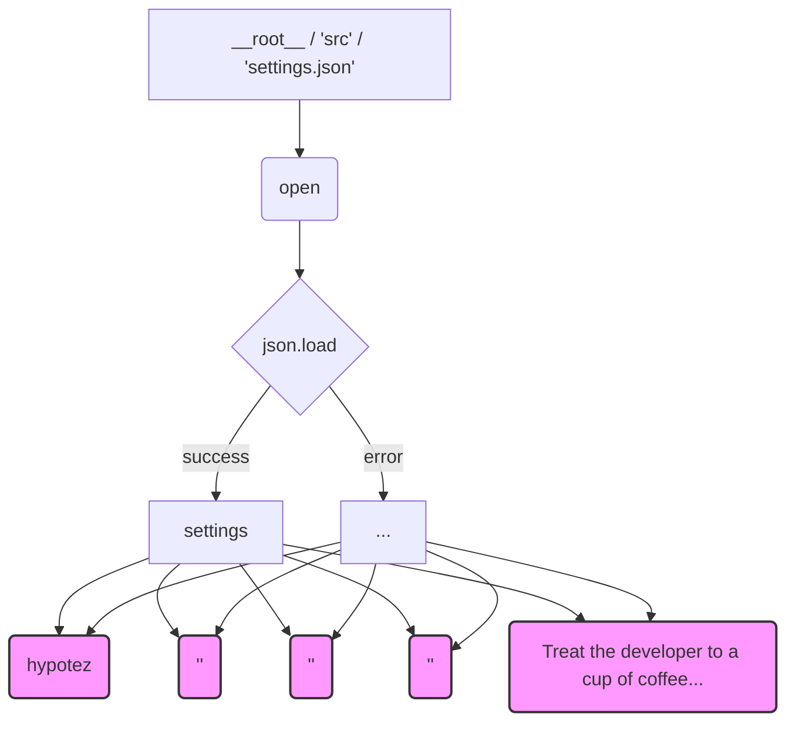

# <input code>

```python
## \file hypotez/src/ai/helicone/version.py
# -*- coding: utf-8 -*-
#! venv/Scripts/python.exe
#! venv/bin/python/python3.12

"""
.. module: src.ai.helicone 
	:platform: Windows, Unix
	:synopsis:

"""
MODE = 'dev'

"""
	:platform: Windows, Unix
	:synopsis:

"""


"""
	:platform: Windows, Unix
	:synopsis:

"""


"""
  :platform: Windows, Unix

"""
"""
  :platform: Windows, Unix
  :platform: Windows, Unix
  :synopsis:
"""MODE = 'dev'
  
""" module: src.ai.helicone """


import json

settings:dict = None

try:
    with open(__root__ / 'src' / 'settings.json', 'r') as settings_file:
        settings = json.load(settings_file)
except (FileNotFoundError, json.JSONDecodeError):
    ...

__project_name__ = settings.get("project_name", 'hypotez') if settings  else 'hypotez'
__version__: str = settings.get("version", '')  if settings  else ''
__doc__: str = ''
__details__: str = ''
__author__: str = settings.get("author", '')  if settings  else ''
__copyright__: str = settings.get("copyrihgnt", '')  if settings  else ''
__cofee__: str = settings.get("cofee", "Treat the developer to a cup of coffee for boosting enthusiasm in development: https://boosty.to/hypo69")  if settings  else "Treat the developer to a cup of coffee for boosting enthusiasm in development: https://boosty.to/hypo69"
```

# <algorithm>

1. **Инициализация:** Переменная `settings` инициализируется как `None`.

2. **Чтение настроек:**  Код пытается открыть файл `src/settings.json`.
   * **Успех:** Если файл найден и содержит корректный JSON, данные загружаются в переменную `settings`.
   * **Ошибка:** Если файл не найден или содержит некорректный JSON, обработчик исключений `try...except` пропускает эту часть кода, оставляя `settings` равным `None`.

3. **Получение метаданных:**  Если `settings` не пусто, из него извлекаются значения для переменных `__project_name__`, `__version__`, `__author__`, `__copyright__`, и `__cofee__`.  Если `settings` пусто, используются значения по умолчанию ('hypotez', '', '', '', ...).

4. **Возврат:** Код не возвращает никакого значения явно, но он устанавливает значения переменных, которые, предположительно, будут использоваться в других частях проекта для хранения метаданных о проекте.


# <mermaid>



**Объяснение диаграммы:**

Диаграмма показывает поток данных.  Файл `settings.json` открывается, его содержимое загружается в переменную `settings`. Если загрузка успешна, значения из `settings` используются для заполнения переменных проекта. В случае ошибки (например, файл не найден или некорректный JSON), значения по умолчанию подставляются в переменные проекта.

**Зависимости:**

Код зависит от модуля `json` для парсинга JSON-файла.


# <explanation>

* **Импорты:**
    `import json`:  Этот импорт необходим для работы с JSON-данными, позволяя загружать и парсить файл `settings.json`.  Связь с другими частями проекта:  `settings.json` вероятно содержит конфигурацию, используемую в других модулях проекта.

* **Классы:**  Нет определенных классов в данном коде, только переменные.

* **Функции:** Нет функций в данном фрагменте, только код для обработки данных.

* **Переменные:**
    `settings`: словарь (dict), хранит данные из `settings.json`, инициализируется `None`.  Важно, что этот словарь используется для получения переменных проекта.
    `__project_name__`, `__version__`, `__author__`, `__copyright__`, `__cofee__`:  строковые переменные, хранящие метаданные о проекте.  Они получены из `settings` или имеют значения по умолчанию.

* **Возможные ошибки/улучшения:**
    * **Обработка ошибок:**  Код обрабатывает `FileNotFoundError` и `json.JSONDecodeError`, но мог бы быть более подробным, например, выводить сообщение об ошибке или логгировать ее.
    * **Структура проекта:**  Использование `__root__` предполагает, что  код находится в структуре пакета.  Без контекста проекта неясно, как будет определена эта переменная и как этот файл интегрируется в более крупную систему.
    * **Типизация:** Использование типов `:dict` для переменной `settings` улучшает читаемость кода и может предупредить о возможных ошибках.
    * **Docstrings:** Документация кода `"""Docstrings..."""` в файле должна быть более информативной о назначении переменных `MODE`, `__project_name__`, `__version__` и т.д.

* **Цепочка взаимосвязей:** Файл `version.py` скорее всего, обеспечивает доступ к переменным, которые используются в других частях проекта (например, в скриптах командной строки или при сборке документации).  `settings.json` является источником конфигурационных данных, влияющих на поведение всего приложения.  Этот файл определяет поведение программы, включая версию, авторство, и другую информацию.