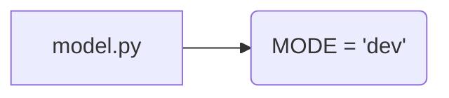

## <input code>

```python
## \file hypotez/src/ai/llama/model.py
# -*- coding: utf-8 -*-\
#! venv/Scripts/python.exe
#! venv/bin/python/python3.12

"""
.. module: src.ai.llama 
	:platform: Windows, Unix
	:synopsis:

"""
MODE = 'dev'

"""
	:platform: Windows, Unix
	:synopsis:

"""


"""
	:platform: Windows, Unix
	:synopsis:

"""


"""
  :platform: Windows, Unix

"""
"""
  :platform: Windows, Unix
  :platform: Windows, Unix
  :synopsis:
"""MODE = 'dev'
  
""" module: src.ai.llama """
```

## <algorithm>

Данный код представляет собой фрагмент Python-файла, вероятно, часть более крупного проекта. Алгоритм в нем отсутствует, так как это лишь пустой файл с комментариями и константой.  Нет функций, классов или логики обработки данных.  Поэтому пошаговая блок-схема не применима.


## <mermaid>



## <explanation>

Этот код представляет собой пустой файл с комментариями, который, скорее всего, является заготовкой или частью документации для Python модуля `hypotez/src/ai/llama`.

**Импорты**:  Нет импортов.

**Классы**: Нет классов.

**Функции**: Нет функций.

**Переменные**:  `MODE = 'dev'` — строковая константа, вероятно, используется для определения режима работы.


**Возможные ошибки или области для улучшений**:

*   **Отсутствие кода**: Файл не содержит никакой функциональной логики, только комментарии. Он не выполняет никакой работы, кроме хранения константы.
* **Непоследовательная документация**:  Комментарии в стиле Sphinx  (`.. module`) не используются для реальной документации, а скорее для генерации docstrings.


**Связь с другими частями проекта**:

Для определения взаимосвязей необходим контекст.  Без дополнительного кода, невозможно определить, какие другие части проекта используют этот модуль, или какие зависимости он сам имеет.

**Общее**:

Файл, скорее всего, должен содержать код, определяющий модель `llama` (вероятно, для обучения или использования модели больших языковых моделей). Сейчас он пуст и требует доработки.