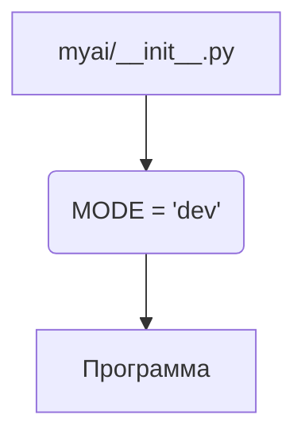

```MD
# <input code>

```python
## \file hypotez/src/ai/myai/__init__.py
# -*- coding: utf-8 -*-\
#! venv/Scripts/python.exe
#! venv/bin/python/python3.12

"""
.. module: src.ai.myai 
	:platform: Windows, Unix
	:synopsis:

"""
MODE = 'dev'
```

# <algorithm>

Этот код представляет собой инициализационный модуль `myai` в пакете `ai` проекта `hypotez`. Алгоритм работы в данном случае тривиален: он определяет константу `MODE` и присваивает ей строковое значение `'dev'`.  В данном случае, нет циклов, вызовов функций, или других сложных операций.


**Пошаговая блок-схема:**

1. **Определение константы:**  `MODE = 'dev'` - Присваивает значение `'dev'` переменной `MODE`.

**Примеры:**

- Никаких примеров выполнения нет, так как код просто устанавливает значение.


# <mermaid>



В данной блок-схеме `myai/__init__.py` - файл модуля, `MODE = 'dev'` - выполнение присваивания константе,  `Программа` -  обозначение продолжения выполнения кода, который использует  значение этой константы.

# <explanation>

**Импорты:**

В данном коде отсутствуют импорты. Это означает, что данный модуль не использует функциональность других модулей.

**Классы:**

Нет определенных классов.

**Функции:**

Нет определенных функций.

**Переменные:**

- `MODE`:  Строковая переменная, содержащая константу.  Тип данных - строка.  Используется, вероятно, для выбора режима работы (например, `dev` для разработки, `prod` для производства).  Значение `'dev'` задает режим разработки.


**Возможные ошибки или области для улучшений:**

- Отсутствие документации. Хотя в коде присутствует docstring, он слишком краток.
- Неясно, как это значение `MODE` используется в остальных частях проекта `hypotez`.  Для более глубокого анализа нужно посмотреть, как этот модуль вызывается из других частей проекта.


**Цепочка взаимосвязей с другими частями проекта:**

Данный модуль, скорее всего, инициализирует какие-то настройки, относящиеся к модулю `ai` проекта `hypotez`. Более глубокое понимание его роли будет доступно после изучения остальных частей проекта.  Например,  будут ли использоваться другие константы, или модуль, или классы, из других файлов проекта `hypotez`, `ai` или `myai`.