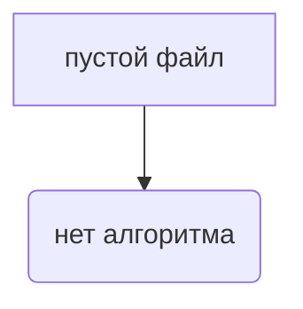

# <input code>

```python
## \file hypotez/src/ai/myai/traffic_light.py
# -*- coding: utf-8 -*-
#! venv/Scripts/python.exe
#! venv/bin/python/python3.12

"""
.. module: src.ai.myai 
	:platform: Windows, Unix
	:synopsis:

"""
MODE = 'dev'

"""
	:platform: Windows, Unix
	:synopsis:

"""


"""
	:platform: Windows, Unix
	:synopsis:

"""


"""
  :platform: Windows, Unix

"""
"""
  :platform: Windows, Unix
  :platform: Windows, Unix
  :synopsis:
"""MODE = 'dev'
  
""" module: src.ai.myai """


""" HERE SHOULD BE A DESCRIPTION OF THE MODULE OPERATION ! 
https://habr.com/ru/articles/849414/
"""
```

# <algorithm>

Этот код не содержит функциональности. Это просто пустой файл с комментариями.  Поскольку нет кода, описывающего алгоритм, блок-схема не может быть построена.

# <mermaid>



# <explanation>

Код представляет собой пустой файл `traffic_light.py` в структуре проекта `hypotez/src/ai/myai`. Он содержит только комментарии, которые описывают предполагаемую функциональность и контекст модуля, но без какого-либо программного кода.

**Импорты:** Отсутствуют импорты.

**Классы:** Нет определений классов.

**Функции:** Нет определений функций.

**Переменные:** Единственная переменная `MODE`, которая содержит строку 'dev', но без привязки к определенным задачам программы.

**Возможные ошибки/улучшения:**

* **Отсутствие функциональности:** Файл не содержит никакого исполняемого кода. Он не выполняет никаких операций или задач. Необходима реализация функциональности для управления светофором.
* **Недостаточная документация:** Хотя комментарии присутствуют, они не содержат конкретных деталей о том, как реализуется функциональность управления светофором.


**Цепочка взаимосвязей:**  Без кода невозможно определить взаимосвязи с другими частями проекта. При добавлении кода в этом файле, будет определено, как этот файл взаимодействует с другими.


**Вывод:** Файл `traffic_light.py` представляет собой пустой шаблон или заготовку для модуля, который должен управлять светофором.  Необходимо заполнить его функциональностью для реализации этой задачи.