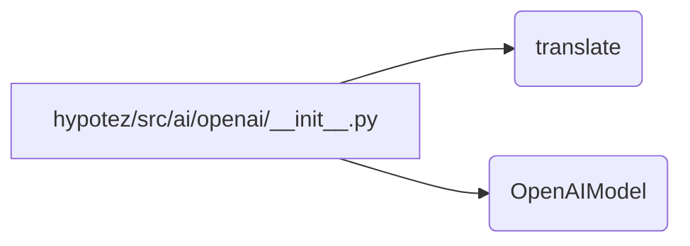

# <input code>

```python
## \file hypotez/src/ai/openai/__init__.py
# -*- coding: utf-8 -*-
#! venv/Scripts/python.exe
#! venv/bin/python/python3.12

"""
.. module: src.ai.openai 
	:platform: Windows, Unix
	:synopsis: Модуль модели `openai`

"""
MODE = 'dev'

from .translator import translate
from .model import OpenAIModel
```

# <algorithm>

Нет явного алгоритма в представленном коде.  Это файл-инициализатор, который импортирует функции и классы из подмодулей `translator` и `model`.  Код просто объявляет переменную `MODE` и импортирует необходимые элементы, подготавливая их для использования другими частями проекта.

Пример использования: в другом файле проекта можно будет импортировать `translate` и `OpenAIModel` из `hypotez/src/ai/openai`.


# <mermaid>



**Описание диаграммы:**

* **A:**  Файл `hypotez/src/ai/openai/__init__.py`.
* **B:** Функция `translate` из модуля `translator`.
* **C:** Класс `OpenAIModel` из модуля `model`.

Диаграмма показывает, что данный файл просто импортирует функции и классы из своих подмодулей (`translator` и `model`).  Связь с другими частями проекта осуществляется через эти импортированные элементы.  Никакой собственной логики или обработки данных в этом файле нет.


# <explanation>

**Импорты:**

* `from .translator import translate`: Импортирует функцию `translate` из подмодуля `translator`, находящегося в той же директории, что и `__init__.py`.  Это указывает на то, что модуль `translator` содержит функции для работы с переводом.
* `from .model import OpenAIModel`: Импортирует класс `OpenAIModel` из подмодуля `model`, находящегося в той же директории.  Это указывает на то, что модуль `model` содержит классы, представляющие модели, например, модель OpenAI.

**Переменные:**

* `MODE = 'dev'`:  Переменная, скорее всего, определяет режим работы (например, "dev" - для разработки, "prod" - для производства).  Она используется для настройки поведения приложения.

**Особенности кода:**

* **Структура пакета:** Код организован в виде модулей (`hypotez/src/ai/openai`), что позволяет организовать более сложные проекты и разделять функциональность. Использование импортов из подмодулей  `translator` и `model` указывает на модульную структуру.
* **Документация:** Код содержит документацию (в виде строки документации `"""..."""`) для функций и класса. Это важная практика, облегчающая понимание и использование кода.

**Цепочка взаимосвязей:**

Данный `__init__.py`-файл не содержит никакой собственной логики и выполняет роль точки входа в модуль `ai/openai`. Дальнейшее использование `translate` и `OpenAIModel` будет зависеть от того, как эти элементы реализованы в подмодулях.  Например, `translate` может взаимодействовать с внешними API или библиотеками для выполнения переводов, а `OpenAIModel` может обеспечивать доступ к API модели OpenAI. Таким образом, цепочка взаимосвязей будет вести к API OpenAI и другим библиотекам, с которыми взаимодействуют `translate` и `OpenAIModel`.


**Возможные ошибки/улучшения:**

*  Не указаны типы возвращаемых значений функций. В последующих версиях кода рекомендуется явно указывать типы возвращаемых данных (например, с помощью аннотаций).
*  Отсутствует обработка ошибок при взаимодействии с внешними ресурсами (API). В production-коде, следует предусмотреть `try...except` блоки, чтобы предотвратить падение программы из-за ошибок сети, отсутствия API-ключей и т.д.