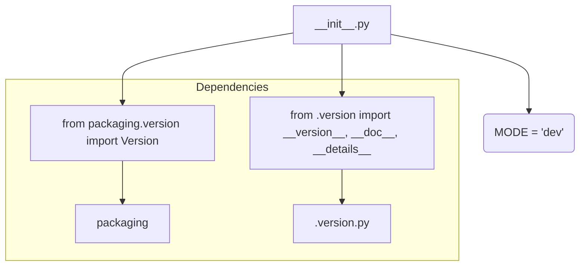

```MD
# Анализ кода hypotez/src/ai/openai/_examples/__init__.py

1. **<input code>**:

```python
## \file hypotez/src/ai/openai/_examples/__init__.py
# -*- coding: utf-8 -*-
#! venv/Scripts/python.exe
#! venv/bin/python/python3.12

"""
.. module: src.ai.openai._examples 
	:platform: Windows, Unix
	:synopsis:

"""
MODE = 'dev'

"""
	:platform: Windows, Unix
	:synopsis:

"""


"""
	:platform: Windows, Unix
	:synopsis:

"""


"""
  :platform: Windows, Unix

"""
"""
  :platform: Windows, Unix
  :platform: Windows, Unix
  :synopsis:
"""MODE = 'dev'
  
""" module: src.ai.openai._examples """


from packaging.version import Version
from .version import __version__, __doc__, __details__
```

2. **<algorithm>**:

Код представляет собой инициализацию модуля `_examples` в пакете `openai`.  Алгеритм не описывает вычисления или обработку данных. Это скорее описание настроек и импортов.  Нет циклов или рекурсии. Алгоритм состоит из:

* Определения переменной `MODE` со значением 'dev'.
* Импорта класса `Version` из библиотеки `packaging`.
* Импорта переменных `__version__`, `__doc__`, и `__details__` из файла `version.py` в текущем подпакете (`./version.py`).

Пример:
```
# Пример использования
print(MODE)  # Вывод: dev
```


3. **<mermaid>**:



4. **<explanation>**:

* **Импорты**:
    * `from packaging.version import Version`: Импортирует класс `Version` из пакета `packaging`. Этот пакет используется для работы с версиями программного обеспечения.  Связь с `src`: Импорт из внешнего пакета, не связанного напрямую с `src` деревом проекта.
    * `from .version import __version__, __doc__, __details__`: Импортирует переменные `__version__`, `__doc__`, и `__details__` из файла `version.py` в подпакете `_examples`.  Связь с `src`: Подключает информацию о версии и документации из другого файла внутри текущего модуля.

* **Классы**: Нет определений классов в этом файле.

* **Функции**: Нет определений функций в этом файле.

* **Переменные**:
    * `MODE`: Строковая переменная, скорее всего, используется для определения режима работы (например, `dev`, `prod`).  Используется в других частях проекта.


* **Возможные ошибки или области для улучшений**:

    * Не хватает более информативных комментариев для переменной `MODE` (например, какой смысл имеет значение `dev`).
    * Нет практического использования импорта `Version` в текущем файле, импорт не нужен для текущей функциональности.

* **Цепочка взаимосвязей с другими частями проекта**:

    Файл `__init__.py` служит точкой входа в подпакет `_examples` и устанавливает импорты для доступа к функциям и классам, определенным в других файлах подпакета.  По всей видимости, файл `version.py` содержит информацию о версии и документации. Это типичная организация Python-проектов.  Связь с остальной частью проекта (`src`) не ясна из предоставленного кода.  Необходимо видеть контекст, чтобы понять назначение и роль этого файла внутри проекта.