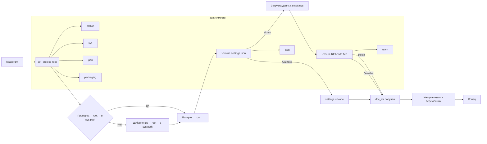

# <input code>

```python
## \file hypotez/src/logger/header.py
# -*- coding: utf-8 -*-\
#! venv/Scripts/python.exe
#! venv/bin/python/python3.12

"""
module: src.logger 
	:platform: Windows, Unix
	:synopsis: Модуль определяющий корневой путь к проекту. Все импорты строятся относительно этого пути.
    :TODO: В дальнейшем перенести в системную переменную"""
MODE = 'dev'

import sys
import json
from packaging.version import Version

from pathlib import Path
def set_project_root(marker_files=('pyproject.toml', 'requirements.txt', '.git')) -> Path:
    """
    Finds the root directory of the project starting from the current file's directory,
    searching upwards and stopping at the first directory containing any of the marker files.

    Args:
        marker_files (tuple): Filenames or directory names to identify the project root.
    
    Returns:
        Path: Path to the root directory if found, otherwise the directory where the script is located.
    """
    __root__:Path
    current_path:Path = Path(__file__).resolve().parent
    __root__ = current_path
    for parent in [current_path] + list(current_path.parents):
        if any((parent / marker).exists() for marker in marker_files):
            __root__ = parent
            break
    if __root__ not in sys.path:
        sys.path.insert(0, str(__root__))
    return __root__


# Get the root directory of the project
__root__ = set_project_root()
"""__root__ (Path): Path to the root directory of the project"""

from src import gs

settings:dict = None
try:
    with open(gs.path.root / 'src' /  'settings.json', 'r') as settings_file:
        settings = json.load(settings_file)
except (FileNotFoundError, json.JSONDecodeError):
    ...

doc_str:str = None
try:
    with open(gs.path.root / 'src' /  'README.MD', 'r') as settings_file:
        doc_str = settings_file.read()
except (FileNotFoundError, json.JSONDecodeError):
    ...


__project_name__ = settings.get("project_name", 'hypotez') if settings  else 'hypotez'
__version__: str = settings.get("version", '')  if settings  else ''
__doc__: str = doc_str if doc_str else ''
__details__: str = ''
__author__: str = settings.get("author", '')  if settings else ''
__copyright__: str = settings.get("copyrihgnt", '')  if settings else ''
__cofee__: str = settings.get("cofee", "Treat the developer to a cup of coffee for boosting enthusiasm in development: https://boosty.to/hypo69")  if settings else "Treat the developer to a cup of coffee for boosting enthusiasm in development: https://boosty.to/hypo69"
```

# <algorithm>

**Алгоритм работы:**

1. **`set_project_root`:**
   - Принимает кортеж `marker_files`, содержащий имена файлов для поиска корня проекта.
   - Начинает поиск с текущей директории (`__file__`).
   - Итеративно проверяет родительские директории.
   - Если находится директория, содержащая любой из файлов в `marker_files`, то она становится корнем проекта (`__root__`).
   - Если корень проекта не найден в пути `sys.path`, то добавляет его в начало `sys.path`.
   - Возвращает путь к корню проекта (`__root__`).

   **Пример:**
   Если `__file__` находится в `/home/user/project/src/logger/header.py`, и `pyproject.toml` находится в `/home/user/project`, то `__root__` будет `/home/user/project`.


2. **Получение настроек (`settings`):**
   - Используется путь, полученный в `set_project_root`, чтобы найти файл `settings.json` в директории `src`.
   - Если файл найден, то загружает данные из него в переменную `settings` с помощью `json.load`.
   - Если файл не найден или возникла ошибка `json.JSONDecodeError`, то `settings` остается `None`.

3. **Получение документации (`doc_str`):**
    - Аналогично предыдущему пункту, ищет файл `README.MD` и читает его содержимое в `doc_str`.
    - Обрабатывает возможные ошибки (`FileNotFoundError` или `json.JSONDecodeError`).

4. **Инициализация переменных:**
   - `__project_name__`, `__version__`, `__doc__`, `__details__`, `__author__`, `__copyright__`, `__cofee__` получают значения из `settings` или задают значения по умолчанию.

**Пошаговая блок-схема (неполная, из-за объема):**

```mermaid
graph TD
    A[Начало] --> B{Получить __file__};
    B --> C[set_project_root(__file__, marker_files)];
    C --> D{__root__ в sys.path?};
    D -- Да --> E[Возврат __root__];
    D -- Нет --> F[Добавить __root__ в sys.path];
    F --> E;
    E --> G[Загрузка settings.json];
    G -- Успех --> H[Загрузка README.MD];
    G -- Ошибка --> I[settings = None];
    H -- Успех --> J[Инициализация переменных];
    H -- Ошибка --> J;
    I --> J;
    J --> K[Конец];
```

# <mermaid>




# <explanation>

**Импорты:**

- `sys`: Модуль для доступа к системным переменным Python, в том числе `sys.path`, что позволяет импортировать модули из различных директорий.
- `json`: Модуль для работы с JSON-форматом.
- `packaging.version`: Модуль для работы с версиями пакетов.
- `pathlib`: Модуль для работы с путями к файлам и каталогам.  Он значительно улучшает работу с файловой системой по сравнению с `os.path`.
- `src.gs`: Вероятно, внутренний модуль проекта (или класс), предоставляющий функции для работы с корневым каталогом проекта.  Его точная функциональность не ясна без доступа к `gs.py`.

**Классы:**

- Нет явных определений классов.

**Функции:**

- `set_project_root(marker_files=...)`: Функция находит корень проекта, начиная с текущего файла, проходя вверх по дереву директорий, и останавливаясь на первой директории, содержащей файлы-маркеры (`marker_files`).  Это позволяет найти корень проекта независимо от того, где находится данный файл.

**Переменные:**

- `MODE`: Строковая константа, вероятно, для обозначения режима работы программы.
- `__root__`: Путь к корневому каталогу проекта, который используется в последующих операциях.
- `settings`: Словарь, содержащий данные из файла `settings.json`.
- `doc_str`: Строка, содержащая содержимое файла `README.MD`.
- `__project_name__`, `__version__`, `__doc__`, `__details__`, `__author__`, `__copyright__`, `__cofee__`: Переменные, содержащие информацию о проекте, полученные из файла настроек.

**Возможные ошибки и улучшения:**

- **Обработка исключений:** Блоки `try...except` неплохо обрабатывают возможные ошибки, но можно добавить более информативные сообщения об ошибках.
- **Документация:**  Функции, классы и переменные должны быть снабжены более подробными комментариями, особенно `gs`.
- **Зависимость от `gs`:** Код слишком сильно зависит от внутреннего модуля `gs`. Нужно стараться декомпозировать логику, сделать её менее зависимой.
- **Временная сложность:** Поиск корня проекта может быть медленным, если у приложения большая структура файлов.

**Взаимосвязи с другими частями проекта:**

- Функция `set_project_root` играет ключевую роль в построении корректных путей к файлам настроек и документации.
- Переменные `settings` и `doc_str` используются для получения информации о проекте, которая может быть использована другими модулями.
- Зависимость от `gs` указывает на то, что этот файл является частью проекта и имеет общие данные с другими модулями.  Для детального понимания нужно посмотреть код `src.gs`.


В целом, код структурирован и достаточно понятен, но требует дополнительных комментариев и улучшений в обработке ошибок для повышения надежности и удобства использования.