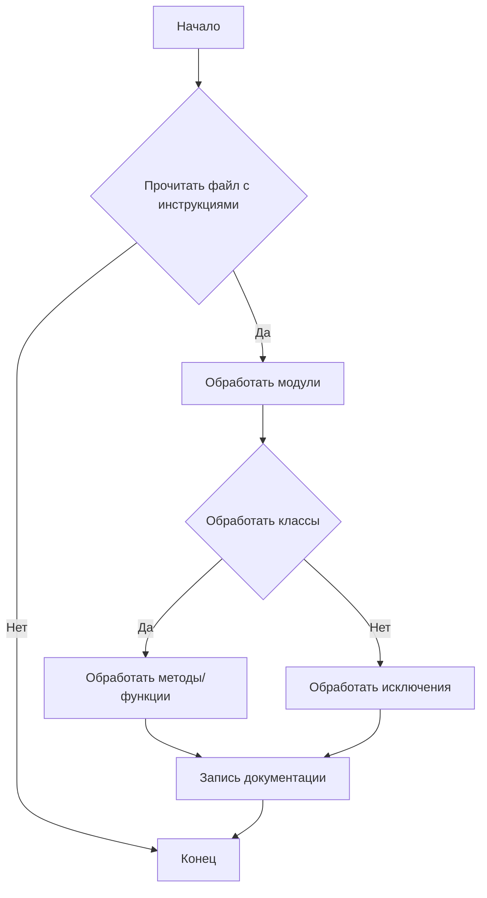
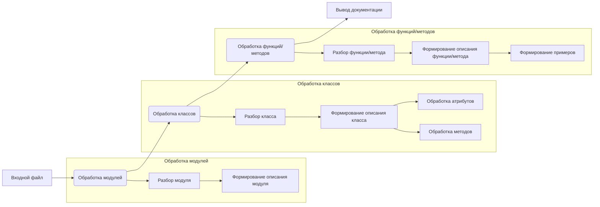

# <algorithm>

**Блок-схема алгоритма документации кода:**

**Описание логических блоков:**

* **Прочитать файл с инструкциями (B):**  Проверяется существование файла, содержащего инструкции по документированию. При успешном чтении инструкции обрабатываются. В противном случае выполняется выход из алгоритма.
* **Обработать модули (C):**  Инструкции разбираются по модулям и ищутся соответствующие им блоки кода.
* **Обработать классы (E):** Инструкции разбираются по классам и ищутся соответствующие им блоки кода.
* **Обработать методы/функции (F):** Инструкции разбираются по методам/функциям и ищутся соответствующие им блоки кода.
* **Обработать исключения (C1):** Обрабатываются инструкции по работе с исключениями.
* **Запись документации (G):**  Создается файл документации в формате Markdown, содержащий обработанные инструкции.
* **Конец (D):**  Завершение алгоритма.

**Примеры данных, передаваемых между функциями:**

* При чтении файла с инструкциями: данные из файла.
* При обработке модуля: имя модуля, инструкции для этого модуля, блок кода, соответствующий этому модулю.
* При обработке класса: имя класса, атрибуты, методы, инструкции для этого класса, блок кода, соответствующий этому классу.
* При обработке метода/функции: имя метода/функции, параметры, возвращаемые значения, инструкции для этого метода/функции, блок кода, соответствующий этому методу/функции.

# <mermaid>

# <explanation>

**1. Импорты:**

В данном коде нет импортов, т.к. это *инструкция* по документированию кода, а не сам код.  Файл описывает структуру документации.

**2. Классы:**

Документирование кода описывает структуру класса `CodeAssistant` (как пример), содержащего атрибуты (`role`, `lang`, `model`) и методы (`process_files`).  Описание не содержит реализации этих элементов, а только *как* их нужно документировать.

**3. Функции:**

Аналогично, файл описывает структуру документации для функций. Например, функция `process_files` (в примере) описывается с указанием параметров (`files`, `options`), возвращаемого значения (результат обработки), и примера использования.

**4. Переменные:**

Документирование кода описывает использование переменных (как параметров функций и методов), но не определяет их типы или значения, поскольку это детали реализации, которые должны быть описаны в самом коде.

**5. Возможные ошибки/улучшения:**

* Инструкция предполагает использование Markdown для документирования. Необходима проверка корректности форматирования Markdown в файлах с инструкциями.
* Инструкция не описывает, как происходит взаимодействие между инструментами обработки файла (программа/API), где находятся входные файлы и куда сохраняется результат.

**Цепочка взаимосвязей с другими частями проекта:**

Документация `doc_writer_html_ru.md` является частью процесса документирования проекта.  Она не имеет direct зависимостей от других файлов в коде. Взаимодействие будет происходить во время выполнения кода, когда код для обработки кода будет использовать эту инструкцию для создания документации.