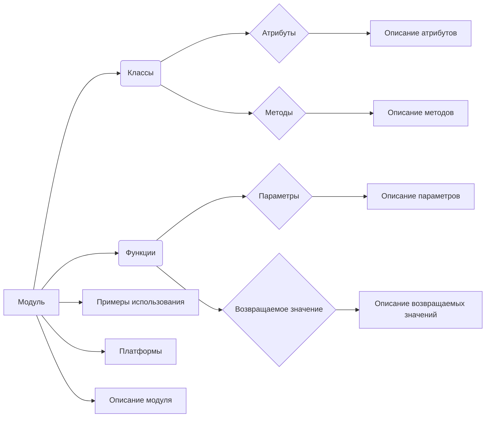
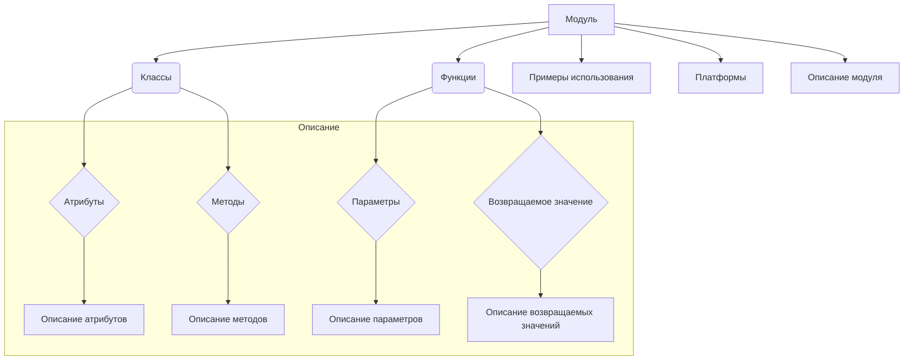

# Документация модуля разработчика для проекта `hypotez`

Этот модуль содержит инструкции по написанию документации для кода проекта `hypotez` в формате RST.  Он предназначен для создания подробных и структурированных документов, объясняющих функциональность кода, атрибуты, методы и взаимосвязи с другими частями проекта.

## Пример использования

Следуйте инструкциям в этом модуле для написания документации к вашему коду.  Все комментарии должны быть понятными, информативными и соответствовать стандарту RST.


```


```markdown
## <algorithm>

**Шаг 1:** Определение модуля/класса/функции.
**Шаг 2:** Написание описания.
**Шаг 3:**  Описание атрибутов/параметров.
**Шаг 4:** Описание методов/функций с параметрами, возвращаемыми значениями и примерами.
**Шаг 5:**  Создание примеров использования.
**Шаг 6:**  Описание исключений.
**Шаг 7:**  Включение комментариев в код.
**Шаг 8:** Проверка на соответствие формату RST.

**Примеры:**

* **Модуль:** Модуль `my_module` отвечает за обработку данных.  Примеры:
```python
# my_module.py
def process_data(data):
    """Обрабатывает данные."""
    # ...
    return processed_data
```

* **Класс:** Класс `DataProcessor` обрабатывает файлы.  Пример:
```python
# data_processor.py
class DataProcessor:
    def __init__(self, file_path):
        self.file_path = file_path
    def process(self):
        # ...
        return processed_data
```

* **Функция:** Функция `calculate_average` вычисляет среднее арифметическое. Пример:
```python
def calculate_average(numbers):
    """Вычисляет среднее арифметическое чисел."""
    if not numbers:
        return 0  # Возвращает 0 для пустого списка
    return sum(numbers) / len(numbers)
```

## <mermaid>



## <explanation>

**Импорты:**  В данном случае нет импортируемого кода.  Инструкция фокусируется на формате документации, а не на конкретном коде.

**Классы, функции, переменные:**  Инструкция описывает *как* писать документацию, а не какой код написать.  Она предоставляет шаблон для документирования классов, функций, методов и модулей.

**Возможные ошибки и улучшения:**  Инструкция не содержит кода для анализа ошибок, поэтому нет точных рекомендаций по улучшениям. Ошибки в коде обнаруживаются и исправляются на этапе анализа и проверки качества кода, а не в ходе документирования.

**Цепочка взаимосвязей:**  Инструкция направлена на построение связей между частями документации, а не кода.  Взаимосвязь предполагается в соответствии с логикой описания модулей, классов и функций для создания цельного руководства по проекту `hypotez`.