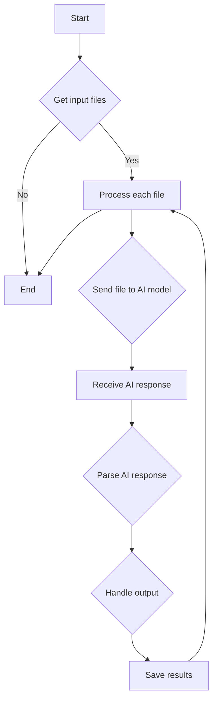

# <algorithm>



**Описание алгоритма:**

1. **Получение входных файлов:** Программа получает список файлов, которые нужно обработать.
2. **Обработка каждого файла:** Для каждого файла выполняется следующая последовательность действий:
    * **Отправка файла модели AI:** Файл передается выбранной модели AI (например, Google Gemini или OpenAI).
    * **Получение ответа модели AI:** Программа ожидает ответа модели.
    * **Парсинг ответа:** Полученный ответ анализируется для извлечения необходимой информации.
    * **Обработка результата:** Результаты обработки применяются к данным файла.
    * **Сохранение результатов:** Измененный или полученный результат сохраняется.
3. **Конец:** Процесс завершается после обработки всех файлов.

**Примеры:**

* **Входные данные:** `['file1.py', 'file2.js']`
* **Обработка файла `file1.py`:** Модель AI анализирует `file1.py`, предоставляет комментарии, и результат сохраняется в файле `file1_result.txt`
* **Обработка файла `file2.js`:** Модель AI анализирует `file2.js` аналогичным способом.

**Передача данных:** Данные передаются между этапами в виде файлов, запросов к модели AI и ответов.  Последовательность операций - пошаговая и упорядоченная.


# <mermaid>

```mermaid
graph LR
    A[CodeAssistant] --> B(process_files);
    B --> C{Get Files};
    C --> D[Send to AI];
    D --> E(Receive Response);
    E --> F[Parse Response];
    F --> G[Handle Output];
    G --> H[Save Results];
    H --> B;
    subgraph AI Model
        D --> |Gemini/OpenAI|
        E <-- |Gemini/OpenAI|
    end
```

**Объяснение диаграммы:**

Диаграмма показывает взаимодействие `CodeAssistant` с функцией `process_files`.  `CodeAssistant`  получает файлы, отправляет их в модель AI (Gemini/OpenAI), получает ответ, анализирует его, обрабатывает результаты и сохраняет их.  Цикл продолжается до обработки всех файлов. Зависимости от моделей AI (Gemini/OpenAI)  подразумеваются, но не детализируются.

# <explanation>

**1. Импорты:**

Код не содержит импортов.  Предполагается, что необходимые библиотеки для работы с моделями AI (например, для API Gemini или OpenAI) будут импортированы в соответствующих модулях или файлах.

**2. Классы:**

* **`CodeAssistant`:** Класс, отвечающий за обработку файлов с помощью моделей AI.  Предполагается наличие методов для инициализации (с указанием role, языка, моделей), обработки файлов (`process_files`), и взаимодействия с API.

**3. Функции:**

* **`process_files`:** Метод класса `CodeAssistant`. Он принимает список файлов (`files`) и опции (`options`) для обработки.  Он должен возвращать результат обработки в виде списка или других структур данных.  Подробная функциональность (в том числе обработка ошибок) не показана, но предполагается.

**4. Переменные:**

* `role`, `lang`, `model`: Атрибуты класса `CodeAssistant`, определяющие настройки обработки.
* `files`: Список входных файлов для обработки.
* `options`: Параметры для настройки обработки файлов.
* `result`: Переменная, хранящая результат обработки.


**Возможные ошибки и улучшения:**

* **Детализация обработки ошибок:** Необходимо детально описать обработку ошибок (например, если файл не найден, если ответ модели пустой или некорректный).
* **Вариативность моделей:** Код должен уметь работать с различными моделями AI, а не только с одной (Gemini).
* **Автоматическое обнаружение файлов:** Вместо жесткого списка файлов (`files`), может быть полезно автоматическое обнаружение файлов в директории или из других источников.
* **Передача данных:** Необходимо указать, как данные передаются между `process_files` и моделями AI.
* **Формат результата:** Нужно определить, в каком формате возвращается результат.

**Цепочка взаимосвязей:**

Предполагается, что `CodeAssistant` использует API моделей AI (например, Gemini или OpenAI) для обработки файлов.  Таким образом,  `CodeAssistant` зависит от этих API.

**Общая оценка:**

Представленный текст является шаблоном для документации кода, а не самим кодом. Он описывает структуру и примеры документации, но не реализованный функционал. Необходима реализация кода `CodeAssistant` и связанных функций/методов для полного анализа.