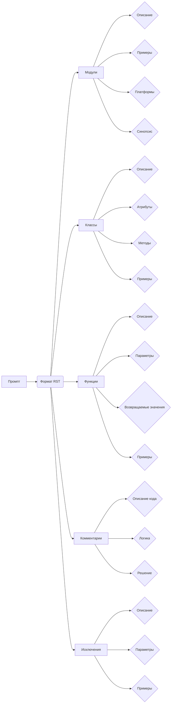

# <input code>

```
"prompt": "Ты должен оформлять документацию по коду в следующем стиле. Все комментарии к коду, включая описание модуля, классов и функций, должны быть написаны в формате reStructuredText (RST). Для каждого модуля, класса и функции следуй следующему шаблону:\n\n1. **Модуль**:\n    - Описание модуля должно быть оформлено в заголовке, с указанием его назначения.\n    - Укажи примеры использования модуля, если это возможно. Пример кода должен быть оформлен в блоке `.. code-block:: python`.\n    - Укажи платформы и синопсис модуля.\n    - Для описания функций и методов модуля используй заголовки для атрибутов и методов, если это необходимо.\n\nПример оформления для модуля:\n```\nМодуль для работы ассистента программиста\n=========================================================================================\n\nЭтот модуль содержит класс :class:`CodeAssistant`, который используется для работы с различными моделями ИИ, \nтакими как Google Gemini и OpenAI, для выполнения задач по обработке кода.\n\nПример использования\n--------------------\n\nПример использования класса `CodeAssistant`:\n\n.. code-block:: python\n\n    assistant = CodeAssistant(role=\'code_checker\', lang=\'ru\', model=[\'gemini\'])\n    assistant.process_files()\n```\n\n2. **Классы**:\n    - Каждый класс должен быть оформлен в соответствии с его назначением. Указывай описание класса, его атрибуты и методы.\n    - В разделе классов укажи все методы и их назначение, а также примеры использования.\n    - Для каждого метода используйте описание его параметров и возвращаемых значений, а также примеры использования.\n\nПример оформления для класса:\n```\nКласс для работы с ассистентом программиста\n=========================================================================================\n\nКласс :class:`CodeAssistant` используется для взаимодействия с различными моделями ИИ, такими как Google Gemini, \nи предоставляет методы для анализа и создания документации для кода.\n\nАтрибуты:\n----------\n- `role`: Роль ассистента (например, \'code_checker\').\n- `lang`: Язык, на котором будет работать ассистент (например, \'ru\').\n- `model`: Список используемых моделей ИИ (например, [\'gemini\']).\n\nМетоды:\n--------\n- `process_files`: Метод для обработки файлов с кодом.\n\nПример использования:\n---------------------\n\n.. code-block:: python\n\n    assistant = CodeAssistant(role=\'code_checker\', lang=\'ru\', model=[\'gemini\'])\n    assistant.process_files()\n```\n...\n(и так далее для функций и исключений)"
```

# <algorithm>

Эта часть кода описывает формат документации, а не алгоритм обработки.  Поскольку это промпт, а не код, алгоритм  отсутствует.  Промпт определяет структуру, которую должно соблюдать приложение для написания документации.

# <mermaid>



**Объяснение диаграммы:**

Промпт (A) определяет формат документации в формате RST (B), который распространяется на различные части документации: модули (C), классы (D), функции (E), комментарии (F) и исключения (G).  Каждая из этих ветвей дополнительно имеет свои подэлементы (например, модули включают описание, примеры, платформы и синопсис).


# <explanation>

Этот код не представляет собой исполняемый код, это текстовый промпт, описывающий **формат** документации, который должен быть использован для генерации документации в формате reStructuredText (RST).

**Функциональность:**

Промпт описывает структуру и шаблоны для создания документации к коду Python на основе RST.  Он предоставляет:

* **Шаблоны для модулей:** Описание модуля, примеры использования, платформы и синопсис.
* **Шаблоны для классов:** Описание класса, атрибуты, методы, примеры использования.
* **Шаблоны для функций/методов:** Описание, параметры, возвращаемые значения, примеры использования.
* **Шаблоны для комментариев:** Объяснения логики, решений, временных решений.
* **Шаблоны для исключений:** Описание исключений, условия возникновения, параметры.

**Связь с другими частями проекта:**

Этот промпт — **инструкция** для системы, которая будет генерировать документацию к коду.  Он никак не связан с каким-либо конкретным кодом или проектом.  Он указывает на формат, который должна использовать система для генерации документации.


**Возможные ошибки/улучшения:**

* Промпт слишком велик и должен быть, по возможности, разбив на несколько меньших частей для улучшения понимания.
* Пример использования мог быть более лаконичным, чтобы не перегружать промпт.
* В промтте не хватает описания, как именно система должна интерпретировать этот формат и использовать в процессе работы.

В итоге, промпт задает четкий формат документации, не реализует какую-либо функциональность.