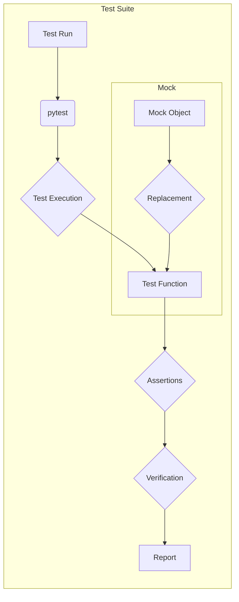

# Анализ кода pytest_en.md

```markdown
**1. <input code>**

```python
# Task: You are a QA engineer. Your task is to write tests for Python modules that handle various operations using the pytest library.

# ... (The rest of the Markdown text describing the testing approach, examples, and explanations)
```

**2. <algorithm>**

```mermaid
graph TD
    A[Analyze Functionality] --> B{Identify Inputs, Outputs, Errors};
    B --> C[Prepare Test Cases];
    C --> D{Validate with Data Types};
    D --> E{Edge Cases (Empty, Non-existent, Invalid)};
    E --> F[Error Handling];
    F --> G{Simulate Exceptions};
    G --> H{Verify Exception Handling & Logging};
    C --> I[Test Isolation];
    I --> J{Use Mocking};
    J --> K{Ensure Independence};
    C --> L[Test Structure];
    L --> M{Clear & Descriptive Names};
    L --> N{Readability & Structure};
    L --> O{Use Fixtures};
    C --> P[Example Test];
    P --> Q{Basic Check};
    P --> R{Error Handling};
    O --> Q;
    O --> R;
```

**Пример:**  Анализ функции сохранения данных в файл.  Шаг 1: Анализ функции `save_data_to_file`.  Шаг 2: Подготовка тестов для разных сценариев (правильное сохранение, пустой ввод, исключение при записи в файл).  Шаг 3: Тестирование обработки исключений.  Шаг 4: Изоляция теста с помощью подмены реальных файлов на моки.  Шаг 5: Проверка корректности возвращаемого значения.

**3. <mermaid>**



**4. <explanation>**

* **Импорты**:  
    * `pytest`: Основная библиотека для тестирования Python-кода.
    * `unittest.mock`: Модуль для создания Mock-объектов, имитирующих реальные объекты, но не взаимодействующих с реальной средой.
        * `patch`: Декоратор для подмены функций или атрибутов.
        * `mock_open`: Создает Mock для объекта `open()`.
        * `mock_mkdir`: Создает Mock для объекта `mkdir()`
    * `module_name`:  Предполагается, что это имя модуля, который тестируется.


* **Классы**:  Код не содержит классов.


* **Функции**:  
    * `test_save_data_to_file`: Функция для тестирования функции `save_data_to_file` из модуля `module_name`.
        * Аргументы:  `data` (данные для сохранения), `file_path` (путь к файлу).
        * Возвращаемое значение: `True` при успешном сохранении, `False` при ошибке.
        * Цель:  Проверка корректного сохранения данных, обработки исключений, использования mocks.


* **Переменные**:
    * `file_path`:  Строка, содержащая путь к файлу.
    * `data`:  Строка, содержащая данные для сохранения.


* **Возможные ошибки или улучшения**:
    * Отсутствие детализации тестирования: Примеры тестов слишком общие и не охватывают все граничные случаи.
    * Не указан путь к модулю `module_name`. Требуется дополнение кодом или комментариями, где находиться модуль `module_name`.
    * Отсутствует описание `save_data_to_file`.


* **Взаимосвязи с другими частями проекта**:
    * Тесты взаимодействуют с модулем `module_name`. Необходимо описание этого модуля, чтобы полностью оценить функциональность.


**Заключение:**  Код предоставляет примеры тестирования с использованием `pytest` и `mock`.  Однако, для более полного анализа необходимо предоставить код модуля `module_name`.  Тесты можно улучшить, добавив больше тестов с различными сценариями, включая проверку типа данных входных данных, обработку различных исключений, и граничные случаи.