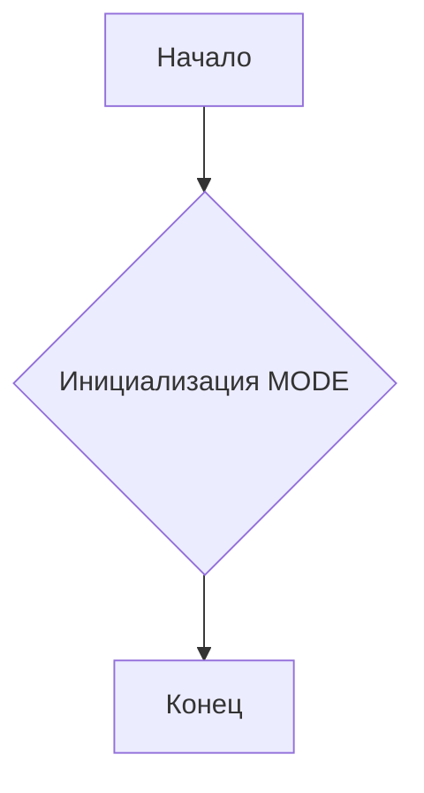
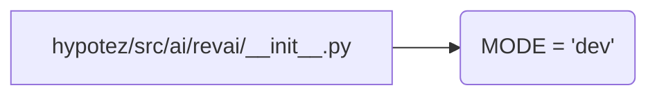

```MD
# Анализ файла `hypotez/src/ai/revai/__init__.py`

## <input code>

```python
## \file hypotez/src/ai/revai/__init__.py
# -*- coding: utf-8 -*-\
#! venv/Scripts/python.exe
#! venv/bin/python/python3.12

"""
.. module: src.ai.revai 
	:platform: Windows, Unix
	:synopsis:

"""
MODE = 'dev'

"""
	:platform: Windows, Unix
	:synopsis:

"""


"""
	:platform: Windows, Unix
	:synopsis:

"""


"""
  :platform: Windows, Unix

"""
"""
  :platform: Windows, Unix
  :platform: Windows, Unix
  :synopsis:
"""MODE = 'dev'
  
# https://www.rev.com/api/docs
# https://docs.rev.ai/resources/code-samples/python/
```

## <algorithm>

Этот файл (`hypotez/src/ai/revai/__init__.py`) скорее всего является инициализатором модуля `revai` в пакете `ai` проекта `hypotez`.  В нем определено единственное глобальное значение, `MODE`, со значением 'dev'.  Поскольку файл содержит только эту переменную и комментарии,  алгоритм работы  тривиален.  Файл не содержит вызовов функций или циклов.  Данные не передаются между функциями, классами или методами.

**Блок-схема:**



**Пример:**  Инициализируется переменная `MODE` со значением 'dev'.


## <mermaid>



## <explanation>

**Импорты:**

Файл не содержит импортов.

**Классы:**

Файл не содержит классов.

**Функции:**

Файл не содержит функций.

**Переменные:**

`MODE`: Глобальная переменная, хранящая строку 'dev'.  Предположительно используется для настройки режима работы модуля (например, 'dev', 'prod').

**Возможные ошибки или области для улучшений:**

* **Отсутствие документации:**  Комментарии `""" ... """`  должны содержать подробную документацию, включая назначение переменных и их типов.
* **Использование констант:**  Использование `MODE='dev'` вместо, скажем, `MODE_DEVELOPMENT='dev'` делает код менее читабельным.  Используйте константы для ясности.
* **Потенциальные зависимости:**  Ссылки на `https://www.rev.com/api/docs` и `https://docs.rev.ai/resources/code-samples/python` предполагают, что этот модуль связан с API Rev.AI.  Это важно для понимания контекста и взаимосвязей.  Необходимо определить, какие функции будут использовать эту переменную `MODE`.
* **Отсутствие явных целей**:  Этот файл без логики не имеет практического применения без контекста.  Необходимо указать, для чего используется переменная `MODE`.


**Цепочка взаимосвязей:**

Файл `hypotez/src/ai/revai/__init__.py` является частью проекта `hypotez` и, предположительно, играет роль в инициализации модулей `ai/revai`.  Возможные дальнейшие зависимости могут включать в себя другие файлы в `hypotez/src/ai`,  модули для работы с API Rev.AI,  и другие модули или сервисы в проекте.


**Заключение:**

Файл `hypotez/src/ai/revai/__init__.py` является тривиальным инициализационным файлом, содержащим только одну переменную `MODE` и комментарии,  указывающие на зависимость от API Rev.AI.  Для более детального анализа необходим контекст, в котором используется этот файл, и его дальнейшее взаимодействие с другими частями проекта.