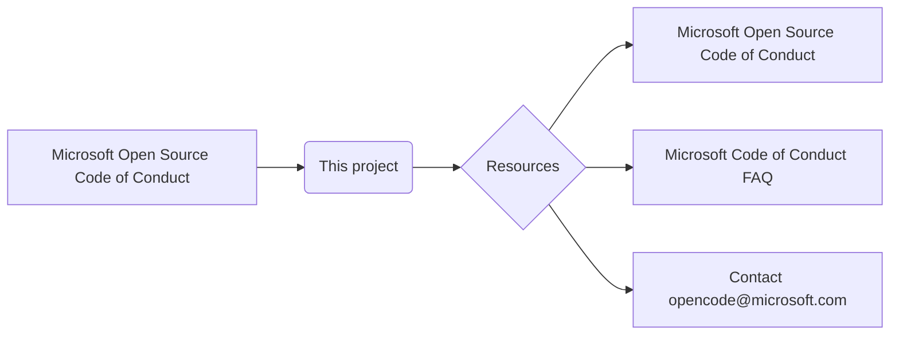

```MD
# Анализ файла CODE_OF_CONDUCT.md

1. **<input code>**:

```
# Microsoft Open Source Code of Conduct

This project has adopted the [Microsoft Open Source Code of Conduct](https://opensource.microsoft.com/codeofconduct/).

Resources:

- [Microsoft Open Source Code of Conduct](https://opensource.microsoft.com/codeofconduct/)
- [Microsoft Code of Conduct FAQ](https://opensource.microsoft.com/codeofconduct/faq/)
- Contact [opencode@microsoft.com](mailto:opencode@microsoft.com) with questions or concerns
```

2. **<algorithm>**:

Этот код не имеет алгоритма в традиционном понимании. Он представляет собой текстовый документ, описывающий принятый кодекс поведения для проекта.  Логики выполнения здесь нет.  Данные в этом случае — ссылки и текст.  Процесс — чтение и ознакомление.


3. **<mermaid>**:



**Объяснение диаграммы:**

Диаграмма представляет простые связи между элементами документа.  `Microsoft Open Source Code of Conduct` — это основной концептуальный элемент, который принят проектом.  `Resources` — это набор ссылок на связанные ресурсы. Диаграмма иллюстрирует, как эти ресурсы (документы и адреса) относятся к основному документу.


4. **<explanation>**:

* **Импорты:**  Здесь нет импортов в традиционном понимании, так как это текстовый файл, а не код на языке программирования.

* **Классы:** Нет классов.

* **Функции:** Нет функций.

* **Переменные:** Нет переменных.

* **Объяснение:** Этот файл представляет собой документ, описывающий принятый кодекс поведения для открытого исходного кода проекта, основанного на руководящих принципах Microsoft. Он содержит ссылки на важную информацию по этой теме и контактную информацию для вопросов.  Нет никаких действий, только предоставление информации.


**Возможные ошибки или области для улучшений:**

*  Возможно, стоит добавить краткое описание этого кодекса поведения в самом начале документа, помимо ссылок.


**Цепочка взаимосвязей с другими частями проекта:**

Этот файл является частью документации проекта и определяет его этические принципы.  Он необходим для поддержания репутации и доверия сообщества к проекту, но не содержит кода, напрямую влияющего на функциональность.  Связь с другими частями проекта — это связь через общий принцип этического поведения, который должны соблюдать все участники проекта.