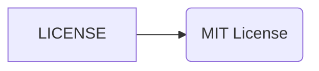

```MD
# Анализ кода (LICENSE)

**1. <input code>**

```
    MIT License

    Copyright (c) Microsoft Corporation.

    Permission is hereby granted, free of charge, to any person obtaining a copy
    of this software and associated documentation files (the "Software"), to deal
    in the Software without restriction, including without limitation the rights
    to use, copy, modify, merge, publish, distribute, sublicense, and/or sell
    copies of the Software, and to permit persons to whom the Software is
    furnished to do so, subject to the following conditions:

    The above copyright notice and this permission notice shall be included in all
    copies or substantial portions of the Software.

    THE SOFTWARE IS PROVIDED "AS IS", WITHOUT WARRANTY OF ANY KIND, EXPRESS OR
    IMPLIED, INCLUDING BUT NOT LIMITED TO THE WARRANTIES OF MERCHANTABILITY,
    FITNESS FOR A PARTICULAR PURPOSE AND NONINFRINGEMENT. IN NO EVENT SHALL THE
    AUTHORS OR COPYRIGHT HOLDERS BE LIABLE FOR ANY CLAIM, DAMAGES OR OTHER
    LIABILITY, WHETHER IN AN ACTION OF CONTRACT, TORT OR OTHERWISE, ARISING FROM,
    OUT OF OR IN CONNECTION WITH THE SOFTWARE OR THE USE OR OTHER DEALINGS IN THE
    SOFTWARE
```

**2. <algorithm>**

Этот код не содержит алгоритма в привычном понимании.  Это текстовый файл, содержащий лицензионное соглашение MIT.  Пошаговая блок-схема не применима.

**3. <mermaid>**



**4. <explanation>**

Этот файл представляет собой лицензионное соглашение MIT, используемое для определения условий использования, модификации и распространения кода, находящегося в репозитории.  Он не содержит функций, классов, переменных в традиционном смысле.

* **Импорты**:  Отсутствуют импорты. Это текстовый файл.
* **Классы**: Отсутствуют классы.
* **Функции**: Отсутствуют функции.
* **Переменные**: Отсутствуют переменные.
* **Возможные ошибки или области для улучшений**:  В этом файле нет потенциальных ошибок, поскольку он содержит стандартное лицензионное соглашение MIT.  Отсутствует код, который может быть некорректным.
* **Взаимосвязь с другими частями проекта**: Этот файл является важным элементом проекта, определяя права доступа к исходному коду и описывая соглашения о его использовании.  Он находится в директории `hypotez/src/ai/tiny_troupe/TinyTroupe/LICENSE`.

**Цепочка взаимосвязей с другими частями проекта:**  Файл LICENSE нужен для любой части проекта, где код использует этот тип лицензии. В целом, он связывает проект с общими принципами лицензирования программного обеспечения.


**Заключение:**
Данный файл – это статический текст, описывающий условия использования кода и не содержит структур, которые требуют алгоритмического анализа.