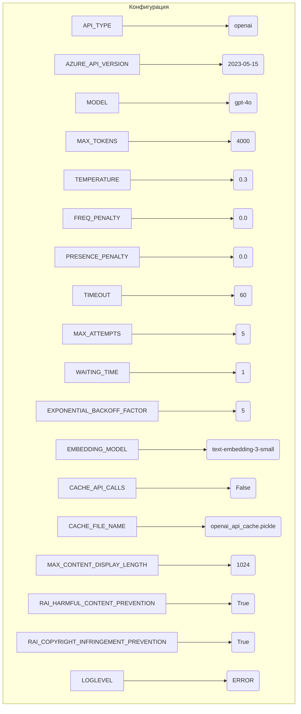

```MD
# Анализ конфигурационного файла config.ini

1. **<input code>**:

```ini
#
# OpenAI or Azure OpenAI Service
#

# Default options: openai, azure
API_TYPE=openai

# Check Azure's documentation for updates here:
# https://learn.microsoft.com/en-us/azure/ai-services/openai/chatgpt-quickstart?tabs=command-line&pivots=programming-language-python
AZURE_API_VERSION=2023-05-15

#
# Model parameters
#

MODEL=gpt-4o
MAX_TOKENS=4000
TEMPERATURE=0.3
FREQ_PENALTY=0.0
PRESENCE_PENALTY=0.0
TIMEOUT=60
MAX_ATTEMPTS=5
WAITING_TIME=1
EXPONENTIAL_BACKOFF_FACTOR=5

EMBEDDING_MODEL=text-embedding-3-small 

CACHE_API_CALLS=False
CACHE_FILE_NAME=openai_api_cache.pickle

MAX_CONTENT_DISPLAY_LENGTH=1024

[Simulation]
RAI_HARMFUL_CONTENT_PREVENTION=True
RAI_COPYRIGHT_INFRINGEMENT_PREVENTION=True


[Logging]
LOGLEVEL=ERROR
# ERROR
# WARNING
# INFO
# DEBUG
```

2. **<algorithm>**:

Этот код представляет собой конфигурационный файл (`.ini`), который определяет параметры для взаимодействия с API OpenAI или Azure OpenAI.  Пошагового алгоритма в классическом смысле нет, так как файл просто задаёт значения параметров.

3. **<mermaid>**:



Диаграмма отображает прямое соответствие между параметрами (ключи) и их значениями (значения).  Нет сложных взаимосвязей между секциями (разделами) конфигурации.


4. **<explanation>**:

* **Импорты**:  Нет импортируемых модулей. Это конфигурационный файл, который не содержит импортируемого кода.
* **Классы**: Нет классов.
* **Функции**: Нет функций.
* **Переменные**:  Все переменные представляют собой строки (строковые значения конфигурации) или логические типы данных (True/False), определяющие параметры работы с API OpenAI/Azure OpenAI и модели машинного обучения.  
* **Возможные ошибки/улучшения**:
    * Отсутствует валидация параметров. Файл предполагает корректность входных данных (имя модели, значения числовых параметров). В реальном приложении желательно добавлять проверку входных данных для предотвращения ошибок, например,  проверка того, что `MAX_TOKENS` не больше допустимого для модели значения.  
    * Отсутствует гибкость.  Изменение параметров требует редактирования файла. Вместо этого, лучше иметь конфигурационный файл с возможностью динамического изменения параметров (например, в YAML, который легче обрабатывается программным способом).  
    * Не описаны default values параметров. 

**Цепочка взаимосвязей с другими частями проекта**:

Этот конфигурационный файл (`config.ini`) используется другими частями проекта (`src.*`) для определения настроек при взаимодействии с API OpenAI.  Например, в модуле `src.ai.tiny_troupe.TinyTroupe`, возможно, есть функция или класс, которые считывают эти параметры из файла, чтобы инициализировать API-клиент с заданными параметрами.
```