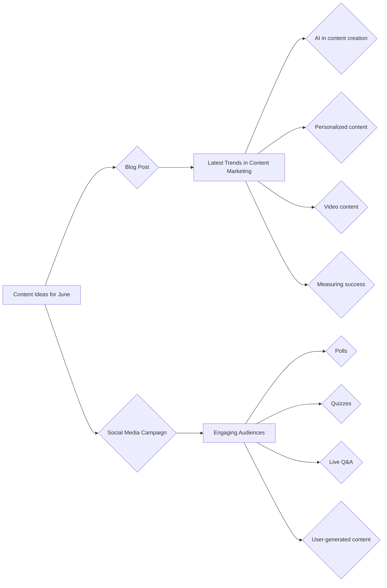

```MD
# Анализ кода (Content Ideas for June)

## <input code>

```
## Content Ideas for June

### 1. Blog Post: Latest Trends in Content Marketing

**Objective:** To inform our audience about the latest trends in content marketing and how they can leverage these trends to improve their own Startegies.

**Key Points to Cover:**
- The rise of AI in content creation
- The importance of personalized content
- The growing influence of video content
- How to measure the success of content marketing efforts

### 2. Social Media Campaign: Engaging Audiences Through Interactive Content

**Objective:** To increase audience engagement on social media platforms by using interactive content such as polls, quizzes, and live Q&A sessions.

**Key Elements:**
- Create a series of polls related to industry topics
- Develop fun and informative quizzes that relate to our brand
- Host live Q&A sessions with industry experts
- Encourage user-generated content by asking followers to share their experiences and tag our brand
```

## <algorithm>

Этот код не содержит программного кода, а представляет собой документ с идеями контент-плана на июнь. Алгоритм работы отсутствует, так как нет кода для выполнения.  Данный документ – это планирование, а не исполняемый скрипт.

## <mermaid>



## <explanation>

Этот документ не содержит кода. Он представляет собой текстовый документ, содержащий идеи для контент-плана на июнь.

* **Импорты**: Отсутствуют, так как нет кода.
* **Классы**: Отсутствуют, так как нет кода.
* **Функции**: Отсутствуют, так как нет кода.
* **Переменные**: Отсутствуют, так как нет кода.
* **Возможные ошибки или области для улучшений**:  Документ в текущем виде недостаточно структурирован для последующей реализации. Необходимо добавить более конкретные детали по каждой идее, например, темы для постов, предполагаемые платформы для социальных сетей, формат проведения Q&A, целевую аудиторию.


**Цепочка взаимосвязей с другими частями проекта:**  Этот документ является частью более крупного плана маркетинговой деятельности.  Он может служить основой для создания более детализированных планов и задач, которые впоследствии будут переведены в код для автоматизации (если это необходимо).  Например, если планируется автоматизировать создание постов блога или управление социальными сетями, то этот документ станет частью документации для разработчиков.