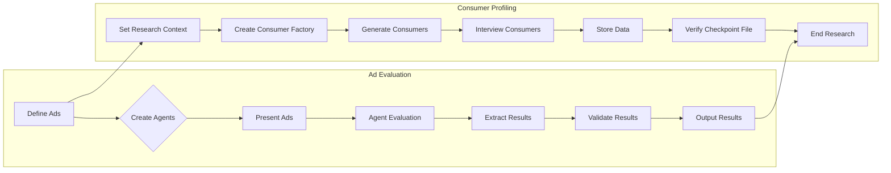

# <input code>

```python
import pytest
import logging
logger = logging.getLogger("tinytroupe")

import sys
sys.path.append('../../tinytroupe/')
sys.path.append('../../')
sys.path.append('..')


import tinytroupe
from tinytroupe.agent import TinyPerson
from tinytroupe.environment import TinyWorld, TinySocialNetwork
from tinytroupe.factory import TinyPersonFactory
from tinytroupe.extraction import ResultsExtractor
from tinytroupe.examples import create_lisa_the_data_scientist, create_oscar_the_architect, create_marcos_the_physician
from tinytroupe.extraction import default_extractor as extractor
import tinytroupe.control as control
from tinytroupe.control import Simulation

from testing_utils import *

# ... (rest of the code)
```

# <algorithm>

Unfortunately, a detailed step-by-step algorithm and flowchart cannot be accurately represented without the context of the `testing_utils` module.  The provided code snippet involves several scenarios related to ad evaluation, focus group creation, and consumer profiling.

**High-Level Algorithm (Example - Ad Evaluation):**

1. **Input:** Define advertisement texts (`travel_ad_1`, `travel_ad_2`, etc.).  Formulate an evaluation request message.

2. **Prepare Agents:** Create agent instances (Lisa, Oscar, etc.) within a specific context or situation.  Set their context ("planning a Europe vacation").

3. **Present to Agents:** Present the evaluation request message to each agent.

4. **Agent Actions:** Each agent evaluates the ads, makes a choice, and provides justification.

5. **Extraction:** Extract the choice, ad title, and justification from each agent's response.

6. **Validation:** Validate the extracted results (e.g., checking if the agent selected a valid ad, if all the expected fields were present).

7. **Output:** Print the results and ensure the scenario's constraints are met (e.g., 2 agents made choices).

**High-Level Algorithm (Example - Consumer Profiling):**

1. **Context:** Establish a general research context, set goals and details to generate appropriate persons with preferences for gazpacho.

2. **Factory Creation:** Create a `TinyPersonFactory` to generate consumers.

3. **Consumer Generation:** Iterate a specified number of times. Create consumers from the factory.

4. **Interview:** Ask specific questions regarding their gazpacho purchasing interest to each generated consumer.

5. **Data Storage:** Store answers from each consumer.

6. **Check:** Verify that the file with consumer data was created.

7. **Cleanup:** Indicate research is completed.


# <mermaid>




# <explanation>

**Imports:**

- `pytest`: Used for testing.
- `logging`: For logging messages.  `logger = logging.getLogger("tinytroupe")` creates a logger instance for the "tinytroupe" namespace.
- `sys`: Used to modify the Python path to find necessary modules.  Crucially, this is used to find the code in your project's `tinytroupe` and related directories, indicating a potential issue with project structure if it's not set up correctly.
- `tinytroupe`: Contains all the classes and functions for the TinyTroupe project.
- `testing_utils`:  An external module used for testing purposes, containing functions not seen in the code snippet.
- `control`: For managing the simulation (important for managing tests and state).
- `time`: Used for pauses in the consumer profiling scenario to avoid overwhelming the system.

**Classes:**

- `TinyPerson`: Likely represents an agent or simulated person with attributes (e.g., name, preferences) and methods (e.g., `listen_and_act`, `change_context`).
- `TinyWorld`, `TinySocialNetwork`:  Parts of the TinyTroupe environment providing simulation context and interaction.
- `TinyPersonFactory`: Creates `TinyPerson` instances.
- `ResultsExtractor`: Extracts results from the agent interactions.

**Functions:**

- `test_ad_evaluation_scenario`, `test_ad_creation_scenario`, `test_consumer_profiling_scenario`: These are test functions.  They set up scenarios, run simulations, and use assertions to verify expected outcomes.
- `create_lisa_the_data_scientist`, `create_oscar_the_architect`, `create_marcos_the_physician`:  Factories that generate persons with predefined traits.
- `interview_consumer_batch`: Contains the iterative consumer interview process.


**Variables:**

- Various strings (`travel_ad_1`, `travel_ad_2`, `situation`, `apartment_description`, `task`, `general_context`) store text data for the scenarios.

**Error and Improvement Potential:**

- The code heavily relies on external modules (`testing_utils`) which are not included. Without seeing those modules, it is difficult to know all dependencies.  This makes the code less self-contained and potentially harder to run in other environments.

- Assertions are a good practice but they are not always specific enough. Assertions like `assert res is not None` can be improved to state *what* specific content should be present in `res`.

- The `interview_consumer_batch` function includes substantial delays using `sleep(2)`. This significantly increases the test execution time.  Consider optimizing or mocking time-related operations in testing environments.

- Path manipulation using `sys.path.append` should be reviewed to see if a more robust structure is used to manage imports.  The `../../` path adjustments indicate that the project structure might need improvement.  Consider using `importlib` for better import management.


**Relationship with Other Parts of the Project (Inferred):**

The `tinytroupe` package clearly contains essential components for the simulation, agent interaction, and scenario management.  `testing_utils` likely provides utility functions for testing.  The code's interaction with the environment and agents suggests an architecture for interacting with simulated users and evaluating their choices in various contexts. This interaction depends on how these other modules and classes work. The code heavily relies on the expected structure of TinyTroupe's modules for import resolution.