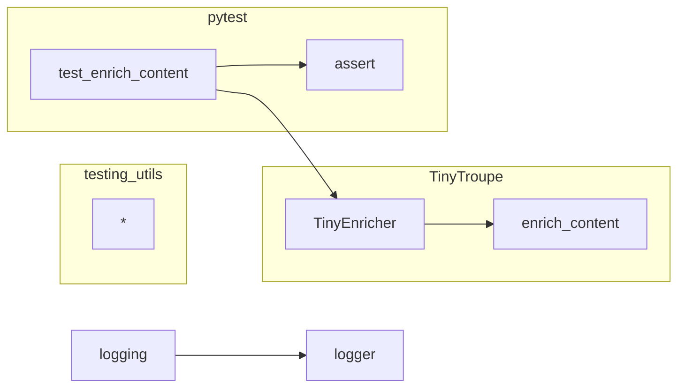

```MD
# Анализ кода test_enrichment.py

## <input code>

```python
import pytest
import textwrap
import logging
logger = logging.getLogger("tinytroupe")
import sys
sys.path.append('../../tinytroupe/')
sys.path.append('../../')
sys.path.append('..')
from testing_utils import *
from tinytroupe.enrichment import TinyEnricher

def test_enrich_content():

    content_to_enrich = textwrap.dedent(
    """
    # WonderCode & Microsoft Partnership: Integration of WonderWand with GitHub
    ## Executive Summary
    This document outlines the Startegic approach and considerations for the partnership between WonderCode and Microsoft, focusing on the integration of WonderWand with GitHub. It captures the collaborative efforts and insights from various departments within WonderCode.
    ## Business Startegy
    ... (много текста)
    """).strip()

    requirements = textwrap.dedent(
    """
    Turn any draft or outline into an actual and long document, with many, many details. Include tables, lists, and other elements.
    The result MUST be at least 3 times larger than the original content in terms of characters - do whatever it takes to make it this long and detailed.
    """).strip()

    result = TinyEnricher().enrich_content(requirements=requirements, 
                                        content=content_to_enrich, 
                                        content_type="Document", 
                                        context_info="WonderCode was approached by Microsoft to for a partnership.",
                                        context_cache=None, verbose=True)    

    assert result is not None, "The result should not be None."

    logger.debug(f"Enrichment result: {result}\\n Length: {len(result)}\\n Original length: {len(content_to_enrich)}\\n")

    assert len(result) >= len(content_to_enrich) * 3, "The result should be at least 3 times larger than the original content."
```

## <algorithm>

**Блок-схема:**

```mermaid
graph TD
    A[Начало] --> B{Получить content_to_enrich, requirements};
    B -- content_to_enrich, requirements --> C[Создать экземпляр TinyEnricher];
    C --> D[Вызвать enrich_content(requirements, content, content_type, context_info, context_cache, verbose)];
    D --> E{result != None?};
    E -- да --> F[assert result is not None];
    E -- нет --> G[Ошибка];
    F --> H[logger.debug(result length)];
    H --> I{len(result) >= len(content_to_enrich) * 3?};
    I -- да --> J[assert len(result) >= ...];
    I -- нет --> K[Ошибка];
    J --> L[Конец];
```

**Пример:**

* `content_to_enrich`:  Документ об интеграции.
* `requirements`: Требования к расширению.
* `TinyEnricher.enrich_content`: Функция, которая расширяет документ.
* `result`: Расширенный документ.

## <mermaid>



## <explanation>

**Импорты:**

* `pytest`: Библиотека для написания юнит-тестов.
* `textwrap`: Для форматирования строк.
* `logging`: Для логирования. `logger = logging.getLogger("tinytroupe")` создаёт логгер для модуля "tinytroupe".
* `sys`: Для манипуляций с путем импорта. `sys.path.append(...)` добавляет пути к каталогам, чтобы Python мог найти нужные модули.
* `testing_utils`:  Вероятно, содержит вспомогательные функции или классы для тестов. Находится в папке `../../testing_utils/`.
* `tinytroupe.enrichment`: Модуль, содержащий класс `TinyEnricher` для расширения контента.  Находится в папке `src/ai/tiny_troupe/TinyTroupe/tinytroupe/`.

**Классы:**

* `TinyEnricher`: Класс для расширения контента. Пока не виден код самого класса, но судя по методу `enrich_content`, он отвечает за логику расширения.  Есть предположение, что он содержит алгоритмы и логику работы с требованиями и исходным контентом.

**Функции:**

* `test_enrich_content`: Функция тестирования, проверяющая корректность работы `TinyEnricher`. Она принимает требования к расширению и исходный контент, вызывает метод `enrich_content`, и проверяет, что результат соответствует ожиданиям (размер увеличен в 3 раза).

**Переменные:**

* `content_to_enrich`: Исходный контент, который нужно расширить.
* `requirements`: Требования к расширению.
* `result`: Результат расширения.
* `logger`: Логгер для вывода сообщений о ходе тестирования.

**Возможные ошибки/улучшения:**

* Не указана конкретная реализация логики `enrich_content`, что затрудняет более глубокий анализ.  Важно понимать, как происходит расширение (добавление информации, структур, генерация текста).
* Отсутствует описание `testing_utils`, что затрудняет понимание контекста.
* Неясно, как `context_info` и `context_cache` используются.
* Отсутствует проверка корректности входных данных (например, пустые `content_to_enrich` и/или `requirements`).
* Нет анализа производительности, например, времени работы.


**Цепочка взаимосвязей:**

Тест `test_enrich_content` использует класс `TinyEnricher` из модуля `tinytroupe.enrichment`.  В свою очередь, `testing_utils` вероятно содержит вспомогательные функции для создания тестовых данных или проверки результатов.  `tinytroupe.enrichment`  вероятно находится в слое `src/ai/tiny_troupe/TinyTroupe/`, и взаимодействие с ним напрямую не показано в этом фрагменте.  Нужно посмотреть код класса `TinyEnricher`, чтобы получить больше информации о взаимодействиях.