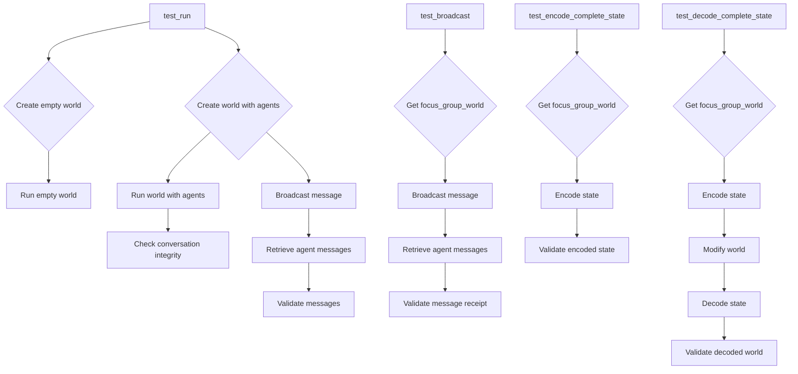

# <input code>

```python
import pytest
import logging
logger = logging.getLogger("tinytroupe")

import sys
sys.path.append('../../tinytroupe/')
sys.path.append('../../')
sys.path.append('..')

from tinytroupe.examples import create_lisa_the_data_scientist, create_oscar_the_architect, create_marcos_the_physician
from tinytroupe.environment import TinyWorld
from testing_utils import *

def test_run(setup, focus_group_world):

    # empty world
    world_1 = TinyWorld("Empty land", [])   
    world_1.run(2)

    # world with agents
    world_2 = focus_group_world
    world_2.broadcast("Discuss ideas for a new AI product you'd love to have.")
    world_2.run(2)

    # check integrity of conversation
    for agent in world_2.agents:
        for msg in agent.episodic_memory.retrieve_all():
            if 'action' in msg['content'] and 'target' in msg['content']['action']:
                assert msg['content']['action']['target'] != agent.name, f"{agent.name} should not have any messages with itself as the target."
            
            # TODO stimulus integrity check?

def test_broadcast(setup, focus_group_world):

    world = focus_group_world
    world.broadcast("""
                Folks, we need to brainstorm ideas for a new baby product. Something moms have been asking for centuries and never got.

                Please start the discussion now.
                """)
    
    for agent in focus_group_world.agents:
        # did the agents receive the message?
        assert "Folks, we need to brainstorm" in agent.episodic_memory.retrieve_first(1)[0]['content']['stimuli'][0]['content'], f"{agent.name} should have received the message."


def test_encode_complete_state(setup, focus_group_world):
    world = focus_group_world

    # encode the state
    state = world.encode_complete_state()
    
    assert state is not None, "The state should not be None."
    assert state['name'] == world.name, "The state should have the world name."
    assert state['agents'] is not None, "The state should have the agents."

def test_decode_complete_state(setup, focus_group_world):
    world = focus_group_world

    name_1 = world.name
    n_agents_1 = len(world.agents)

    # encode the state
    state = world.encode_complete_state()
    
    # screw up the world
    world.name = "New name"
    world.agents = []

    # decode the state back into the world
    world_2 = world.decode_complete_state(state)

    assert world_2 is not None, "The world should not be None."
    assert world_2.name == name_1, "The world should have the same name."
    assert len(world_2.agents) == n_agents_1, "The world should have the same number of agents."


```

# <algorithm>

**test_run:**

1. Creates an empty `TinyWorld` instance (`world_1`) with no agents.
2. Calls `world_1.run(2)`.  This likely simulates 2 time steps in the world's evolution.
3. Creates a `focus_group_world` (presumably populated with agents).
4. Calls `world_2.broadcast()` to send a message to all agents.
5. Calls `world_2.run(2)`, simulating further time steps.
6. Iterates through agents in `world_2`.
7. Iterates through messages in each agent's memory.
8. Checks if messages contain 'action' and 'target' keys in the 'action' part.
9. Ensures no agent has a message targeting itself.

**test_broadcast:**

1. Gets a `focus_group_world` instance.
2. Calls `world.broadcast()` to send a message to all agents.
3. Iterates through agents.
4. Checks if the message was received by each agent, specifically verifying the presence of the specified string in the retrieved message.


**test_encode_complete_state:**

1. Gets a `focus_group_world` instance.
2. Calls `world.encode_complete_state()` to serialize the world's state.
3. Verifies that the encoded state (`state`) is not `None`.
4. Verifies that the encoded state contains the world's name and agents data.


**test_decode_complete_state:**

1. Gets a `focus_group_world` instance.
2. Gets the original name and number of agents.
3. Encodes the state (`world.encode_complete_state()`).
4. Modifies the `world` object (e.g., changes its name, removes agents).
5. Calls `world.decode_complete_state(state)` to restore the world from the encoded state.
6. Verifies that the decoded world (`world_2`) is not `None`.
7. Verifies that the decoded world has the original name and number of agents.

# <mermaid>




# <explanation>

**Imports:**

- `pytest`: Used for writing and running unit tests.
- `logging`: For logging messages (logger is configured with a "tinytroupe" name).
- `sys`: Allows manipulation of the Python path, crucial for finding modules in the project structure.  `sys.path.append` appends paths to the module search path, allowing imports from within the project even if the files are not directly in the current directory.
- `tinytroupe.examples`: Likely contains classes or functions for creating example agents (Lisa, Oscar, Marcos).
- `tinytroupe.environment`: Contains the `TinyWorld` class, which represents the environment where agents interact.
- `testing_utils`: A custom module, likely containing utility functions for testing.


**Classes:**

- `TinyWorld`: This class manages the environment.  It has methods like `run()`, `broadcast()`, `encode_complete_state()`, `decode_complete_state()`.  Crucially, it's likely to hold information about agents and their interactions, and state.

**Functions:**

- `test_run`: Tests the basic functionality of the `TinyWorld` environment, including running it with and without agents, checking conversation integrity.
- `test_broadcast`: Tests the broadcasting of messages to agents.  It verifies that agents receive the broadcast messages in their episodic memory.
- `test_encode_complete_state`: Tests the serialization of the world's state (likely used for saving or transferring the current state of the environment to a different point in time or another process.)
- `test_decode_complete_state`: Tests the ability to restore a `TinyWorld` from a saved state.  Critically, it verifies that the deserialized object is identical to the original in relevant properties (name, agent count).


**Variables:**

- `focus_group_world`:  Presumably a `TinyWorld` instance initialized with agents, used as a test subject in several test methods.


**Possible Errors/Improvements:**

- The `TODO` comment suggests that stimulus integrity checks need to be implemented.
- The tests are quite reliant on the existence of `setup` and `focus_group_world`. These variables are defined in the `testing_utils` module (which is not present in the snippet) so there is a dependency on that module and what it sets up to run. There's an implicit assumption that `focus_group_world` is properly initialized.


**Relationships:**

The `tinytroupe` project likely has a structure similar to:

```
tinytroupe/
├── tinytroupe/
│   ├── examples/  # Contains classes like Lisa, Oscar, Marcos
│   ├── environment/ # Contains TinyWorld
│   ├── ...
└── testing_utils/  # Utility functions and setup
```

The tests depend on the `tinytroupe` modules (which define `TinyWorld`, agents, etc.).  The `testing_utils` module appears to be a support module containing test setup, making the code more organized and reusable. The `test_` functions are pytest test functions. The code structure strongly suggests a well-designed modular structure to support unit testing and code reuse within the `tinytroupe` package.