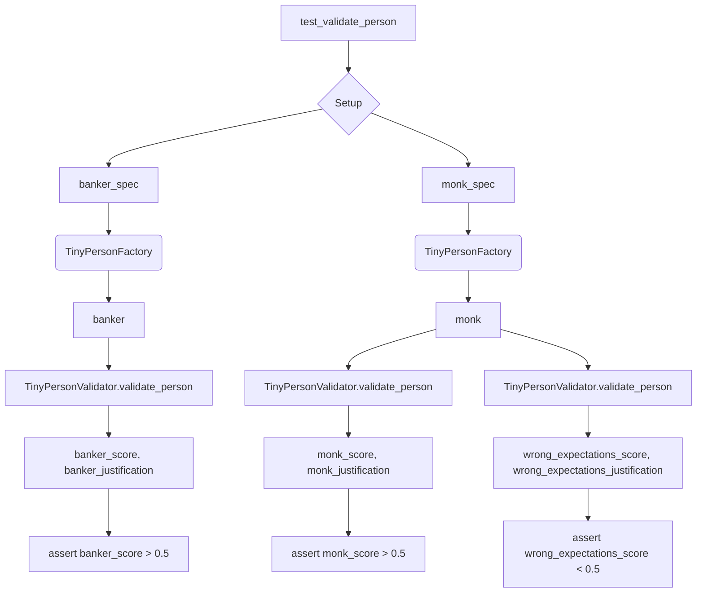

# <input code>

```python
import pytest
import os

import sys
sys.path.append('../../tinytroupe/')
sys.path.append('../../')
sys.path.append('..')


from tinytroupe.examples import create_oscar_the_architect
from tinytroupe.control import Simulation
import tinytroupe.control as control
from tinytroupe.factory import TinyPersonFactory
from tinytroupe.validation import TinyPersonValidator

from testing_utils import *

def test_validate_person(setup):

    ##########################
    # Banker
    ##########################
    banker_spec ="""
    A vice-president of one of the largest brazillian banks. Has a degree in engineering and an MBA in finance. 
    Is facing a lot of pressure from the board of directors to fight off the competition from the fintechs.    
    """
    banker_factory = TinyPersonFactory(banker_spec)
    banker = banker_factory.generate_person()
    banker_expectations ="""
    He/she is:
    - Wealthy
    - Very intelligent and ambitious
    - Has a lot of connections
    - Is in his 40s or 50s

    Tastes:
    - Likes to travel to other countries
    - Either read books, collect art or play golf
    - Enjoy only the best, most expensive, wines and food
    - Dislikes communists, unions and the like

    Other notable traits:
    - Has some stress issues, and might be a bit of a workaholic
    - Deep knowledge of finance, economics and financial technology
    - Is a bit of a snob
    - Might pretend to be a hard-core woke, but in reality that's just a facade to climb the corporate ladder  
    """
    banker_score, banker_justification = TinyPersonValidator.validate_person(banker, expectations=banker_expectations, include_agent_spec=False, max_content_length=None)
    print("Banker score: ", banker_score)
    print("Banker justification: ", banker_justification)

    assert banker_score > 0.5, f"Validation score is too low: {banker_score:.2f}"


    ##########################
    # Busy Knowledge Worker   
    ########################## 
    monk_spec ="""
    A poor buddhist monk living alone and isolated in a remote montain.
    """
    monk_spec_factory = TinyPersonFactory(monk_spec)
    monk = monk_spec_factory.generate_person()
    monk_expectations ="""
    Some characteristics of this person:
    - Is very poor, and in fact do not seek money
    - Has no formal education, but is very wise
    - Is very calm and patient
    - Is very humble and does not seek attention
    - Honesty is a core value    
    """

    monk_score, monk_justification = TinyPersonValidator.validate_person(monk, expectations=monk_expectations, include_agent_spec=False, max_content_length=None)
    print("Monk score: ", monk_score)
    print("Monk justification: ", monk_justification)
          

    assert monk_score > 0.5, f"Validation score is too low: {monk_score:.2f}"

    # Now, let's check the score for the busy knowledge worker with the wrong expectations! It has to be low!
    wrong_expectations_score, wrong_expectations_justification = TinyPersonValidator.validate_person(monk, expectations=banker_expectations, include_agent_spec=False, max_content_length=None)

    assert wrong_expectations_score < 0.5, f"Validation score is too high: {wrong_expectations_score:.2f}"
    print("Wrong expectations score: ", wrong_expectations_score)
    print("Wrong expectations justification: ", wrong_expectations_justification)
```

# <algorithm>

The algorithm tests the `TinyPersonValidator` by creating two different types of people (a banker and a monk) and validating them against specific expectations.

1. **Define expectations:** Define characteristics and traits for each person (banker and monk) using string literals (`banker_expectations`, `monk_expectations`).
2. **Create persons:** Use `TinyPersonFactory` to create a person based on a description (`banker_spec`, `monk_spec`).
3. **Validate person:**  Call `TinyPersonValidator.validate_person` to assess how well the created person matches the predefined expectations.  This function likely compares the characteristics of the generated person against the provided expectations and returns a score and a justification for the score.
4. **Assert the score:** Check if the returned score is above a certain threshold for the correctly matching expectations.  If not, an assertion fails. This is done for both the "banker" and "monk".
5. **Test with wrong expectations:** Create a new validation using the wrong expectations.  The algorithm ensures that in this case the score is lower than the threshold.

# <mermaid>



# <explanation>

- **Imports:**
    - `pytest`: Used for running tests.
    - `os`: For interacting with the operating system (not directly used here).
    - `sys`: For manipulating the Python path. `sys.path.append` statements are used to allow the script to import modules from different directories which likely contain the TinyTroupe project files. This is a common practice when dealing with modules in project hierarchies.
    - `create_oscar_the_architect`, `Simulation`, `control`, `TinyPersonFactory`, `TinyPersonValidator`: Modules from the TinyTroupe project. `control` is imported directly and as an alias.  These imports define classes and functions for creating, simulating, and validating tiny persons.
    - `testing_utils`: Likely a custom module containing utility functions for testing.
- **Classes:**
    - `TinyPersonFactory`: Creates `TinyPerson` objects based on a provided specification.  The `generate_person()` method likely parses the input string and creates a representative object. This is a crucial part of the design.
    - `TinyPersonValidator`: Validates a `TinyPerson` against expectations. The `validate_person` function is the core of this class. Likely performs comparisons and calculations based on the provided person object and expectation string.
- **Functions:**
    - `test_validate_person`: The test function which creates and validates `TinyPerson` objects. This function is used to create various test cases to cover different scenarios.
    - `validate_person`: Takes the `TinyPerson` object and `expectations` string as input. Returns a validation score and justification (likely text explaining the decision).
- **Variables:**
    - `banker_spec`, `banker_expectations`, `monk_spec`, `monk_expectations`: String literals holding the expected characteristics of the test individuals.
    - `banker`, `monk`: Objects of the `TinyPerson` class, created by the `TinyPersonFactory`.
    - `banker_score`, `banker_justification`, etc.: Variables storing the results of the validation process.
- **Possible Errors/Improvements:**
    - The validation logic within `TinyPersonValidator.validate_person` is crucial for assessing the quality of the validation.
    - The code assumes the input strings (`banker_expectations`, `monk_expectations`) are in a specific format interpretable by the validator.
    - The meaning of the validation score (e.g., what does a score of 0.8 mean?) is not clear from the code alone.  A clear definition and validation logic are essential.

**Relationship to other parts of the project:**

The code heavily relies on classes (`TinyPersonFactory`, `TinyPersonValidator`) within the TinyTroupe project.  The `testing_utils` likely provides helper functions related to test setup. The `examples` module might define the base types for `TinyPerson`.  There is a clear dependency on the `tinytroupe` package for generating and validating personas, potentially forming a larger system for AI-generated personality characterization.