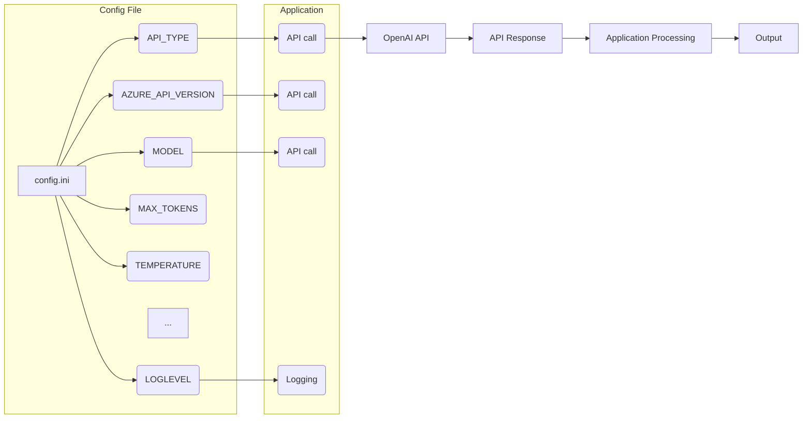

```MD
# Анализ конфигурационного файла tinytroupe/config.ini

1. **<input code>**:

```ini
#
# OpenAI or Azure OpenAI Service
#

# Default options: openai, azure
API_TYPE=openai

# Check Azure's documentation for updates here:
# https://learn.microsoft.com/en-us/azure/ai-services/openai/chatgpt-quickstart?tabs=command-line&pivots=programming-language-python
AZURE_API_VERSION=2023-05-15

#
# Model parameters
#

MODEL=gpt-4o
MAX_TOKENS=4000
TEMPERATURE=0.3
FREQ_PENALTY=0.0
PRESENCE_PENALTY=0.0
TIMEOUT=60
MAX_ATTEMPTS=5
WAITING_TIME=1
EXPONENTIAL_BACKOFF_FACTOR=5

EMBEDDING_MODEL=text-embedding-3-small

CACHE_API_CALLS=False
CACHE_FILE_NAME=openai_api_cache.pickle

MAX_CONTENT_DISPLAY_LENGTH=1024

[Simulation]
RAI_HARMFUL_CONTENT_PREVENTION=True
RAI_COPYRIGHT_INFRINGEMENT_PREVENTION=True


[Logging]
LOGLEVEL=ERROR
# ERROR
# WARNING
# INFO
# DEBUG
```

2. **<algorithm>**:

Конфигурационный файл не содержит алгоритма в том понимании, что это не исполняемый код, а набор параметров для программного обеспечения.  Файл задаёт значения переменных, которые определяют поведение приложения, работающего с OpenAI API.  Нет пошаговой логики, как в алгоритме сортировки.  Данные передаются в программу при её запуске.

3. **<mermaid>**:



**Описание диаграммы:**

* `Config File`: блок, представляющий конфигурационный файл.
* `Application`: блок, представляющий приложение, использующее настройки из файла.
* Стрелки (`-->`) представляют передачу данных или влияния параметров.
* `OpenAI API`: внешняя система, с которой взаимодействует приложение.
* `API Response`: ответ от `OpenAI API`.
* `Application Processing`: внутренняя обработка приложения.
* `Output`: результат работы приложения.

4. **<explanation>**:

* **Импорты**: Нет импортов, так как это конфигурационный файл.  Импорты нужны в коде на языке программирования, а не в конфигурации.

* **Классы**: Нет классов. Конфигурационный файл задаёт параметры для приложения, а не описывает структуры данных.

* **Функции**: Нет функций.

* **Переменные**: Переменные в файле представлены именованными значениями.  Их типы — строки (например, `API_TYPE = openai`).  Они хранят настройки для API OpenAI.

    * `API_TYPE`: Тип API (OpenAI или Azure).
    * `AZURE_API_VERSION`: Версия API Azure OpenAI.
    * `MODEL`: Модель OpenAI (например, `gpt-4o`).
    * `MAX_TOKENS`: Максимальное количество токенов в запросе.
    * `TEMPERATURE`: Параметр для моделирования случайности.
    * `FREQ_PENALTY`, `PRESENCE_PENALTY`: Штрафы за повторение слов.
    * `TIMEOUT`, `MAX_ATTEMPTS`: Параметры для обработки таймаутов и попыток.
    * `WAITING_TIME`, `EXPONENTIAL_BACKOFF_FACTOR`: Параметры для обработки ошибок API.
    * `EMBEDDING_MODEL`: Модель встраивания текстов.
    * `CACHE_API_CALLS`, `CACHE_FILE_NAME`: Флаг и имя файла кеширования вызовов.
    * `MAX_CONTENT_DISPLAY_LENGTH`: Максимальная длина отображаемого контента.
    * `RAI_HARMFUL_CONTENT_PREVENTION`, `RAI_COPYRIGHT_INFRINGEMENT_PREVENTION`: Флаги для предотвращения вредного и копирайт-запрещенного контента (вероятно, для моделирования).
    * `LOGLEVEL`: Уровень ведения журнала.

* **Возможные ошибки или улучшения**:
    * Должна быть возможность задать логирование через файл.
    *  Проверить, что все необходимые переменные определены в программе, которая использует этот конфигурационный файл.
    * Необходимо добавить описание параметров, чтобы указать их корректные значения и типы.
    * Должно быть описание возможных значений для `API_TYPE`, чтобы избежать ошибок.


**Взаимосвязь с другими частями проекта**:

Этот конфигурационный файл используется приложением, которое взаимодействует с API OpenAI. Входные параметры API задаются через этот файл, что определяет поведение приложения.  Файл определяет, какие параметры использовать для работы, например, модель (`MODEL`) и параметры, связанные с таймаутами и ограничениями.