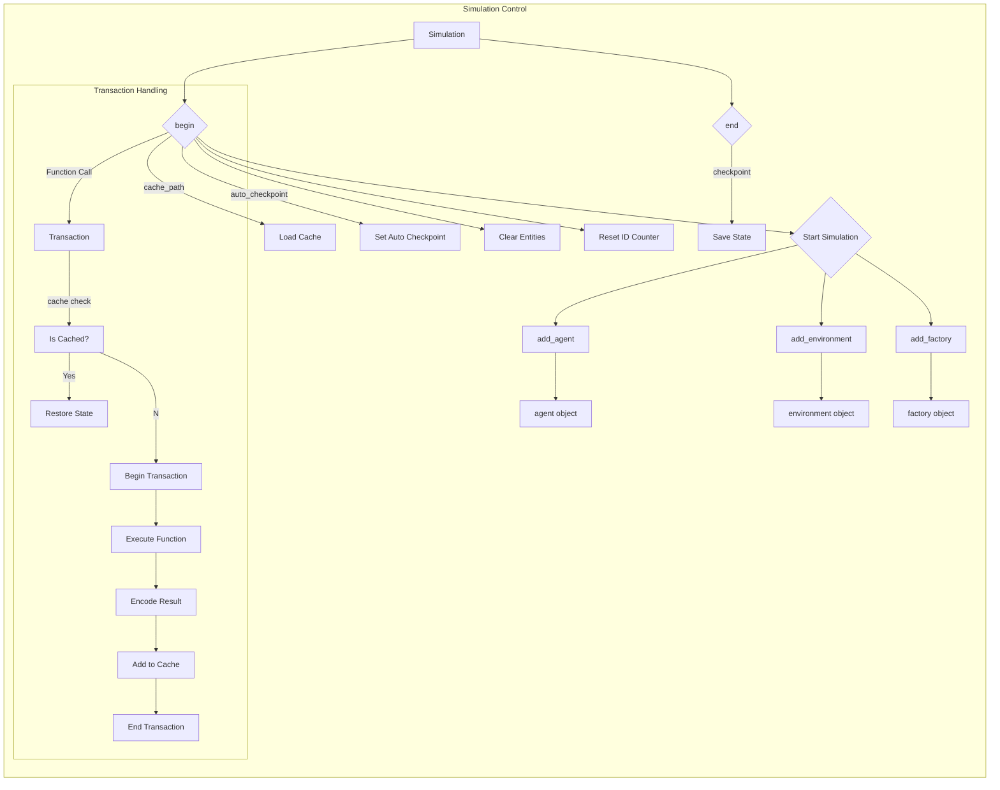

# <input code>

```python
"""
Simulation controlling mechanisms.
"""
import json
import os
import tempfile

import tinytroupe
import tinytroupe.utils as utils

import logging
logger = logging.getLogger("tinytroupe")

class Simulation:

    STATUS_STOPPED = "stopped"
    STATUS_STARTED = "started"

    def __init__(self, id="default", cached_trace:list=None):
        self.id = id

        self.agents = []
        self.name_to_agent = {} # {agent_name: agent, ...}

        self.environments = []

        self.factories = [] # e.g., TinyPersonFactory instances
        self.name_to_factory = {} # {factory_name: factory, ...}

        self.name_to_environment = {} # {environment_name: environment, ...}
        self.status = Simulation.STATUS_STOPPED

        self.cache_path = f"./tinytroupe-cache-{id}.json" # default cache path
        
        self.auto_checkpoint = False
        self.has_unsaved_cache_changes = False
        self._under_transaction = False

        if cached_trace is None:
            self.cached_trace = []
        else:
            self.cached_trace = cached_trace

        self.execution_trace = []

    def begin(self, cache_path:str=None, auto_checkpoint:bool=False):
        # ... (implementation details)
    
    def end(self):
        # ... (implementation details)

    def checkpoint(self):
        # ... (implementation details)

    def add_agent(self, agent):
        # ... (implementation details)

    def add_environment(self, environment):
        # ... (implementation details)

    def add_factory(self, factory):
        # ... (implementation details)

    def _execution_trace_position(self) -> int:
        # ... (implementation details)

    def _function_call_hash(self, function_name, *args, **kwargs) -> int:
        # ... (implementation details)

    def _skip_execution_with_cache(self):
        # ... (implementation details)

    def _is_transaction_event_cached(self, event_hash) -> bool:
        # ... (implementation details)

    def _drop_cached_trace_suffix(self):
        # ... (implementation details)

    def _add_to_execution_trace(self, state: dict, event_hash: int, event_output):
        # ... (implementation details)

    def _add_to_cache_trace(self, state: dict, event_hash: int, event_output):
        # ... (implementation details)

    def _load_cache_file(self, cache_path:str):
        # ... (implementation details)

    def _save_cache_file(self, cache_path:str):
        # ... (implementation details)

    def begin_transaction(self):
        # ... (implementation details)

    def end_transaction(self):
        # ... (implementation details)

    def is_under_transaction(self):
        # ... (implementation details)

    def _clear_communications_buffers(self):
        # ... (implementation details)

    def _encode_simulation_state(self) -> dict:
        # ... (implementation details)

    def _decode_simulation_state(self, state: dict):
        # ... (implementation details)
```

# <algorithm>

The code implements a simulation control mechanism with caching and transactional support.  The `Simulation` class manages the simulation state, agents, environments, and factories.  The `Transaction` class encapsulates individual actions within the simulation.

**Algorithm for Simulation Control (Simplified):**

1. **Initialization (`Simulation.__init__`):**
   - Creates a `Simulation` object, optionally loading a cached simulation trace.
   - Initializes empty lists for agents, environments, factories.
   - Initializes simulation status to "stopped."
   - Initializes cache and execution trace.

2. **Starting the Simulation (`Simulation.begin`):**
   - Sets the simulation status to "started."
   - Clears existing simulation entities (agents, environments, factories) from previous simulations.
   - Resets a fresh id counter for new objects.
   - Loads cached trace (if any) from the specified or default path.

3. **Ending the Simulation (`Simulation.end`):**
   - Sets the status to "stopped."
   - Saves the simulation trace to the cache file (using `checkpoint`).


4. **Checkpoint (`Simulation.checkpoint`):**
   - Saves the current simulation state to the cache file.

5. **Adding Entities (`Simulation.add_agent`, `Simulation.add_environment`, `Simulation.add_factory`):**
   - Validates unique entity names.
   - Adds the entity to the appropriate lists and mapping.

6. **Transactional Control (`Transaction` class):**
    - A transaction encapsulates a function call within the simulation.
    - `Transaction.execute()` checks if the function call is already cached.
      - If cached, skips the execution and restores the cached state.
      - Otherwise, starts a transaction, executes the function, saves the state and result to the cache, and ends the transaction.
    - Caches and decodes function results to/from a specific format preserving object references.


# <mermaid>



**Explanation of Dependencies:**

The `Simulation` class depends on `tinytroupe`, `tinytroupe.utils`, `json`, `os`, `tempfile`, `logging`.  The `Simulation` class interacts with `tinytroupe.agent`, `tinytroupe.environment`, `tinytroupe.factory` classes (implicitly through `add_agent`, `add_environment`, etc. and the `Transaction` class) for handling the relevant simulation objects. The `utils` module likely provides utility functions like hashing, which is used for caching mechanisms.  Importantly, the simulation and transaction handling is recursive and has internal dependency on itself to maintain the state and the execution trace, which is crucial for its correct operation.


# <explanation>

**Imports:**

- `json`: Used for serializing and deserializing simulation state to/from JSON files.
- `os`: Used for file system operations (like replacing files).
- `tempfile`: Used for creating temporary files to prevent issues with concurrency and race conditions when updating cache files.
- `tinytroupe`: Likely a package for simulations, likely contains classes and functions for agents, environments, etc.
- `tinytroupe.utils`: Contains utility functions (likely includes hashing for caching).
- `logging`: Used for logging events.


**Classes:**

- `Simulation`: Manages the overall simulation state, including agents, environments, factories, status, and the caching mechanisms. It supports starting and ending the simulation and handling checkpoints. Its methods are designed to create transactional boundaries for the execution and the cache state.
- `Transaction`: Encapsulates a single function call within the simulation. It handles checking the cache, executing the function, saving the result if the state is not cached, and restoring it if cached. It supports nested transactions (reentrant calls) within the transactional process without breaking the simulation consistency.


**Functions:**

- `begin`, `end`: Control the simulation startup and shutdown.
- `checkpoint`: Saves the current simulation state to a cache file.
- `add_agent`, `add_environment`, `add_factory`: Add entities to the simulation.  Critically, they validate the unique names of the added entities.
- `_execution_trace_position`, `_function_call_hash`, etc.: Utility functions for tracking the simulation execution trace and caching.
- `transactional`: A decorator that makes a function transactional.  It is a critical part of the design to allow developers to use the code without worrying about the caching.


**Variables:**

- `STATUS_STOPPED`, `STATUS_STARTED`: Constants defining the simulation status.
- `cache_path`: Path to the cache file.
- `auto_checkpoint`: Flag to enable automatic checkpointing after each transaction.
- `has_unsaved_cache_changes`: Flag to indicate if there are changes that haven't been saved yet.
- `cached_trace`: Stores the simulation's states, including previous states and relevant information to reconstruct the simulation.
- `execution_trace`: Holds the currently executing simulation state trace.

**Possible Errors/Improvements:**

- Error handling could be improved in `_load_cache_file` and `_save_cache_file`. A `try...except` block should handle exceptions during file operations.
- The code assumes only one simulation can run at a time.  Support for multiple concurrent simulations would require significant re-design.
- The `_clear_communications_buffers` method is marked as a TODO.  This suggests there are communications buffers that need to be cleared for a simulation to work. The `begin_transaction` and `end_transaction` methods should also be reviewed to ensure the consistency of state handling.

**Relationship to Other Parts of the Project:**

The `Simulation` class interacts with classes defined in `tinytroupe.agent`, `tinytroupe.environment`, `tinytroupe.factory` through its methods.  This suggests that those modules define objects representing agents, environments, and factories. These objects need to be `encode`/`decode`-able using a specific format.  The transactional process relies on all simulated object states to be serializable and deserializable to and from a specific format, for the cache to function as expected. The simulation state is likely handled through an object encoding system.