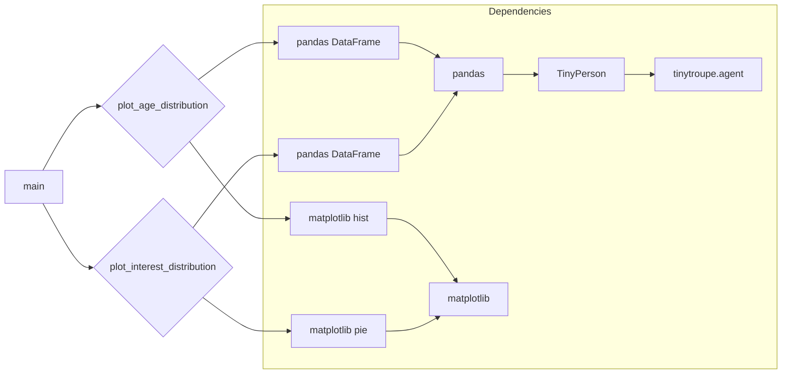

# <input code>

```python
"""
Provides mechanisms for creating understanding the characteristics of agent populations, such as
the their age distribution, typical interests, and so on.

Guideline for plotting the methods: all plot methods should also return a Pandas dataframe with the data used for 
plotting.
"""
import pandas as pd
import matplotlib.pyplot as plt
from typing import List
from tinytroupe.agent import TinyPerson

def plot_age_distribution(agents:List[TinyPerson], title:str="Age Distribution", show:bool=True):
    """
    Plots the age distribution of the given agents.

    Args:
        agents (List[TinyPerson]): The agents whose age distribution is to be plotted.
        title (str, optional): The title of the plot. Defaults to "Age Distribution".
        show (bool, optional): Whether to show the plot. Defaults to True.
    
    Returns:
        pd.DataFrame: The data used for plotting.
    """
    ages = [agent.get("age") for agent in agents]

    # corresponding dataframe
    df = pd.DataFrame(ages, columns=["Age"])
    df["Age"].plot.hist(bins=20, title=title)
    if show:
        plt.show()

    return df
    

def plot_interest_distribution(agents:List[TinyPerson], title:str="Interest Distribution", show:bool=True):
    """
    Plots the interest distribution of the given agents.

    Args:
        agents (List[TinyPerson]): The agents whose interest distribution is to be plotted.
        title (str, optional): The title of the plot. Defaults to "Interest Distribution".
        show (bool, optional): Whether to show the plot. Defaults to True.
    
    Returns:
        pd.DataFrame: The data used for plotting.
    """
    interests = [agent.get("interests") for agent in agents]

    # corresponding dataframe
    df = pd.DataFrame(interests, columns=["Interests"])

    # let's plot a pie chart
    df["Interests"].value_counts().plot.pie(title=title)
    if show:
        plt.show()

    return df
```

# <algorithm>

**plot_age_distribution:**

1. Takes a list of `TinyPerson` agents and optional title and display flag.
2. Extracts the ages from the agents, creating a list called `ages`.
3. Creates a Pandas DataFrame (`df`) from the `ages` list, setting the column name to "Age".
4. Plots a histogram of the ages using `df["Age"].plot.hist()` with 20 bins and the provided title.
5. Displays the plot if `show` is True.
6. Returns the DataFrame `df` containing the age data.

**Example:**

If `agents` contains 5 agents with ages [20, 25, 30, 20, 25], `df` will look like this:
```
   Age
0   20
1   25
2   30
3   20
4   25
```

**plot_interest_distribution:**

1. Takes a list of `TinyPerson` agents and optional title and display flag.
2. Extracts the interests from the agents, creating a list called `interests`.
3. Creates a Pandas DataFrame (`df`) from the `interests` list, setting the column name to "Interests".
4. Plots a pie chart of the interest distribution using `df["Interests"].value_counts().plot.pie()`. This creates a pie chart showing the counts of each interest.
5. Displays the plot if `show` is True.
6. Returns the DataFrame `df` containing the interest data.

**Example:**

If `agents` contains 5 agents with interests ['music', 'sports', 'music', 'sports', 'music'], `df` will initially look like:
```
   Interests
0      music
1     sports
2      music
3     sports
4      music
```
Then `df["Interests"].value_counts()` will create a Series showing the counts of each interest (e.g. music: 3, sports: 2).  The pie chart will reflect these counts.


# <mermaid>



# <explanation>

**Imports:**

- `pandas as pd`: Used for data manipulation and analysis, specifically creating DataFrames and plotting.
- `matplotlib.pyplot as plt`: Used for creating visualizations (histograms and pie charts).
- `from typing import List`: Provides type hinting for the `agents` parameter in the functions.
- `from tinytroupe.agent import TinyPerson`: Imports the `TinyPerson` class from the `tinytroupe.agent` module. This indicates a dependency on the `TinyPerson` class definition within the `tinytroupe` package, which presumably contains other agent-related functionality. This is a crucial part of the code's organization.

**Classes:**

- `TinyPerson`:  The code assumes that a `TinyPerson` class exists in the `tinytroupe/agent.py` file.  The code needs the `TinyPerson` to retrieve the agent's age and interests.  There's no definition of the `TinyPerson` class shown, so we are relying on its existence and methods. This class is part of a larger ecosystem, presumably storing agent data (like age and interests) and providing methods to access it (`get("age")` and `get("interests")`).

**Functions:**

- `plot_age_distribution(agents, title="Age Distribution", show=True)`: Takes a list of `TinyPerson` agents, an optional title, and a flag to show the plot. Calculates the age distribution using a histogram, and returns the DataFrame containing the age data.
- `plot_interest_distribution(agents, title="Interest Distribution", show=True)`:  Similar to `plot_age_distribution`, but plots the interest distribution as a pie chart.

**Variables:**

- `agents`: A list of `TinyPerson` objects. This is the input data for plotting functions.
- `ages`, `interests`: Lists holding the age and interest data extracted from the `agents` list.
- `df`: Pandas DataFrame used to store and plot the data.
- `title`, `show`: Optional arguments for the plot.

**Possible Errors/Improvements:**

- **Error Handling:** The code lacks error handling. If an agent doesn't have an "age" or "interests" attribute, or if the `agents` list is empty, exceptions could occur.  Adding `try...except` blocks would make the code more robust.
- **Data Validation:** It's important to ensure that the "age" values are valid numbers and that "interests" are stored in a consistent format (e.g., string or list of strings).  Using type hinting with `typing.Union` and stricter checks would prevent incorrect data types.
- **Flexibility:** The `bins` argument in `plot_age_distribution` is set to 20.  It might be useful to make this parameter configurable.  More descriptive labels in plots and perhaps the ability to specify plotting style parameters would add value.  For example, different color options for pie charts.
- **Efficiency:** Extracting data into `ages` and `interests` lists might become inefficient with very large datasets. Consider using pandas vectorized operations or other optimized methods to avoid looping if the number of `TinyPerson` objects in the input is very large.
- **Documentation:** While the docstrings are good, more detailed explanations of the expected input types (e.g., what format "interests" should be in) would prevent issues.

**Relationships with other parts of the project:**

The code relies heavily on the `TinyPerson` class, which is presumably defined elsewhere in the `tinytroupe` package.  Thus the `tinytroupe` package and possibly other parts of the application using these plotting methods (like a main entry point) are all part of a larger program. These components need to be in sync.  There would be likely functions to create or manage these `TinyPerson` objects.