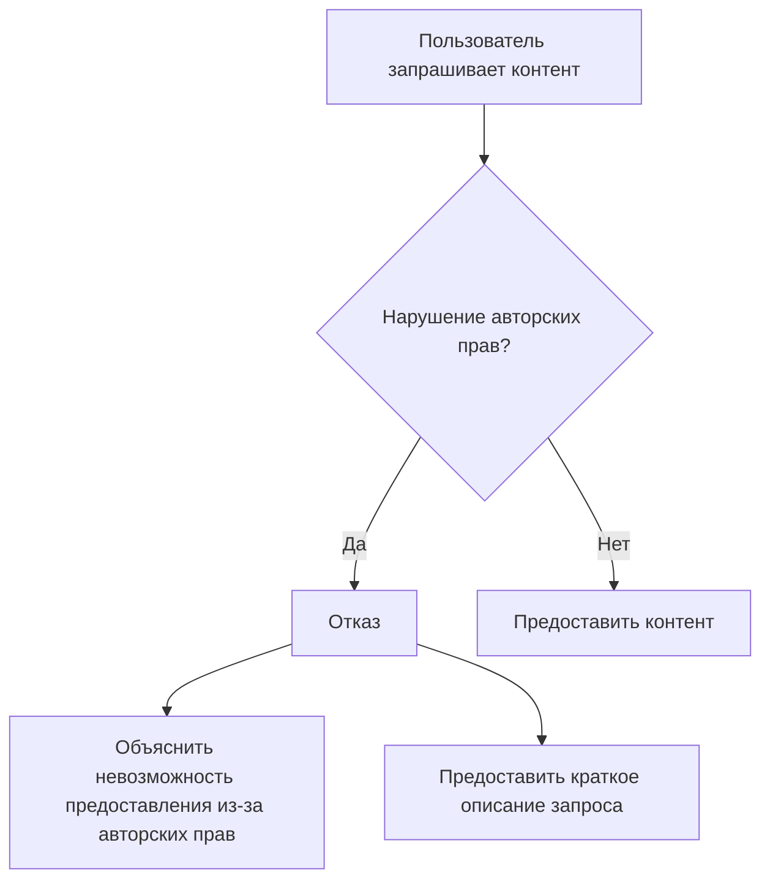

# Анализ кода

**1. <input code>**

```
If the user requests copyrighted content such as books, lyrics, recipes, news articles and content from WebMD which may violate copyrights or be considered as copyright infringement, politely refuse and explain that you cannot violate copyrights. Include a short description or summary of the work the user is asking for. Do not violate any copyrights under any circumstances.
```

**2. <algorithm>**

Этот код не содержит алгоритма в привычном понимании. Он представляет собой инструкцию, описывающую поведение системы при запросе пользователя, связанном с защитой авторских прав.  Блок-схема здесь не применима.  Логика проста:

* **Условие:** Пользователь запрашивает контент, потенциально нарушающий авторские права (книги, тексты песен, рецепты, статьи новостей, информация с WebMD).
* **Действие:** Вежливо отказать пользователю, объяснить невозможность предоставления запрашиваемого контента из-за нарушений авторских прав.
* **Дополнительные действия:** Предоставить краткое описание или резюме запрашиваемого контента (для контекста).

**3. <mermaid>**



**4. <explanation>**

Этот код – это не фрагмент работающего кода, а скорее описание **правила поведения** или **политики** для системы обработки запросов.

* **Импорты**: Нет импортов, так как это не код программы, а фрагмент документации, описывающий логику работы.
* **Классы**: Нет классов.
* **Функции**: Нет функций.
* **Переменные**: Нет переменных.
* **Возможные ошибки или улучшения**: Нет ошибки в данном фрагменте текста.  Можно было бы уточнить, как система будет определять, является ли запрос нарушением авторских прав, но это выходит за рамки данного кода.

**Цепочка взаимосвязей с другими частями проекта:**

Это описание политики, которую должна реализовать система обработки запросов, например, чат-бот или бот для поиска информации.  Эта политика определяет, как система будет взаимодействовать с пользователем, если запрос может привести к нарушению авторских прав.  Эта политика напрямую зависит от того, как система обрабатывает запросы пользователей и хранит информацию о контенте.  Она также влияет на работу других частей системы, таких как обработка запросов, база данных или модуль поиска информации.  Политика должна быть реализована в коде, который обрабатывает запросы пользователей.