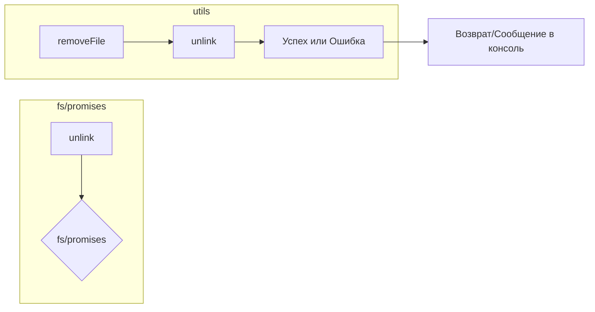

# Анализ кода utils.js

**1. <input code>**

```javascript
import { unlink } from 'fs/promises'
export async function removeFile(path) {
    try {
        await unlink(path)
    } catch (e) {
        console.log('Error while removing file', e.message)
    }
}
```

**2. <algorithm>**

```mermaid
graph TD
    A[Вход path] --> B{Проверка существования файла};
    B -- Существует --> C[unlink(path)];
    C --> D[Успех];
    B -- Не существует --> E[Ошибка];
    E --> F[Вывести ошибку в консоль];
    D --> G[Возврат];
    F --> G;
```

**Пример:**

Если `path` указывает на файл `myFile.txt`, алгоритм будет пытаться удалить этот файл. Если удаление прошло успешно, функция вернёт управление. Если произойдёт ошибка (например, файл не найден или нет доступа), будет выведена соответствующая информация в консоль.

**3. <mermaid>**



**Объяснение диаграммы:**

Диаграмма показывает зависимость функции `removeFile` от модуля `fs/promises`.  `unlink` - это асинхронная функция из `fs/promises`, используемая для удаления файла.  `removeFile` -  функция, которая оборачивает `unlink` и обрабатывает потенциальные ошибки.

**4. <explanation>**

* **Импорты:**
    * `import { unlink } from 'fs/promises'`:  Импортирует функцию `unlink` из модуля `fs/promises`. Этот модуль предоставляет асинхронные методы для работы с файловой системой Node.js.  Связь с другими частями проекта:  `utils.js` использует низкоуровневый модуль `fs/promises` для выполнения конкретной задачи – удаления файлов.  Эта функция скорее всего используется в других частях приложения для управления файлами (например, при удалении временных файлов или логов).

* **Функции:**
    * `removeFile(path)`:
        * **Аргументы:** `path` (строка) – путь к файлу, который нужно удалить.
        * **Возвращаемое значение:** Асинхронная функция, которая не возвращает явного значения.  Она работает асинхронно, и успех/ошибка обрабатываются внутри функции.
        * **Назначение:** Функция асинхронно удаляет файл по указанному пути.
        * **Пример:**
            ```javascript
            const filePath = '/tmp/myTempFile.txt';
            removeFile(filePath)
                .then(() => console.log('File removed successfully'))
                .catch(err => console.error('Failed to remove file:', err));
            ```
        * **Обработка ошибок:** Использование `try...catch` обрабатывает потенциальные ошибки при удалении файла (например, файл не существует, нет прав доступа).  Это важно для устойчивости приложения.


* **Переменные:**
    * Нет объявленных глобальных переменных.

* **Возможные ошибки/улучшения:**
    * **Обработка не-строкового пути**: Функция не проверяет тип `path`. Если передан не строковый тип, то может произойти ошибка. Можно добавить проверку типа, например:
      ```javascript
      if (typeof path !== 'string') {
          console.error('Invalid path type.');
          return; // Или throw new Error(...)
      }
      ```
    * **Улучшение сообщений об ошибках**: Сообщение `console.log('Error while removing file', e.message)` можно сделать более информативным, например, указав конкретный путь к файлу, который не удалось удалить.
    * **Логирование**:  Для более сложных сценариев, вероятно, потребуется более полное логирование, используя, например, библиотеку для логирования (например, Winston).

**Цепочка взаимосвязей:**

Функция `removeFile` используется в других частях проекта для удаления файлов, созданных приложением.  Она не связана напрямую с какими-то специфическими частями приложения, но играет критическую роль в управлении данными и ресурсами.