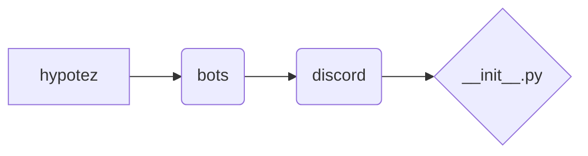

# <input code>

```python
## \file hypotez/src/bots/discord/__init__.py
# -*- coding: utf-8 -*-\
#! venv/Scripts/python.exe
#! venv/bin/python/python3.12

"""
.. module: src.bots.discord 
	:platform: Windows, Unix
	:synopsis:

"""
MODE = 'dev'

"""
	:platform: Windows, Unix
	:synopsis:

"""


"""
	:platform: Windows, Unix
	:synopsis:

"""


"""
  :platform: Windows, Unix

"""
"""
  :platform: Windows, Unix
  :platform: Windows, Unix
  :synopsis:
"""MODE = 'dev'
  
""" module: src.bots.discord """

```

# <algorithm>

Этот код представляет собой пустой модуль `__init__.py` для пакета `discord` внутри пакета `bots` проекта `hypotez`.  Он не содержит логики выполнения и функциональности.  Алгоритм работы не определен, так как нет ни одной функции, класса или переменной с действием.

# <mermaid>



# <explanation>

Этот файл `__init__.py` является частью пакета `discord` внутри пакета `bots` проекта `hypotez`.  Он предназначен для инициализации этого пакета, но фактически пуст.  Различные строки с документацией (`"""Docstrings"""`) не выполняют никакой логической задачи, а лишь служат для комментариев и, возможно, будут использоваться системами документирования.

* **Импорты**:  В этом файле отсутствуют импорты.  Если в дальнейшем будут нужны какие-либо классы или функции из других модулей, то импорты должны быть добавлены сюда.

* **Классы**:  В файле нет ни одного класса.

* **Функции**:  Нет функций.

* **Переменные**: Единственная переменная `MODE = 'dev'`, но она не используется ни в одной функции или методе.  Это, скорее всего, конфигурационная переменная, значение которой может быть использовано в других частях проекта для определения режима работы (например, `dev`, `prod`).


**Возможные ошибки или области для улучшений**:

* **Отсутствие логики**: Файл `__init__.py` пуст и не содержит никакой функциональности.  В таком виде он не оказывает влияния на работу проекта.
* **Неясное назначение**:  Непонятно, для чего служит эта переменная `MODE`.  Её назначение должно быть уточнено и объяснено в коде или в документации.

**Взаимосвязи с другими частями проекта**:

Файл `__init__.py` в папке `discord` находится в иерархии пакета `bots` проекта `hypotez`.  Он должен быть связан с другими файлами в папке `discord` через импорты, если эти файлы содержат классы или функции, которые будут использоваться в этом проекте.  Например, если в других файлах пакета `discord` есть классы ботов или функции для взаимодействия с Discord API, то они будут импортированы в этот файл или в другие файлы, которые используют функциональность Discord бота.