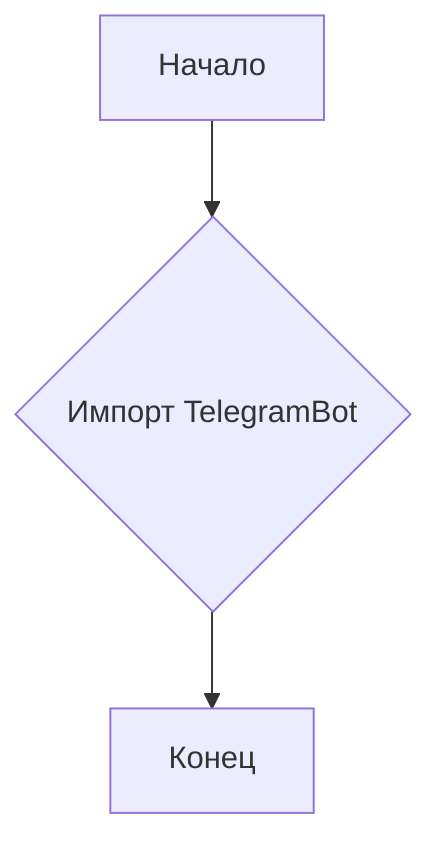

```MD
# <input code>

```python
## \file hypotez/src/bots/telegram/__init__.py
# -*- coding: utf-8 -*-
#! venv/Scripts/python.exe
#! venv/bin/python/python3.12

"""
.. module: src.bots.telegram 
	:platform: Windows, Unix
	:synopsis:

"""
MODE = 'dev'

from .bot import TelegramBot
```

# <algorithm>

Этот код определяет модуль `src.bots.telegram`.  Он содержит константу `MODE` со значением 'dev' и импортирует класс `TelegramBot` из подмодуля `bot`.

**Блок-схема:**



**Пример данных:**

* `MODE` хранит строку 'dev'.
* Импорт `TelegramBot` подразумевает, что в `hypotez/src/bots/telegram/bot.py` определен класс `TelegramBot`.

# <mermaid>

```mermaid
graph LR
    A[hypotez/src] --> B(src/bots);
    B --> C(src/bots/telegram);
    C --> D[TelegramBot];
    
    subgraph "Другие части проекта"
        D -- Использование -- E[Другой модуль];
    end
```

# <explanation>

* **Импорты:**
    * `from .bot import TelegramBot`: Импортирует класс `TelegramBot` из файла `bot.py` в текущем каталоге (`hypotez/src/bots/telegram`). Символ `.` указывает на относительный путь.  Это стандартная Python практика для импорта модулей и подмодулей внутри проекта.

* **Классы:**
    * `TelegramBot`: Этот класс, определённый в файле `bot.py`, отвечает за взаимодействие с Telegram API.  Необходимость такого класса указывает на то, что данный проект предполагает бота для Telegram.  Подробное описание класса содержится в файле `bot.py`.

* **Функции:**
    * Нет функций, только класс и переменная `MODE`.

* **Переменные:**
    * `MODE = 'dev'`:  Строковая константа, вероятно, для обозначения режима работы (например, `dev` для разработки, `prod` для производства).  Это позволит в будущем изменять поведение кода в зависимости от значения переменной.

* **Возможные ошибки/улучшения:**
    * Отсутствие описания/документации для класса `TelegramBot` в файле `bot.py` делает код менее понятным. Должен быть комментарий, описывающий его назначение и методы.
    * Нет указаний на какие-либо библиотеки или зависимости, необходимые для работы класса `TelegramBot`.  Скорее всего, требуется библиотека, например, `python-telegram-bot`.


**Взаимосвязи с другими частями проекта:**

Этот модуль (`hypotez/src/bots/telegram/__init__.py`) импортирует класс `TelegramBot`.  Это указывает на то, что существует более широкая архитектура проекта, где класс `TelegramBot` используется для взаимодействия с другим кодом или логикой, скорее всего, через вызовы методов класса `TelegramBot` в другом месте проекта.  Без просмотра файлов проекта `bot.py` и других файлов, точные взаимосвязи остаются неясными.  В дальнейшем нужно проанализировать и другие файлы, входящие в проект, для полного понимания цепочки зависимостей.