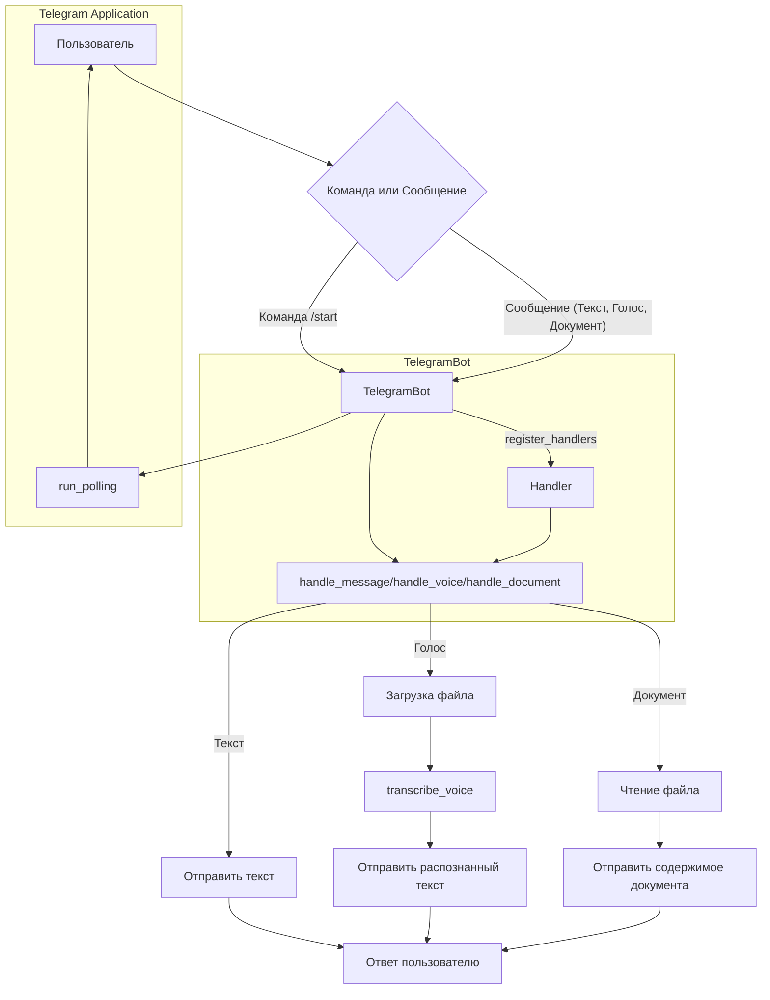

# <input code>

```python
## \file hypotez/src/bots/telegram/bot.py
# -*- coding: utf-8 -*-
#! venv/Scripts/python.exe
#! venv/bin/python/python3.12

"""
.. module: src.bots.telegram 
	:platform: Windows, Unix
	:synopsis:

"""
MODE = 'dev'

from pathlib import Path
import tempfile
import asyncio
from telegram import Update
from telegram.ext import Application, CommandHandler, MessageHandler, filters, CallbackContext

import header
from  src import gs
from src.utils import j_loads, j_loads_ns, j_dumps
from src.logger import logger
import requests  # For downloading files
from src.utils.convertors.tts import speech_recognizer, text2speech
from src.utils.file import read_text_file

class TelegramBot:
    """Telegram bot interface class."""

    application: Application

    def __init__(self, token: str):
        """Initialize the Telegram bot.

        Args:
            token (str): Telegram bot token, e.g., `gs.credentials.telegram.bot.kazarinov`.
        """
        self.application = Application.builder().token(token).build()
        self.register_handlers()

    def register_handlers(self):
        """Register bot commands and message handlers."""
        self.application.add_handler(CommandHandler('start', self.start))
        self.application.add_handler(CommandHandler('help', self.help_command))
        self.application.add_handler(MessageHandler(filters.TEXT & ~filters.COMMAND, self.handle_message))
        self.application.add_handler(MessageHandler(filters.VOICE, self.handle_voice))  # Новый обработчик голосовых сообщений
        self.application.add_handler(MessageHandler(filters.Document.ALL, self.handle_document))

    async def start(self, update: Update, context: CallbackContext) -> None:
        """Handle the /start command."""
        await update.message.reply_text('Hello! I am your simple bot. Type /help to see available commands.')

    async def help_command(self, update: Update, context: CallbackContext) -> None:
        """Handle the /help command."""
        await update.message.reply_text(
            'Available commands:\n'
            '/start - Start the bot\n'
            '/help - Show this help message'
        )

    async def handle_voice(self, update: Update, context: CallbackContext) -> None:
        """Handle voice messages and transcribe the audio."""
        try:
            voice = update.message.voice
            file = await context.bot.get_file(voice.file_id)
            file_path = gs.path.temp / f'{voice.file_id}.ogg'

            await file.download_to_drive(file_path)

            transcribed_text = self.transcribe_voice(file_path)

            await update.message.reply_text(f'Распознанный текст: {transcribed_text}')
        except Exception as ex:
            logger.error('Ошибка при обработке голосового сообщения: ', ex)
            await update.message.reply_text('Произошла ошибка при обработке голосового сообщения. Попробуй ещё раз.')

    def transcribe_voice(self, file_path: Path) -> str:
        """Transcribe voice message using a speech recognition service."""
        return 'Распознавание голоса ещё не реализовано.'

    async def handle_document(self, update: Update, context: CallbackContext) -> str:
        """Handle received documents."""
        file = await update.message.document.get_file()
        tmp_file_path = await file.download_to_drive()
        return read_text_file(tmp_file_path)

    async def handle_message(self, update: Update, context: CallbackContext) -> str:
        """Handle any text message."""
        return update.message.text

    async def handle_voice(self, update: Update, context: CallbackContext) -> str:
        """Handle voice messages."""
        voice_file = await update.message.voice.get_file()
        return speech_recognizer(audio_url=voice_file.file_path)

def main() -> None:
    """Start the bot."""
    token = gs.credentials.telegram.bot.kazarinov
    bot = TelegramBot(token)

    bot.application.add_handler(CommandHandler('start', bot.start))
    bot.application.add_handler(CommandHandler('help', bot.help_command))

    bot.application.add_handler(MessageHandler(filters.TEXT & ~filters.COMMAND, bot.handle_message))
    bot.application.add_handler(MessageHandler(filters.VOICE, bot.handle_voice))
    bot.application.add_handler(MessageHandler(filters.Document.ALL, bot.handle_document))

    bot.application.run_polling()

if __name__ == '__main__':
    main()
```

# <algorithm>

**Пошаговая блок-схема:**

1. **Инициализация:**
   - Получение токена Telegram бота из `gs.credentials.telegram.bot.kazarinov`.
   - Создание экземпляра класса `TelegramBot` с передачей токена.
   - Регистрация обработчиков команд и сообщений с помощью `register_handlers()`.

2. **Обработка команд:**
   - `/start`: отправляет приветственное сообщение пользователю.
   - `/help`: отправляет справку с доступными командами.

3. **Обработка сообщений:**
   - **Текст:**
     - Получение текста сообщения с помощью `handle_message`.
   - **Голос:**
     - Загрузка голосового файла на локальную систему.
     - Вызов функции распознавания речи `transcribe_voice` (заглушка).
     - Отправка распознанного текста пользователю.
   - **Документ:**
     - Загрузка документа на локальную систему.
     - Чтение текста из документа с помощью `read_text_file`.
     - Отправка содержимого документа пользователю.

4. **Запуск бота:**
   - Запуск `application.run_polling()`, который слушает обновления от Telegram.

**Примеры данных:**

- **Вход:** `/start` (команда)
- **Выход:** `Hello...` (ответ бота)
- **Вход:** голосовое сообщение
- **Выход:** `Распознанный текст: Привет, мир!` (ответ бота)

**Передвижение данных:**

- Токен передаётся в конструктор `TelegramBot`.
- `Update` объект содержит данные о сообщении.
- Файл голосового сообщения загружается на локальную систему и передаётся в `transcribe_voice` для обработки.


# <mermaid>




# <explanation>

**Импорты:**

- `from pathlib import Path`:  Используется для работы с путями к файлам.
- `import tempfile`:  Используется для временных файлов, хотя в данном коде возможно не используется.
- `import asyncio`:  Используется для асинхронного выполнения операций, необходим для работы с Telegram API.
- `from telegram import Update`:  Объект, содержащий данные о сообщении от пользователя.
- `from telegram.ext import Application, CommandHandler, MessageHandler, filters, CallbackContext`:  Пакет для создания и управления Telegram ботом.
- `import header`:  Вероятно, содержит конфигурацию или вспомогательные функции. Необходимость проанализировать.
- `from src import gs`:  Связь с основным хранилищем данных, например, конфигурационными файлами.
- `from src.utils import j_loads, j_loads_ns, j_dumps`:  Функции для работы с JSON.
- `from src.logger import logger`:  Система логирования.
- `import requests`:  Для скачивания файлов.
- `from src.utils.convertors.tts import speech_recognizer, text2speech`:  Функции для работы с речью.
- `from src.utils.file import read_text_file`:  Функция для чтения текста из файла.


**Классы:**

- `TelegramBot`:  Интерфейс для управления Telegram ботом.
    - `application`: Объект приложения Telegram.
    - `__init__(self, token: str)`: Инициализирует бота с токеном.
    - `register_handlers(self)`: Регистрирует обработчики команд и сообщений.
    - `start(self, update: Update, context: CallbackContext)`: Обрабатывает команду `/start`.
    - `help_command(self, update: Update, context: CallbackContext)`: Обрабатывает команду `/help`.
    - `handle_voice(self, update: Update, context: CallbackContext)`: Обрабатывает голосовые сообщения.
    - `transcribe_voice(self, file_path: Path) -> str`:  Функция для распознавания речи. (Заглушка)
    - `handle_document(self, update: Update, context: CallbackContext) -> str`: Обрабатывает документы.
    - `handle_message(self, update: Update, context: CallbackContext) -> str`: Обрабатывает текстовые сообщения.

**Функции:**

- `main()`: Точка входа для запуска бота.


**Переменные:**

- `MODE`: Вероятно, константа, определяющая режим работы бота.

**Возможные ошибки и улучшения:**

- Отсутствие реализации `transcribe_voice`:  Функция распознавания речи является заглушкой. Необходимо заменить на реальную реализацию, возможно используя Google Cloud Speech-to-Text API или подобный сервис.
- Недостаточная обработка ошибок:  Обработка исключений в `handle_voice` является хорошим примером, но необходимо расширить обработку ошибок для других функций.
- Логирование:  Логирование ошибок, выполнение операций.
- Возможное использование временных файлов: `tempfile` скорее всего необходим, но может быть неправильно использован.
- Отсутствие проверки на валидность token: Необходимо добавить валидацию на наличие токена.


**Взаимосвязи с другими частями проекта:**

- `gs`: Возможно, модуль для работы с Google Cloud Storage или другой сервисной инфраструктурой.
- `src.utils.convertors.tts`: Модуль для конвертации речи.
- `src.utils.file`: Модуль для работы с файлами.


**Общее впечатление:**

Код достаточно структурирован и понятен.  Реализован базовый функционал бота. Необходимо доработать распознавание речи и добавить обработку ошибок для повышения устойчивости.