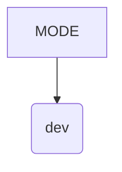
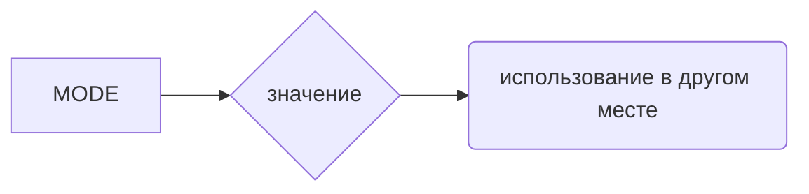

# <input code>

```python
## \file hypotez/src/bots/telegram/logger.py
# -*- coding: utf-8 -*-\
#! venv/Scripts/python.exe
#! venv/bin/python/python3.12

"""
.. module: src.bots.telegram.logger 
	:platform: Windows, Unix
	:synopsis: Модуль логгирования телеграм ботов

"""
MODE = 'dev'
```

# <algorithm>

Этот код представляет собой фрагмент Python-модуля, который, скорее всего, является частью более крупного проекта (например, телеграм-бота).  Он определяет константу `MODE` со значением 'dev'.  Поскольку это очень короткий код,  алгоритм работы сводится к простому определению переменной.  На этом уровне нет циклов, условных операторов или вызовов функций.



Пример: Значение `MODE` будет использоваться где-то в других частях кода проекта, например, для настройки уровня логгирования или других параметров работы в зависимости от фазы разработки ('dev', 'prod' и т.п.).


# <mermaid>



# <explanation>

* **Импорты**: В данном фрагменте кода нет импортов. Это значит, что он не зависит от других модулей или библиотек.


* **Классы**: Нет определенных классов.


* **Функции**: Нет функций.


* **Переменные**: `MODE` – константа строкового типа, хранящая значение 'dev'.  Она, скорее всего, будет использована в других частях кода для настройки поведения приложения.


* **Возможные ошибки или улучшения**: Нет ошибок. Единственным возможным улучшением может быть добавление документации для `MODE` с разъяснением возможных значений (например, 'dev', 'prod'). В идеале, она должна использоваться в рамках более широкой системы конфигурации.


* **Взаимосвязи с другими частями проекта**:  `MODE` скорее всего будет использоваться в других модулях или скриптах проекта, например, для выбора логгера (различные логгера для отладки и для релиза) или других конфигурационных параметров.  Эта константа служит точкой доступа к глобальной настройке. Без контекста остальной части проекта сложно понять точное назначение.  Это, скорее всего, фрагмент из файла конфигурации для запуска приложения, а не непосредственно код телеграм-бота.


**Выводы**:  Код крайне прост и представляет собой всего лишь определение константы. Она используется для настройки параметров в других частях проекта.  Необходимо изучить контекст, в котором используется эта константа, чтобы понять ее роль в системе.