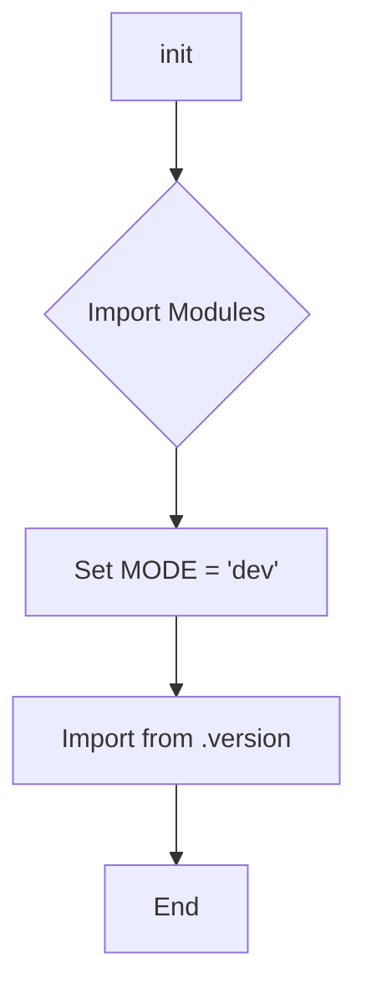
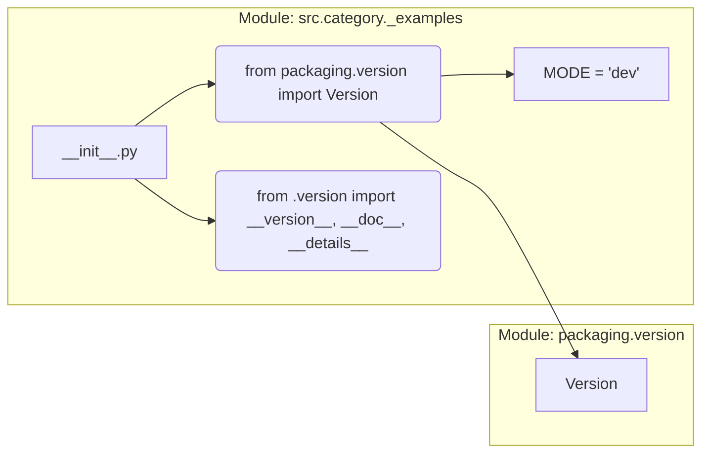

# <input code>

```python
## \file hypotez/src/category/_examples/__init__.py
# -*- coding: utf-8 -*-\
#! venv/Scripts/python.exe
#! venv/bin/python/python3.12

"""
.. module: src.category._examples 
	:platform: Windows, Unix
	:synopsis:

"""
MODE = 'dev'

"""
	:platform: Windows, Unix
	:synopsis:

"""


"""
	:platform: Windows, Unix
	:synopsis:

"""


"""
  :platform: Windows, Unix

"""
"""
  :platform: Windows, Unix
  :platform: Windows, Unix
  :synopsis:
"""MODE = 'dev'
  
""" module: src.category._examples """


""" @namespace src.category._examples """


""" """
...

from packaging.version import Version
from .version import __version__, __doc__, __details__
```

# <algorithm>

Алгоритм работы кода очень прост. Он импортирует необходимые модули и устанавливает глобальную переменную MODE со значением 'dev'.  В данном случае, функция по сути является пустой точкой входа в модуль.  Код описывает свой модуль, и импортирует переменные/функции из подмодуля `version`.  Подробности работы `version` модуля не ясны без его кода.




**Пример:**

Если в подмодуле `.version`  есть переменная `__version__` со значением '1.0.0', то после выполнения кода, переменная `__version__` будет доступна в текущем модуле.


# <mermaid>




# <explanation>

* **Импорты:**
    * `from packaging.version import Version`: Импортирует класс `Version` из пакета `packaging.version`. Этот пакет, вероятно, используется для работы с версиями программного обеспечения.  Использование класса `Version` позволяет проводить сравнения версий, проверять соответствия, и, возможно, обрабатывать информацию о версиях софта.
    * `from .version import __version__, __doc__, __details__`: Импортирует переменные `__version__`, `__doc__`, и `__details__` из модуля `version.py`  в текущем каталоге (`./version.py`). Это предполагает наличие `version.py` внутри каталога `src/category/_examples/`.  Эти переменные, скорее всего, содержат информацию о версии модуля, документацию (docstring) и другие детали.


* **Классы:**  Нет явных классов в данном коде.

* **Функции:**  Нет функций в данном коде.  Есть константная переменная `MODE`.

* **Переменные:**
    * `MODE`: Глобальная переменная, хранящая строку 'dev'. Вероятно, используется для определения режима работы (например, разработка, производство).

* **Возможные ошибки или области для улучшений:**

    * Отсутствие документации (docstrings) для переменной `MODE` и других импортируемых переменных. Добавьте docstrings для повышения читабельности и понимания назначения переменных.
    * Отсутствие блока `if __name__ == "__main__":`. Этот блок позволяет выполнить код внутри модуля только при прямом его запуске, а не при импорте в другой модуль.


* **Взаимосвязи с другими частями проекта:** Модуль импортирует переменные из `version.py`, находящегося в подкаталоге `src/category/_examples/`. Это указывает на существование `version.py` и его связи с текущим модулем.
  Без доступа к `version.py`, сложно точно определить полный смысл и контекст кода.

**Дополнительные замечания:**

* В коде много комментариев-docstring, но они неполные и неактуальные. Необходимо улучшить документацию для лучшего понимания.
* `#! venv/Scripts/python.exe` и `#! venv/bin/python/python3.12` — это магические строки, определяющие интерпретатор Python. Они не влияют на функциональность при импорте модуля, но важны при прямом запуске скрипта из командной строки.
* `...` в конце кода означает, что есть часть кода, которая не показана. Необходимо видеть полный код для полного понимания.