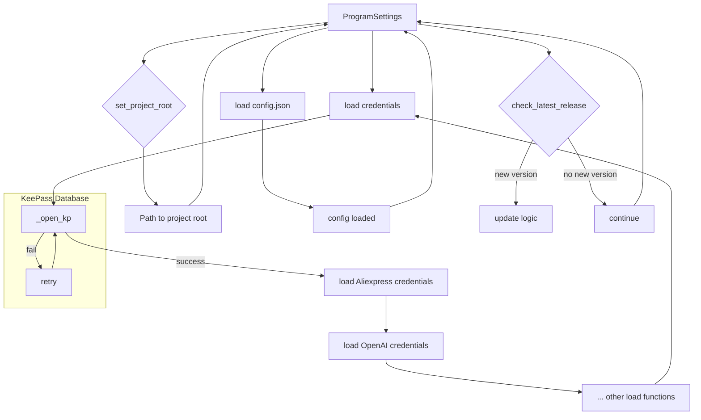

# <input code>

```python
## \file hypotez/src/credentials.py
# -*- coding: utf-8 -*-\
#! venv/Scripts/python.exe
#! venv/bin/python/python3.12

"""
.. module: src 
	:platform: Windows, Unix
	:synopsis: Global Project Settings: paths, passwords, logins, and API settings

"""
MODE = 'dev'


import datetime
from datetime import datetime
import getpass
import os
import sys
import json
import warnings
from dataclasses import dataclass, field
from pathlib import Path
from types import SimpleNamespace
from typing import Optional

from pydantic import BaseModel, Field
from pykeepass import PyKeePass

from src.check_release import check_latest_release
from src.logger.logger import logger
from src.logger.exceptions import (
    BinaryError,
    CredentialsError,
    DefaultSettingsException,
    HeaderChecksumError,
    KeePassException,
    PayloadChecksumError,
    UnableToSendToRecycleBin,
)
from src.utils.file import read_text_file
from src.utils.jjson import j_loads, j_loads_ns
from src.utils.printer import pprint

def set_project_root(marker_files=('pyproject.toml', 'requirements.txt', '.git')) -> Path:
    """
    Finds the root directory of the project starting from the current file's directory,
    searching upwards and stopping at the first directory containing any of the marker files.


    Args:
        marker_files (tuple): Filenames or directory names to identify the project root.

    Returns:
        Path: Path to the root directory if found, otherwise the directory where the script is located.
    """
    __root__:Path
    current_path:Path = Path(__file__).resolve().parent
    __root__ = current_path
    for parent in [current_path] + list(current_path.parents):
        if any((parent / marker).exists() for marker in marker_files):
            __root__ = parent
            break
    if __root__ not in sys.path:
        sys.path.insert(0, str(__root__))
    return __root__

def singleton(cls):
    """Декоратор для реализации Singleton."""
    instances = {}

    def get_instance(*args, **kwargs):
        if cls not in instances:
            instances[cls] = cls(*args, **kwargs)
        return instances[cls]

    return get_instance

@singleton
class ProgramSettings(BaseModel):
    """ 
    `ProgramSettings` - класс настроек программы.

    Синглтон, хранящий основные параметры и настройки проекта.
    """

    class Config:
        arbitrary_types_allowed = True


    base_dir: Path = Field(default_factory=lambda: set_project_root())
    config: SimpleNamespace = Field(default_factory=lambda: SimpleNamespace())
    credentials: SimpleNamespace = field(default_factory=lambda: SimpleNamespace(
        aliexpress=SimpleNamespace(
            api_key=None,
            secret=None,
            tracking_id=None,
            username=None,
            email=None,
            password=None
        ),
        presta=SimpleNamespace(
            translations=SimpleNamespace(
                server=None,
                port=None,
                database=None,
                user=None,
                password=None,
            ),
            client=[SimpleNamespace(
                server=None,
                port=None,
                database=None,
                user=None,
                password=None,
            )]
        ),
        openai=SimpleNamespace(
            api_key=None, 
            assistant_id=SimpleNamespace(), 
            project_api=None
        ),
        gemini=SimpleNamespace(api_key=None),
        rev_com=SimpleNamespace(client_api=None,
                                user_api=None),
        shutter_stock=SimpleNamespace(token=None),
        discord=SimpleNamespace(
            application_id=None, 
            public_key=None, 
            bot_token=None
        ),
        telegram=SimpleNamespace(
            bot=SimpleNamespace()
        ),
        smtp=[],
        facebook=[],
        gapi={}
    ))
    MODE: str = Field(default='development')
    path: SimpleNamespace = Field(default_factory=lambda: SimpleNamespace(
        root = None,
        src = None,
        bin = None,
        log = None,
        tmp = None,
        data = None,
        secrets = None,
        google_drive = None,
        external_storage = None,
        dev_null ='nul' if sys.platform == 'win32' else '/dev/null'
    ))


    def __init__(self, **kwargs):
        super().__init__(**kwargs)
        # Ваш код для выполнения __post_init__

        self.config = j_loads_ns(self.base_dir / 'src' / 'config.json')
        if not self.config:
            logger.error('Ошибка при загрузке настроек')
            ...
            return

        self.config.project_name = self.base_dir.name

        self.path = SimpleNamespace(
            root = Path(self.base_dir),
            bin = Path(self.base_dir / 'bin'), # <- тут бинарники (chrome, firefox, ffmpeg, ...)
            src = Path(self.base_dir) / 'src', # <- тут весь код
            endpoints = Path(self.base_dir) / 'src' / 'endpoints', # <- тут все клиенты
            secrets = Path(self.base_dir / 'secrets'),  # <- это папка с паролями и базой данных ! Ей нельзя попадать в гит!!!

            log = Path(getattr(self.config.path, 'log', self.base_dir / 'log')), 
            tmp = Path(getattr(self.config.path, 'tmp', self.base_dir / 'tmp')),
            data = Path(getattr(self.config.path, 'data', self.base_dir / 'data')), # <- данные от endpoints (hypo69, kazarinov, prestashop, etc ...)
            google_drive = Path(getattr(self.config.path, 'google_drive', self.base_dir / 'google_drive')), # <- шоб не упало, если беда в json
            external_storage = Path(getattr(self.config.path, 'external_storage',  self.base_dir / 'external_storage') )
        )

        # ... (rest of the code)
```


# <explanation>

**Импорты:**

Код импортирует необходимые модули для работы. Обратите внимание, что импорты начинаются с `src.`, что указывает на то, что эти модули являются частью собственной структуры проекта.  Например, `from src.check_release import check_latest_release` импортирует функцию для проверки актуальности версии из пакета `check_release`.  Остальные импорты аналогичным образом связаны с другими модулями внутри проекта.

**Классы:**

* **`ProgramSettings`:** Этот класс представляет собой настройки программы. Он является синглтоном (`@singleton`), поэтому существует только один экземпляр этого класса на протяжении всего выполнения программы.  Класс использует `pydantic` для валидации данных и определения структуры настроек. Атрибуты класса включают:
    * `base_dir`: Путь к корневой директории проекта.
    * `config`: Объект `SimpleNamespace`, содержащий настройки из `config.json`.
    * `credentials`: Объект `SimpleNamespace`, хранящий различные учетные данные (API ключи, пароли и т.д.) из базы KeePass.
    * `MODE`: Режим работы программы.
    * `path`: Объект `SimpleNamespace`, содержащий пути к различным директориям проекта.

**Функции:**

* **`set_project_root`:** Определяет корневую директорию проекта, начиная с текущего файла. Функция ищет файлы, указанные в аргументе `marker_files`, поднимаясь по директориям вверх.  Возвращает найденный корень проекта.
* **`singleton`:** Декоратор для создания синглтон-объекта.
* **`_load_credentials`:** Функция загружает все учетные данные из файла `credentials.kdbx` KeePass. Она делегирует работу функциям для каждой категории учетных данных.
* **`_open_kp`:** Функция для открытия базы KeePass. Она обрабатывает возможные исключения и повторные попытки доступа.
* Функции `_load_*_credentials`: Загружают учетные данные из KeePass для различных сервисов (Aliexpress, OpenAI, Gemini, Telegram, Discord и др.).


**Переменные:**

`MODE`, `logger` (из импортированного модуля),  и другие локальные переменные определяют различные константы, логгеры и настройки.

**Возможные ошибки и улучшения:**

* **Обработка ошибок:** Код содержит много `try...except` блоков, что хорошо для обработки потенциальных исключений при взаимодействии с KeePass.  Однако, логирование ошибок (вместо `print`) и более подробная обработка исключений (например, использование `logging` вместо `print`) значительно улучшит надежность и отладку.
* **Безопасность:** Пароль KeePass хранится в открытом виде в файле `password.txt` (как показано в коде), что является серьёзной проблемой безопасности.  Необходимо использовать более безопасные методы хранения паролей, например, криптографическое шифрование, или хранение пароля в защищённом формате (например, используя библиотеки для работы с защищёнными хранилищами). 
* **Более структурированное хранение credentials:** В `credentials` используется вложенный объект `SimpleNamespace`, что может привести к усложнению работы и не ясности.  Использование класса для каждой категории учетных данных (AliexpressCredentials, OpenAICredentials и т.д.) сделает структуру более понятной и гибкой.
* **Документация:** Некоторые функции имеют недостаточно подробную документацию.  Добавление дополнительных примеров и объяснений улучшит понимание кода другими разработчиками.
* **Общий стиль:** В коде присутствует некоторое несоответствие в именовании переменных и функций (например, mix of `_load_*_credentials` and `load_*credentials`).  Следование одному стилю сделает код более читабельным.


**Взаимосвязи с другими частями проекта:**

Код тесно связан с другими частями проекта, особенно через импорты. `check_latest_release` предполагает существование `src.check_release` модуля, который содержит логику работы с Git.  `logger` связан с  `src.logger.logger`. Это указывает на то, что `credentials.py` является частью крупнейшего проекта, использующего централизованную систему логирования.

**Краткое резюме:**

Код реализует загрузку учетных данных из базы KeePass для различных сервисов. Он использует синглтон для централизованного доступа к настройкам, и валидирует структуру данных.  Однако, код имеет слабые места в плане безопасности хранения паролей.