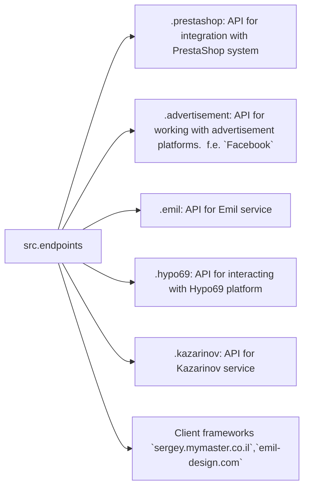
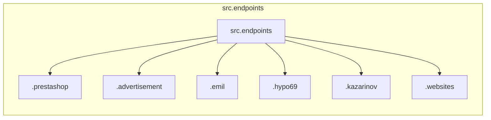

# Анализ кода модуля `endpoints`

## <input code>

```
### Data Consumer Endpoints Module
=========================================================================================

The `endpoints` module provides an implementation of APIs for interacting with data consumers.
Each subdirectory represents a separate module that implements the API for a specific service.
The `endpoints` module includes submodules for integration with various consumer systems,
ensuring seamless interaction with external services.

## Module Structure


### Final Consumer Endpoints

#### 1. **PrestaShop**
Integration with the PrestaShop API, utilizing standard API features.

#### 2. **bots**
Submodule for managing integration with Telegram and Discord bots.

#### 3. **emil**
`https://emil-design.com`
Submodule for integrating with the client at https://emil-design.com (PrestaShop + Facebook).

#### 4. **kazarinov**
`https://sergey.mymaster.co.il`,`@hypo69_kazarinov_bot`
Submodule for integrating with the Kazarinov data provider (pricelist creator, Facebook promotion).

## Module Descriptions

### 1. `prestashop`
This module is designed for integration with the PrestaShop e-commerce system. It implements functionality for managing orders, products, and customers.

- **Key Features**:
  - Create, edit, and delete products.
  - Manage orders and users.

### 2. `advertisement`
The module provides an API for managing advertising platforms, including campaign creation and analytical reports.

- **Key Features**:
  - Manage advertising campaigns.
  - Collect and process analytics data.

### 3. `emil`
Interface for working with the Emil service, providing an API for data exchange.

- **Key Features**:
  - Process and send requests to the service.
  - Retrieve data from the Emil API.

### 4. `hypo69`
API for interacting with the Hypo69 platform, which offers specific business solutions.

- **Key Features**:
  - Retrieve client data.
  - Work with custom reports.

### 5. `kazarinov`
Module for integrating with the Kazarinov service. It supports analytics and data exchange functionality.

- **Key Features**:
  - Data integration between systems.
  - Generate reports and perform analytics.

## Installation and Usage

### Installation
Ensure all project dependencies are installed before starting. Use the following command:

```bash
pip install -r requirements.txt
```

### Usage
Import the required module into your code:

```python
from src.endpoints.prestashop import PrestashopAPI
from src.endpoints.advertisement import AdvertisementAPI
```

Then configure and use the methods depending on your use case.

## Contribution

If you want to contribute to the module, please follow these guidelines:

1. Follow [PEP 8](https://peps.python.org/pep-0008/) for code style.
2. Add tests for new features.
3. Leave detailed comments for any changes.

For questions and suggestions, contact the repository owner or leave comments in [Issues](#).
```

## <algorithm>

Unfortunately, the provided text is a README file and doesn't contain code to create a flowchart.  It describes the structure and purpose of a `src.endpoints` module.  A flowchart would need code from Python files within this module to be generated.


## <mermaid>



This mermaid diagram shows the module structure, depicting the relationship between the `src.endpoints` directory and its submodules.  Each submodule is responsible for interacting with a specific external service or system (PrestaShop, advertising platforms, Emil service, etc.).


## <explanation>

The provided text describes a Python module, `src.endpoints`, designed for interacting with various external data consumers.

* **Импорты:**  The README suggests that Python code within the `src.endpoints` directory (not shown here) will import classes from the respective submodules (`prestashop`, `advertisement`, etc.).  This implies these submodules contain classes (likely representing API clients or interfaces) that handle interactions with external services.

* **Классы:** The README mentions API classes like `PrestashopAPI` and `AdvertisementAPI`. These classes would likely encapsulate the logic for interacting with the respective services (e.g., making API calls, handling responses).  Crucially, the `README` *doesn't* show the code or class implementations; it just describes the purpose.

* **Функции:**  The `README` mentions features of modules (e.g., creating/editing products in PrestaShop), but the functions implementing those features are not shown.  Methods inside the classes are not described in detail.

* **Переменные:**  The README only indirectly mentions variables—variables within the classes would be used to store data, configuration parameters (for external API calls) and results from those calls.

* **Возможные ошибки и улучшения:** The `README` does not contain code, hence analysis of potential errors and improvements is limited.  There could be issues related to error handling, security, and potential issues with external service integration. Good error handling, appropriate security measures (auth, etc.), and robust data validation would be important.

* **Взаимосвязи с другими частями проекта:** The README emphasizes that `src.endpoints` interacts with external services.  The specific interactions with other parts of the project are not detailed. Further analysis would require seeing the code within `src.endpoints` and other related parts of the project to understand its position within the entire architecture.


**Key takeaway:** This analysis focuses on the module's *intended* purpose and structure rather than on the actual code.  Without seeing the code, a detailed explanation of the implementation, potential errors, and overall efficiency is not possible.