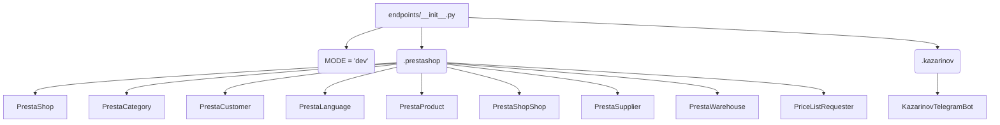

# <input code>

```python
## \file hypotez/src/endpoints/__init__.py
# -*- coding: utf-8 -*-\
#! venv/Scripts/python.exe
#! venv/bin/python/python3.12

"""
.. module: src.endpoints 
	:platform: Windows, Unix
	:synopsis:

"""
MODE = 'dev'


from .prestashop import PrestaShop, PrestaCategory, PrestaCustomer, PrestaLanguage, PrestaProduct, PrestaShopShop, PrestaSupplier, PrestaWarehouse, PriceListRequester 
from .kazarinov import KazarinovTelegramBot
```

# <algorithm>

**Шаг 1:** Импорт модулей

Код импортирует классы и модули из подпапок `prestashop` и `kazarinov`.  Пример:  `from .prestashop import PrestaShop, ...` импортирует классы `PrestaShop` и другие из файла `prestashop.py` внутри папки `endpoints`.

**Шаг 2:**  Определение константы

Код определяет переменную `MODE` со значением 'dev'.  Эта переменная, скорее всего, используется для выбора режима работы приложения (например, 'dev' - режим разработки, 'prod' - режим производства).


# <mermaid>



**Объяснение зависимостей:**

* `endpoints/__init__.py` -  является инициализирующим модулем для пакета `endpoints`.
* `prestashop` -  модуль, скорее всего, содержит классы, представляющие объекты PrestaShop (например, `PrestaShop`, `PrestaCategory`).  Этот модуль вероятно содержит логику взаимодействия с API или базой данных PrestaShop.
* `kazarinov` - модуль, скорее всего, содержит классы и логику взаимодействия с Telegram ботом, разработанным компанией или пользователем Kazarinov.

# <explanation>

**Импорты:**

Код импортирует классы, которые, по всей видимости, представляют различные сущности и функциональность, связанные с системами PrestaShop и Kazarinov Telegram Bot. Импорты организованы так, что модули `.prestashop` и `.kazarinov` являются подмодулями текущего пакета `endpoints`. Это указывает на модульную организацию проекта.

**Классы:**

* **`PrestaShop`, `PrestaCategory`, `PrestaCustomer`, `PrestaLanguage`, `PrestaProduct`, `PrestaShopShop`, `PrestaSupplier`, `PrestaWarehouse`, `PriceListRequester`:**  предположительно представляют объекты из системы PrestaShop (магазин, категории, клиенты, языки, продукты и т.д.). `PriceListRequester` вероятно отвечает за запросы к прайс-листам.  Каждый класс содержит, по всей видимости, атрибуты и методы для работы с соответствующими сущностями.
* **`KazarinovTelegramBot`:**  представляет класс для взаимодействия с Telegram ботом, скорее всего, от Kazarinov.

**Функции (поскольку в данном файле их нет):**

Отсутствуют функции.

**Переменные:**

* **`MODE`:**  Строковая переменная, скорее всего, определяет режим работы программы ('dev' по умолчанию).

**Возможные ошибки или улучшения:**

* Необходимо проверить, что файлы `.prestashop` и `.kazarinov` существуют и содержат объявления соответствующих классов.
* Возможно, стоит добавить docstrings в классы, чтобы лучше объяснить их функциональность.
* В этом файле не указана логика использования объектов.

**Взаимосвязи с другими частями проекта:**

Файл `endpoints/__init__.py` служит для организации доступа к другим модулям, связанным с интеграцией с PrestaShop и Telegram ботом.  Вероятно, существуют другие файлы в проекте, которые используют классы из этого модуля. Например, файлы, содержащие бизнес-логику, или файлы, отвечающие за обработку входящих запросов.