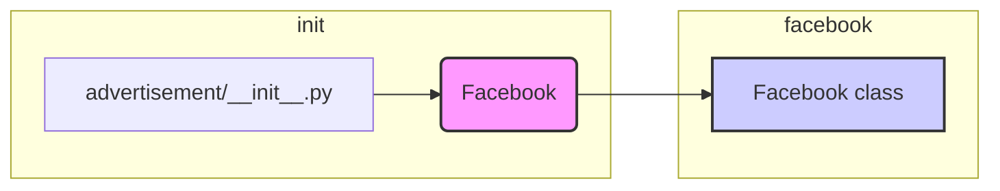

```MD
# <input code>

```python
## \file hypotez/src/endpoints/advertisement/__init__.py
# -*- coding: utf-8 -*-
#! venv/Scripts/python.exe
#! venv/bin/python/python3.12

"""
.. module: src.endpoints.advertisement 
	:platform: Windows, Unix
	:synopsis:

"""
MODE = 'dev'


from .facebook import Facebook
```

# <algorithm>

Этот код представляет собой инициализационный модуль для пакета `advertisement` в проекте `hypotez`.  Он, по сути, импортирует необходимый функционал из другого модуля.

**Шаг 1:** Модуль `advertisement/__init__.py` импортирует класс `Facebook` из подмодуля `facebook.py`.

**Пример:**

```
# В файле facebook.py
class Facebook:
    def __init__(self, api_key):
        self.api_key = api_key

    def get_ads(self):
        # Код для запроса рекламы к Facebook API
        pass
```

**Данные**

В данном случае, данные (в виде `api_key` и т.д.) передаются между модулями при помощи импорта и последующего использования.


# <mermaid>




# <explanation>

**Импорты:**

* `from .facebook import Facebook`:  Этот импорт подключает класс `Facebook` из файла `facebook.py`, который находится в том же каталоге (`./`).  Это стандартная практика импорта модулей, которые находятся в подпапках текущего каталога.

**Переменные:**

* `MODE = 'dev'`:  Это переменная, которая, вероятно, определяет режим работы (например, "development", "production").  В данном случае, значение 'dev' говорит о разработке.  В реальном проекте этот параметр мог бы использоваться для выбора различных конфигураций или логик работы.

**Классы:**

* Класс `Facebook` не определен в данном файле.  Он импортируется из `facebook.py`.  Предполагается, что в файле `facebook.py` есть реализация класса, который содержит функционал, связанный с API Facebook для работы с рекламой.


**Функции:**

В данном `__init__.py` нет определенных функций.  В файле `facebook.py` предположительно будут функции, которые взаимодействуют с Facebook API.  Этот файл, вероятно, предназначен для организации доступа к API.


**Возможные ошибки или области для улучшений:**

* **Отсутствие документации:** Хотя есть docstrings, документации `facebook.py` не видно.
* **Обработка исключений:**  В данном коде отсутствует обработка ошибок (например, при ошибках соединения с Facebook API).
* **Типизация:** Отсутствие типов данных может усложнить понимание кода и дальнейшую поддержку. Добавление аннотаций типов существенно улучшит читаемость.

**Взаимосвязи с другими частями проекта:**

Этот модуль `advertisement/__init__.py`  обеспечивает доступ к функционалу `Facebook`, который, вероятно, используется в других частях приложения для управления рекламной активностью.  Например, в других контроллерах или сервисах.  Детальные взаимосвязи зависят от структуры приложения.