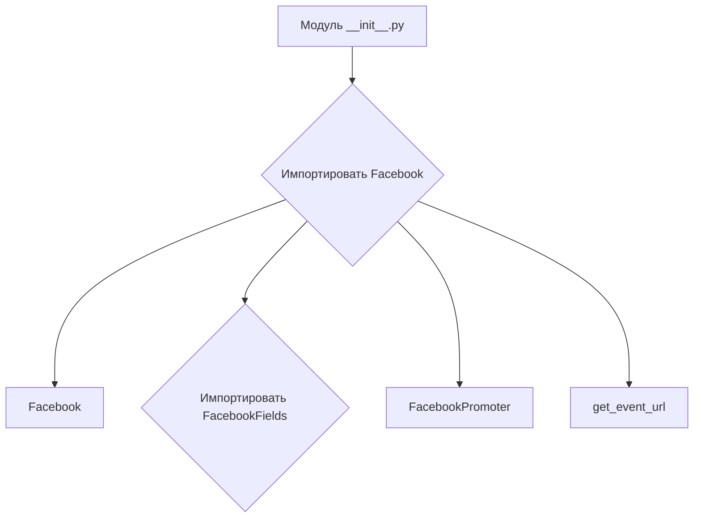
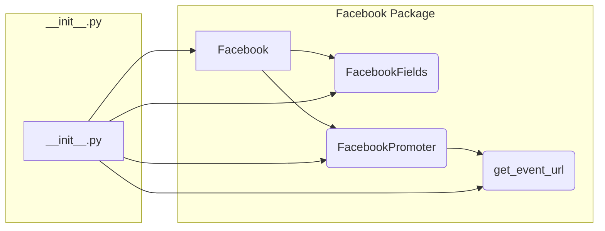

```MD
# Анализ файла `hypotez/src/endpoints/advertisement/facebook/__init__.py`

## <input code>

```python
## \file hypotez/src/endpoints/advertisement/facebook/__init__.py
# -*- coding: utf-8 -*-
#! venv/Scripts/python.exe
#! venv/bin/python/python3.12

"""
.. module: src.endpoints.advertisement.facebook 
	:platform: Windows, Unix
	:synopsis:

"""
MODE = 'dev'

from .facebook import Facebook
from .facebook_fields import FacebookFields
from .promoter import FacebookPromoter, get_event_url
```

## <algorithm>

Код представляет собой модуль инициализации для пакета `facebook` внутри пакета `advertisement` проекта `hypotez`.  Алгоритм работы - импортировать классы и функции из подпапок `facebook`, `facebook_fields` и `promoter`.  Никаких вычислений или действий непосредственно внутри этого модуля нет.  Он просто импортирует необходимые компоненты, делая их доступными для использования в других частях проекта.

**Пример:**

Если другой модуль в `hypotez` захочет использовать класс `Facebook` из пакета `facebook`, то он импортирует его как `from hypotez.src.endpoints.advertisement.facebook import Facebook`.

**Блок-схема (примитивная, так как логики нет):**



## <mermaid>



## <explanation>

**Импорты:**

- `from .facebook import Facebook`: Импортирует класс `Facebook` из модуля `facebook.py` в текущем пакете (`hypotez/src/endpoints/advertisement/facebook`).  `.` означает, что поиск происходит в текущем пакете.
- `from .facebook_fields import FacebookFields`: Импортирует класс `FacebookFields` из модуля `facebook_fields.py` в текущем пакете.
- `from .promoter import FacebookPromoter, get_event_url`: Импортирует класс `FacebookPromoter` и функцию `get_event_url` из модуля `promoter.py` в текущем пакете.

**Классы и функции (взаимодействия):**

*  `Facebook`, `FacebookFields`, `FacebookPromoter`: Представляют классы, скорее всего, связанные с управлением рекламой в Facebook (создание объявлений, определение полей для объявлений, управление кампаниями).  Они будут содержать методы для выполнения операций, таких как создание объектов Facebook, загрузка данных, изменение настроек.  Взаимодействие происходит через вызовы методов в этих классах.
*  `get_event_url`: Предполагаемо, функция, которая возвращает URL-адрес для события в Facebook, вероятно, связанная с рекламой.  Она может быть вызвана из `FacebookPromoter` или напрямую.

**Переменные:**

- `MODE = 'dev'`:  Переменная, вероятно, определяющая режим работы (разработка, производство), используемая для настройки поведения кода.

**Возможные ошибки и улучшения:**

* Отсутствие документации внутри самого модуля `__init__.py`: Добавьте короткие пояснения и примеры использования импортированных объектов, например, строку docstring для переменной MODE.
* Непонятно назначение `MODE`. Его значение `dev` подразумевает, что в модуле есть функционал для режима разработки (debug), который, возможно, не предназначен для конечного продукта. 
* Нет проверки типов и валидации данных.  Принимаемые классы должны иметь реализацию методов, которые контролируют валидность входящих данных.

**Связи с другими частями проекта:**

Этот модуль является частью более крупной системы, связанной с рекламой.  Вероятно, существуют другие модули, которые используют классы и функции из `facebook` для работы с API Facebook и обработки рекламных данных.  Например,  модуль, отвечающий за создание рекламных кампаний, будет использовать `FacebookPromoter` для взаимодействия с рекламой.

**Заключение:**

Модуль `__init__.py` служит для организации импорта классов и функций, связанных с рекламой в Facebook.  Он не содержит логики, но делает эти компоненты доступными для других модулей в проекте, формируя основу для управления рекламной деятельностью, связанной с Facebook.