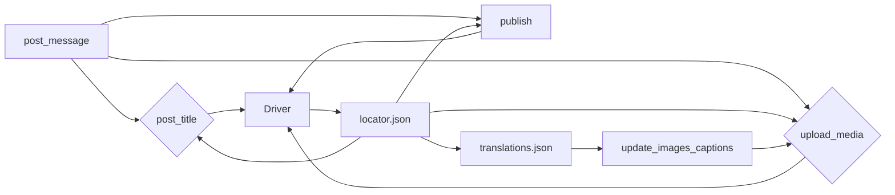

```MD
# <input code>

```python
## \file hypotez/src/endpoints/advertisement/facebook/scenarios/post_message.py
# -*- coding: utf-8 -*-\
#! venv/Scripts/python.exe
#! venv/bin/python/python3.12

"""
.. module: src.endpoints.advertisement.facebook.scenarios 
	:platform: Windows, Unix
	:synopsis: Публикация сообщения

"""
MODE = 'dev'


import time
from pathlib import Path
from types import SimpleNamespace
from typing import Dict, List, Optional
from selenium.webdriver.remote.webelement import WebElement
from src import gs
from src.webdriver import Driver
from src.utils import j_loads_ns, pprint
from src.logger import logger

# Load locators from JSON file.
locator: SimpleNamespace = j_loads_ns(
    Path(gs.path.src / 'endpoints' / 'advertisement' / 'facebook' / 'locators' / 'post_message.json')
)


def post_title(d: Driver, message: SimpleNamespace | str) -> bool:
    """ Sends the title and description of a campaign to the post message box.

    Args:
        d (Driver): The driver instance used for interacting with the webpage.
        category (SimpleNamespace): The category containing the title and description to be sent.

    Returns:
        bool: `True` if the title and description were sent successfully, otherwise `None`.

    Examples:
        >>> driver = Driver(...)
        >>> category = SimpleNamespace(title="Campaign Title", description="Campaign Description")
        >>> post_title(driver, category)
        True
    """
    # ... (implementation details)
    return True


def upload_media(d: Driver, media: SimpleNamespace | List[SimpleNamespace] | str | list[str],   no_video: bool = False, without_captions:bool = False) -> bool:
    # ... (implementation details)
    return True


def update_images_captions(d: Driver, media: List[SimpleNamespace], textarea_list: List[WebElement]) -> None:
    # ... (implementation details)
    pass


def publish(d: Driver, attempts = 5) -> bool:
    # ... (implementation details)
    return True


def promote_post(d: Driver, category: SimpleNamespace, products: List[SimpleNamespace], no_video: bool = False) -> bool:
    # ... (implementation details)
    return True


def post_message(d: Driver, message: SimpleNamespace,  no_video: bool = False,  images:Optional[str | list[str]] = None, without_captions:bool = False) -> bool:
    # ... (implementation details)
    return True
```

# <algorithm>

**Функция `post_message`:**

1. Вызывает `post_title` для добавления заголовка и описания сообщения.
2. Вызывает `upload_media` для загрузки медиафайлов.
3. Вызывает `publish` для публикации сообщения.
4. Возвращает `True` в случае успешного выполнения.

**Функция `post_title`:**

1. Проверяет, был ли успешен скроллинг назад.
2. Открывает форму "Добавить пост".
3. Формирует строку сообщения (из `message.title` и `message.description`).
4. Добавляет сообщение в поле ввода.
5. Возвращает `True` в случае успешного добавления.

**Функция `upload_media`:**

1. Проверяет наличие медиафайлов.
2. Открывает форму "Добавить медиа".
3. Преобразует входные данные `media` в список.
4. Итерируется по медиафайлам.
5. Загружает каждый медиафайл.
6. Если `without_captions` = True, сразу возвращает `True`
7. Открывает форму редактирования заголовков.
8. Вызывает `update_images_captions`.
9. Возвращает `True` в случае успешной загрузки.


**Функция `publish`:**

1. Пытается нажать кнопку "Опубликовать".
2. Если произошел сбой, пытается закрыть всплывающие окна.
3. Если попытки исчерпаны, возвращает `False`.
4. Ждёт, пока поле ввода освободится.
5. Рекурсивно вызывает себя, если произошёл сбой или поле не освободилось.


**Функция `update_images_captions`:**

1. Загружает `translations.json` для перевода.
2. Итерируется по медиафайлам.
3. Для каждого медиафайла формирует строку с описанием (используя данные из переведенного файла).
4. Отправляет текст в соответствующее поле ввода.
5. Возвращает `None`


**Пример данных:**

`message`:
```
SimpleNamespace(title="Campaign Title", description="Campaign Description", products=[SimpleNamespace(local_saved_image='image.jpg')])
```
`media`:
```
[SimpleNamespace(local_saved_image='image1.jpg'), SimpleNamespace(local_saved_image='image2.png')]
```

Данные передаются между функциями через аргументы (`d`, `message`, `media`).


# <mermaid>



**Объяснение диаграммы:**

* `post_message` - основная функция, вызывающая другие функции.
* `post_title`, `upload_media`, `publish` - функции, выполняющие отдельные задачи.
* `Driver` - класс для взаимодействия с веб-драйвером.
* `locator.json` - файл с локаторами элементов на странице.
* `translations.json` - файл с переводами.
* `update_images_captions` - функция, использующая данные из translations.json для описания медиа.

# <explanation>

**Импорты:**

* `from src import gs`: Импортирует модуль `gs` из пакета `src`, вероятно, содержащий конфигурационные данные (например, пути).
* `from src.webdriver import Driver`: Импортирует класс `Driver` из пакета `src.webdriver`, который, вероятно, реализует взаимодействие с веб-драйвером (Selenium).
* `from src.utils import j_loads_ns, pprint`: Импортирует функции `j_loads_ns` и `pprint` из пакета `src.utils`, возможно, для работы с JSON и вывода информации.
* `from src.logger import logger`: Импортирует логгер из пакета `src.logger` для регистрации событий и ошибок.


**Классы:**

* `Driver`:  Этот класс, вероятно, предоставляет методы для взаимодействия с веб-драйвером (Selenium).  Он необходим для управления браузером, навигации по страницам и взаимодействия с элементами.  Не показан в коде, но предполагается, что он содержит методы `scroll`, `execute_locator`, `wait`, `send_keys` и другие.

**Функции:**

* `post_title`: Отправляет заголовок и описание кампании в форму публикации.  Принимает `Driver` и `SimpleNamespace` (или строку) с текстом.
* `upload_media`: Загружает медиафайлы в форму публикации. Принимает `Driver` и список `SimpleNamespace` (или строки) с путями к изображениям.
* `update_images_captions`: Обновляет описания загруженных изображений. Принимает `Driver`, список объектов `SimpleNamespace` (для хранения данных о медиафайлах) и список элементов `WebElement` (для текстовых областей).
* `publish`: Опубликовывает сообщение в Facebook. Принимает `Driver` и количество попыток.
* `promote_post`: Управляет процессом продвижения поста. Принимает `Driver`, `SimpleNamespace` для заголовка/описания и список `SimpleNamespace` для медиафайлов.
* `post_message`: Функция-обертка, которая вызывается для управления всем процессом публикации.


**Переменные:**

* `locator`:  `SimpleNamespace`, загруженный из JSON-файла. Содержит локаторы элементов на странице Facebook.


**Возможные ошибки и улучшения:**

* **Обработка исключений:**  Некоторые части кода (например, в `upload_media`)  могли бы быть улучшены с точки зрения обработки исключений.  Вместо использования `...` нужно обрабатывать конкретные исключения (`FileNotFoundError`,  `ElementNotInteractableException` и т.д.) и сообщать об ошибке.
* **Явное возвращение None:**  Функции, которые могут возвращать `None`, должны это явно делать, чтобы код был более понятным и надежным.
* **Конкретизация типов:** Вместо использования `SimpleNamespace` для хранения данных, рекомендуется использовать более структурированные классы,  что улучшит  читаемость и поддерживаемость кода.
* **Время ожидания:** Нужно использовать более гибкое время ожидания (`d.wait`), чтобы избежать бесконечных циклов.


**Взаимосвязи с другими частями проекта:**

Код зависит от:

* `gs`: для получения конфигурационных данных.
* `src.webdriver`: для взаимодействия с веб-драйвером.
* `src.utils`: для работы с JSON.
* `src.logger`: для регистрации событий и ошибок.
* `post_message.json`: для получения локаторов элементов на странице Facebook.
* `translations.json`: для получения переведенных текстов.

Этот код является частью более крупного проекта, связанного с автоматизацией рекламных кампаний в Facebook.  Он зависит от предварительной подготовки данных (создание `SimpleNamespace` объектов) и предполагает наличие необходимых библиотек (Selenium).