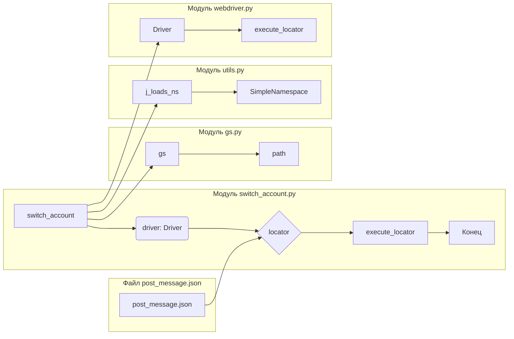

1. <input code>

```python
## \file hypotez/src/endpoints/advertisement/facebook/scenarios/switch_account.py
# -*- coding: utf-8 -*-\
#! venv/Scripts/python.exe
#! venv/bin/python/python3.12

"""
.. module: src.endpoints.advertisement.facebook.scenarios 
	:platform: Windows, Unix
	:synopsis: Переключение между аккаунатми
"""
MODE = 'dev'

from pathlib import Path
from types import SimpleNamespace
from src import gs
from src.webdriver import Driver
from src.utils import j_loads_ns

# Load locators from JSON file.
locator: SimpleNamespace = j_loads_ns(
    Path(gs.path.src / 'endpoints' / 'advertisement' / 'facebook' / 'locators' / 'post_message.json')
)

def switch_account(driver: Driver):
    """ Если есть кнопка `Переключить` - нажимаю её  """
    driver.execute_locator(locator.switch_to_account_button)
```

2. <algorithm>

```mermaid
graph TD
    A[Начало] --> B{Получение драйвера};
    B -- driver: Driver --> C[Получение локейторов];
    C --> D{Существует кнопка "Переключить"};
    D -- Да --> E[Выполнение локейтора для кнопки "Переключить"];
    D -- Нет --> F[Конец];
    E --> G[Конец];
```

**Пример:**

Если в файле `post_message.json` содержится `locator.switch_to_account_button` со значением `xpath = //button[@type='button']`, то `execute_locator`  выполнит поиск и клик по этой кнопке в браузере, управляемом `driver`.  Если такой кнопки нет, сценарий просто завершится.

3. <mermaid>



**Объяснение зависимостей:**

* `switch_account` зависит от `driver` (из `src.webdriver`) для управления браузером и `locator` (полученный из `j_loads_ns` из `src.utils`) для поиска элементов.
* `j_loads_ns` считывает данные из `post_message.json`, который содержит локейторы.
* `gs.path` предоставляет путь к ресурсам.
* `Driver` из `src.webdriver` - это класс для взаимодействия с веб-драйвером.


4. <explanation>

* **Импорты:**
    * `from pathlib import Path`: Используется для работы с путями к файлам, например, `post_message.json`.
    * `from types import SimpleNamespace`:  Создаёт объект, который позволяет обращаться к атрибутам `locator` как к переменным. Это полезно для хранения данных из `JSON` локейторов.
    * `from src import gs`: Импортирует модуль `gs` из пакета `src`, который, вероятно, содержит конфигурационные данные, например, пути к файлам.
    * `from src.webdriver import Driver`: Импортирует класс `Driver` из модуля `webdriver` внутри пакета `src`. Это класс для управления веб-драйвером (Selenium, Playwright и т.п.).
    * `from src.utils import j_loads_ns`: Импортирует функцию `j_loads_ns` из модуля `utils` внутри пакета `src`, которая, вероятно, загружает данные из JSON-файлов в `SimpleNamespace` объекты.


* **Классы:**
    * `Driver`:  Представлен в `src.webdriver`. Отвечает за взаимодействие с веб-драйвером. Не определен в данном фрагменте кода, но предполагается что содержит методы для поиска и взаимодействия с элементами веб-страницы.
    * `SimpleNamespace`: Специальный тип, используемый для хранения данных локейторов из json-файла, в удобочитаемом виде, в качестве атрибутов.

* **Функции:**
    * `switch_account(driver: Driver)`: Эта функция принимает `Driver` объект.  Цель функции - поиск и нажатие кнопки "Переключить аккаунт". Аргументы: `driver` (объект веб-драйвера), возвращает ничего.  Функция `execute_locator` предполагается в классе `Driver`,  выполняет действия с указанным локейтором.

* **Переменные:**
    * `MODE = 'dev'`:  Постоянная, скорее всего, для управления режимом работы (разные настройки, логгирование и т.д.).
    * `locator: SimpleNamespace`:  Переменная, содержащая локейтор для кнопки "Переключить аккаунт". Важно, что `locator` имеет тип `SimpleNamespace` из `types`, поэтому можно напрямую обращаться к атрибутам `locator.switch_to_account_button`.
    * `Path(...)`: Создает объект `Path` для корректной работы с путями к файлам.


* **Возможные ошибки/улучшения:**
    * **Обработка ошибок:**  Код не содержит обработки возможных исключений, таких как:  элемент не найден, ошибка взаимодействия с браузером.  Добавление `try...except` блоков существенно улучшит отказоустойчивость.
    * **Логгирование:**  Отсутствие логгирования затрудняет отладку и анализ выполнения сценария.
    * **Проверка на существование кнопки:**  В функции `switch_account` следует проверить, действительно ли кнопка `Переключить` существует, прежде чем ее пытаться нажать.  Это поможет избежать ошибок.

**Цепочка взаимосвязей:**

`switch_account` использует `Driver` для взаимодействия с браузером и `locator` для нахождения элементов. `locator` создаётся из `post_message.json`, который содержит данные локейторов. В свою очередь, `Driver` и `j_loads_ns` могут зависеть от других модулей, например, от `webdriver` и `json` соответственно.  `gs` вероятно предоставляет конфигурацию, в том числе пути.  Так что есть зависимость от `src.webdriver`, `src.utils`, `src.gs`.