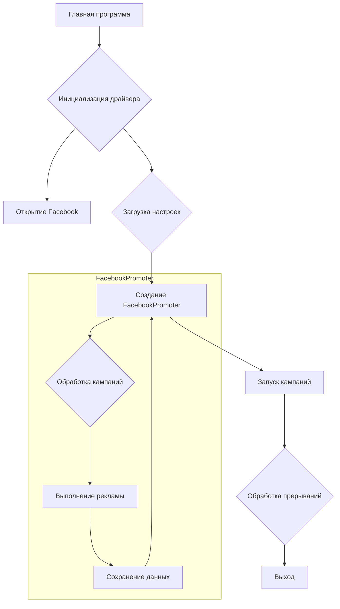

# <input code>

```python
## \file hypotez/src/endpoints/advertisement/facebook/start_posting_katia.py
# -*- coding: utf-8 -*-\
#! venv/Scripts/python.exe
#! venv/bin/python/python3.12

"""
.. module: src.endpoints.advertisement.facebook 
	:platform: Windows, Unix
	:synopsis: Отправка рекламных объявлений в группы фейсбук (Katia?)

"""
MODE = 'dev'


import header 
from src.webdriver import Driver, Chrome
from src.endpoints.advertisement.facebook.promoter import FacebookPromoter
from src.logger import logger

d = Driver(Chrome)
d.get_url(r"https://facebook.com")

filenames:list = ['katia_homepage.json',]
campaigns:list = [ 'sport_and_activity',
                  'bags_backpacks_suitcases',
                    'pain',
                    'brands',
                    'mom_and_baby',
                    'house',
                ]
promoter = FacebookPromoter(d, group_file_paths = filenames, no_video = False)

try:
    promoter.run_campaigns(campaigns)
except KeyboardInterrupt:
    logger.info("Campaign promotion interrupted.")
```

# <algorithm>

**Шаг 1:** Импортирование библиотек.  
* Импортируются необходимые модули для работы: `header`, `Driver`, `Chrome`, `FacebookPromoter` и `logger`. 


**Шаг 2:** Инициализация драйвера.  
* Создается экземпляр класса `Driver` с типом драйвера `Chrome`. 
* Открывается главная страница Facebook.

**Шаг 3:** Определение данных.
*  Задаются списки `filenames` (путей к файлам с данными о группах) и `campaigns` (названия кампаний).

**Шаг 4:** Создание экземпляра `FacebookPromoter`.  
* Создается экземпляр класса `FacebookPromoter`, передавая ему инициализированный драйвер, пути к файлам и значение `no_video` (False). 

**Шаг 5:** Запуск кампаний.
* Вызывается метод `run_campaigns` экземпляра `FacebookPromoter`, передавая список `campaigns`. Этот метод, предположительно, выполняет цикл по кампаниям, используя информацию из файлов, указанных в `filenames` и выполняет рекламные действия.

**Шаг 6:** Обработка исключений.  
* Блок `try...except KeyboardInterrupt` обрабатывает прерывание пользователя (например, нажатие Ctrl+C). В случае прерывания, выводится сообщение в лог.


**Пример данных:**

* `filenames`: `['katia_homepage.json']`
* `campaigns`: `['sport_and_activity', 'bags_backpacks_suitcases', ...]`


# <mermaid>



# <explanation>

**Импорты:**

* `header`: Вероятно, содержит вспомогательные функции или конфигурацию, специфичные для проекта.
* `src.webdriver`: Содержит классы для управления веб-драйверами (например, Chrome). `Driver` и `Chrome` – это, скорее всего, абстрактный базовый класс и конкретная реализация.
* `src.endpoints.advertisement.facebook.promoter`: Модуль, содержащий класс `FacebookPromoter`, отвечающий за выполнение рекламных кампаний на Facebook.
* `src.logger`: Модуль для ведения логов (например, `logger.info`).

**Классы:**

* `Driver`: Класс для управления веб-драйвером. `Chrome` - вероятно, подкласс для работы с Chrome. Необходимы атрибуты для хранения текущего состояния работы, сессии и методы для взаимодействия с браузером.
* `FacebookPromoter`:  Центральный класс для реализации рекламной кампании на Facebook. Должен содержать логику запуска кампаний, взаимодействие с API Facebook (или с веб-интерфейсом посредством драйвера), проверку результатов и сохранение данных.


**Функции:**

*  `d.get_url(r"https://facebook.com")`: Функция для перехода на страницу facebook.

**Переменные:**

* `MODE`: Вероятно, константа для определения режима работы (например, "dev" или "prod").
* `filenames`, `campaigns`:  Списки, хранящие конфигурационные данные для рекламных кампаний.


**Возможные ошибки и улучшения:**

* Отсутствует обработка ошибок при выполнении действий в методе `run_campaigns` (например, если произойдет исключение в процессе взаимодействия с API Facebook).
* Не хватает описания структуры файла `katia_homepage.json`. Важно указать поля данных (например, IDs целевых групп, тексты объявлений, ссылки, настройки таргетинга).
* Отсутствует логика проверки корректности входных данных (проверка наличия необходимых файлов, корректности данных кампаний).
* Следует использовать более подходящие типы данных (например, использовать `Enum` вместо строковых констант для режимов работы).


**Взаимосвязи с другими частями проекта:**

* `FacebookPromoter` зависит от `Driver` для управления браузером.
* `FacebookPromoter` использует логгер (`logger`) для записи сообщений.
* Файлы `katia_homepage.json` содержат данные, необходимы для работы `FacebookPromoter` (например, информацию о целевых группах для таргетирования).  Вероятно, эти файлы создаются и обновляются другими частями проекта.
*  `header` модуль скорее всего содержит конфигурационные настройки, которые могут быть доступны для других частей проекта.


В целом, код представляет структурированный подход к запуску рекламных кампаний на Facebook.  Однако, для полного понимания требуется детальное описание класса `FacebookPromoter` и структуры данных в файлах `katia_homepage.json`.