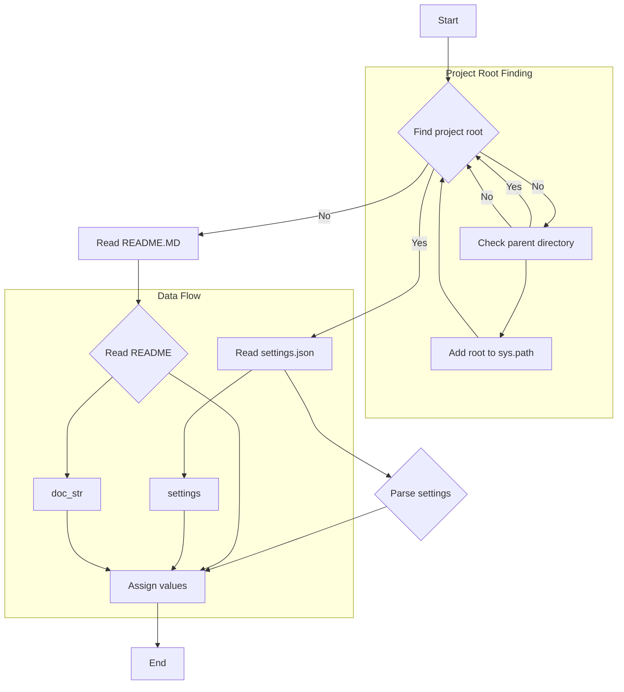

# <input code>

```python
## \file hypotez/src/endpoints/advertisement/header.py
# -*- coding: utf-8 -*-\
#! venv/Scripts/python.exe
#! venv/bin/python/python3.12

"""
.. module: src.endpoints.advertisement 
	:platform: Windows, Unix
	:synopsis:

"""
MODE = 'dev'


import sys
import json
from packaging.version import Version

from pathlib import Path
def set_project_root(marker_files=('pyproject.toml', 'requirements.txt', '.git')) -> Path:
    """
    Finds the root directory of the project starting from the current file's directory,
    searching upwards and stopping at the first directory containing any of the marker files.

    Args:
        marker_files (tuple): Filenames or directory names to identify the project root.
    
    Returns:
        Path: Path to the root directory if found, otherwise the directory where the script is located.
    """
    __root__:Path
    current_path:Path = Path(__file__).resolve().parent
    __root__ = current_path
    for parent in [current_path] + list(current_path.parents):
        if any((parent / marker).exists() for marker in marker_files):
            __root__ = parent
            break
    if __root__ not in sys.path:
        sys.path.insert(0, str(__root__))
    return __root__


# Get the root directory of the project
__root__ = set_project_root()
"""__root__ (Path): Path to the root directory of the project"""

from src import gs

settings:dict = None
try:
    with open(gs.path.root / 'src' /  'settings.json', 'r') as settings_file:
        settings = json.load(settings_file)
except (FileNotFoundError, json.JSONDecodeError):
    ...

doc_str:str = None
try:
    with open(gs.path.root / 'src' /  'README.MD', 'r') as settings_file:
        doc_str = settings_file.read()
except (FileNotFoundError, json.JSONDecodeError):
    ...


__project_name__ = settings.get("project_name", 'hypotez') if settings  else 'hypotez'
__version__: str = settings.get("version", '')  if settings  else ''
__doc__: str = doc_str if doc_str else ''
__details__: str = ''
__author__: str = settings.get("author", '')  if settings  else ''
__copyright__: str = settings.get("copyrihgnt", '')  if settings  else ''
__cofee__: str = settings.get("cofee", "Treat the developer to a cup of coffee for boosting enthusiasm in development: https://boosty.to/hypo69")  if settings  else "Treat the developer to a cup of coffee for boosting enthusiasm in development: https://boosty.to/hypo69"
```

# <algorithm>



**Пример:**

Если `pyproject.toml` находится в директории `/home/user/project`, функция `set_project_root` вернет `/home/user/project`.

# <mermaid>

```mermaid
graph LR
    subgraph Project Setup
        A[set_project_root] --> B(Path(__file__));
        B --> C[resolve()];
        C --> D[parent];
        D --> E{marker_files exist?};
        E -- yes --> F[__root__];
        E -- no --> D;
        F --> G[sys.path.insert];
    end
    subgraph Settings
        H[open settings.json] --> I[json.load];
        I --> J[settings];
    end
    subgraph Documentation
        K[open README.MD] --> L[read];
        L --> M[doc_str];
    end
    J --> N[settings.get];
    M --> O[Assign value];
    N --> P[Assign value];
    O --> Q[Assign value];


    A --> H;
    A --> K;

```


# <explanation>

**Импорты:**

- `sys`: Модуль для доступа к системным переменным, в частности, `sys.path` для добавления пути к проекту в системный путь поиска модулей.
- `json`: Для работы с JSON-файлами (чтение настроек).
- `packaging.version`: Для работы с версиями пакетов. Непосредственно используется в коде, но не очевидно.
- `pathlib`:  Предоставляет классы для работы с путями к файлам и директориям в удобном объектно-ориентированном стиле, что повышает надежность и читаемость.
- `gs`:  Неопределён, но скорее всего, содержит вспомогательные функции для работы с файловой системой и путями (поскольку используется `gs.path.root`). Это внутренний модуль, скорее всего, из `src`, и его нужно определить.


**Классы:**

- `Path`: Класс из `pathlib`, представляет пути к файлам и директориям. Использование `Path` вместо строк для работы с путями делает код более безопасным и читаемым.

**Функции:**

- `set_project_root(marker_files)`:  Находит корневой каталог проекта, начиная с текущего файла и идя вверх по директориям, пока не найдёт директорию, содержащую файлы из `marker_files`. Важно для работы импорта и поиска нужных файлов.
    - `marker_files`: Кортеж имён файлов или директорий, которые используются для определения корневого каталога проекта. По умолчанию включает `pyproject.toml`, `requirements.txt` и `.git`. 
    - Возвращает `Path` к корневому каталогу или директории, где находится текущий файл, если корневой каталог не найден.  Добавляет найденный корневой каталог в `sys.path`, что позволяет импортировать модули из подкаталогов проекта.

**Переменные:**

- `__root__`:  Содержит `Path` к корневому каталогу проекта.
- `settings`: Словарь, загруженный из `settings.json`.
- `doc_str`: Строка, содержащая содержимое `README.MD`.
- `__project_name__`, `__version__`, `__doc__`, `__details__`, `__author__`, `__copyright__`, `__cofee__`:  Переменные, содержащие значения из `settings.json` или значения по умолчанию.  Используются для метаданных проекта, таких как название, версия, описание и т.д.

**Возможные ошибки и улучшения:**

- **Обработка ошибок:**  Использование блоков `try...except` для обработки `FileNotFoundError` и `json.JSONDecodeError` при чтении `settings.json` и `README.MD` — хорошая практика.  Однако, можно добавить более подробную информацию об ошибке в `except`.
- **Вместо `...`:** В блоках `except` вместо `...` лучше поместить код, обрабатывающий ошибку, например, логирование ошибки или возвращение значения по умолчанию.
- **Дополнительно:** При использовании `gs.path.root`, необходимо убедиться, что модуль `gs` и переменная `gs.path` правильно определены и инициализированы в соответствующих модулях.
- **Документация:** Добавьте аннотации типов к функциям (например, `-> Path` в `set_project_root`), чтобы сделать код более понятным.


**Взаимосвязи с другими частями проекта:**

Этот код является частью структуры проекта, которая позволяет устанавливать метаданные проекта, определять корневой каталог и загружать настройки. Эти данные могут быть использованы другими частями проекта, например, для настройки конфигурации, определения путей к ресурсам и т.д.

**Вывод:**

Код хорошо структурирован и предоставляет надёжный способ для поиска корневого каталога проекта, загрузки настроек, и получения метаданных. Обработка исключений улучшает надёжность работы. Необходимо дополнительно определить `gs` для корректного функционирования.