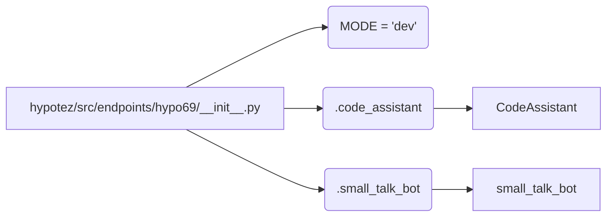

# <input code>

```python
## \file hypotez/src/endpoints/hypo69/__init__.py
# -*- coding: utf-8 -*-
#! venv/Scripts/python.exe
#! venv/bin/python/python3.12

"""
.. module: src.endpoints.hypo69 
	:platform: Windows, Unix
	:synopsis:

"""
MODE = 'dev'


from .code_assistant import CodeAssistant
from .small_talk_bot import bot as small_talk_bot
```

# <algorithm>

Пошаговый алгоритм работы кода не применимо, так как это всего лишь инициализационная часть модуля.  Код импортирует необходимые компоненты из подмодулей `code_assistant` и `small_talk_bot` текущего каталога.  В данном случае не происходит непосредственного исполнения или обработки данных.

# <mermaid>



**Объяснение диаграммы:**

* **A:** Модуль `hypotez/src/endpoints/hypo69/__init__.py`.
* **B:** Переменная `MODE` устанавливает режим работы, но в данном контексте без последствий.
* **C:** Подмодуль `code_assistant`.
* **D:** Подмодуль `small_talk_bot`.
* **E:** Класс `CodeAssistant` (из модуля `code_assistant`).
* **F:** Объект `small_talk_bot` (из модуля `small_talk_bot`).

Диаграмма показывает, что модуль `hypotez/src/endpoints/hypo69/__init__.py` импортирует необходимые классы и объекты из других модулей, которые находятся в том же каталоге (`src/endpoints/hypo69`).  Связь между подмодулями и компонентами (`CodeAssistant`, `small_talk_bot`) прямое, основанное на импортах.

# <explanation>

* **Импорты:**
    * `from .code_assistant import CodeAssistant`: Импортирует класс `CodeAssistant` из подмодуля `code_assistant` текущего каталога (`src/endpoints/hypo69/code_assistant.py`).  Это указывает, что `code_assistant` скорее всего содержит определения классов и функций, необходимых для работы с кодом.
    * `from .small_talk_bot import bot as small_talk_bot`: Импортирует переменную `bot` (вероятно, объект), которая скорее всего является ботом для обмена сообщениями, из подмодуля `small_talk_bot` текущего каталога (`src/endpoints/hypo69/small_talk_bot.py`).  Имя переменной `small_talk_bot` используется как алиас для более короткого обращения к этому объекту.

* **Классы (косвенно):**
    * `CodeAssistant`:  Судя по имени, это класс, предназначенный для работы с кодом (возможно, анализа, генерации или редактирования).  Более детальной информации о его назначении не хватает.
    * `small_talk_bot`: Вероятно, это объект, представляющий собой чат-бота для диалога. Подробнее о методах и возможностях не указано.

* **Функции (косвенно):**
    * В данном `__init__.py` нет явных определений функций. Функциональность спрятана в `code_assistant` и `small_talk_bot`.

* **Переменные:**
    * `MODE = 'dev'`: Переменная, вероятно, для определения режима работы (например, 'dev', 'prod').  В данном контексте эта переменная, скорее всего, не оказывает непосредственного влияния на выполняемые действия, но служит константой, определяющей режим.


* **Возможные ошибки и улучшения:**
    * Не указаны дальнейшие действия с объектами, импортированными в `__init__.py`. Непонятно, как эти объекты будут использоваться.
    * Нет описания `small_talk_bot` или `CodeAssistant` - это делает код неполным. Не хватает информации о возможностях этих классов, методах и взаимодействии.

* **Связь с другими частями проекта:**
    * Модули `code_assistant` и `small_talk_bot`  представляют собой компоненты, которые вероятно, будут использоваться другими частями проекта, отвечающими за обработку данных или взаимодействие с пользователем.  `__init__.py`  служит для доступа к этим компонентам, что показывает, что это ключевой файл, обеспечивающий работу с чат-ботом и анализом кода.