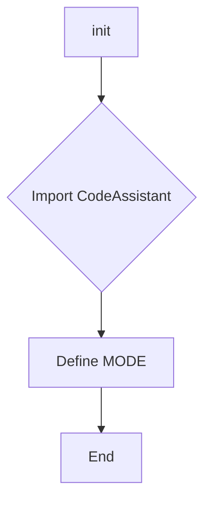
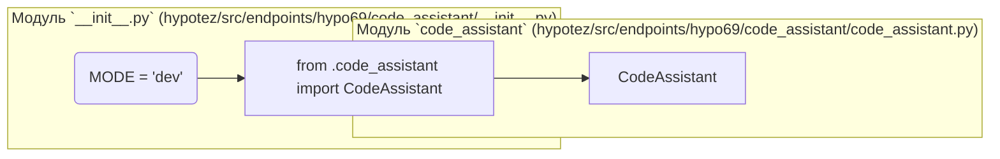

# <input code>

```python
## \file hypotez/src/endpoints/hypo69/code_assistant/__init__.py
# -*- coding: utf-8 -*-
#! venv/Scripts/python.exe
#! venv/bin/python/python3.12

"""
.. module: src.endpoints.hypo69.code_assistant 
	:platform: Windows, Unix
	:synopsis:

"""
MODE = 'dev'

from .code_assistant import CodeAssistant
```

# <algorithm>



**Описание алгоритма:**

Код импортирует класс `CodeAssistant` из модуля `code_assistant.py`, находящегося в той же директории.  Далее, он определяет переменную `MODE` со значением 'dev'.  После этого выполнение завершается.  В данном случае алгоритм крайне тривиален и сводится к импорту и инициализации константы.

**Пример:**

Нет явных данных, переданных или обработанных функциями.


# <mermaid>




# <explanation>

* **Импорты:**
    * `from .code_assistant import CodeAssistant`: Импортирует класс `CodeAssistant` из файла `code_assistant.py`, расположенного в текущем каталоге (`./code_assistant.py`).  `.` означает текущий пакет. Это типичный способ организации модулей в Python.  Связь с другими частями проекта скрыта.  Модуль `code_assistant.py` предполагается содержащим определение класса `CodeAssistant`, который, вероятно, предоставляет функциональность, связанную с ассистентом кода.


* **Классы:**
    * Нет определения классов внутри `__init__.py`.  Этот файл скорее всего используется для инициализации и импорта других модулей (например, `code_assistant.py`), которые содержат классы.


* **Функции:**
    * Нет функций в данном `__init__.py`.


* **Переменные:**
    * `MODE = 'dev'`:  Глобальная переменная, вероятно, используемая для настройки режима работы системы (например, 'dev', 'prod').  Это позволит разным частям программы вести себя по-разному в зависимости от значения `MODE`.  Значение не используется внутри `__init__.py`, его предназначение раскрывается в других модулях проекта.


* **Возможные ошибки или области для улучшений:**
    * Отсутствие описания класса `CodeAssistant` не позволяет понять, какие методы или атрибуты он содержит, что мешает полному пониманию функциональности.
    * Недостаточно информации о том, где и как используется переменная `MODE`. Без этого невозможно оценить, как она влияет на поведение приложения.

* **Взаимосвязь с другими частями проекта:**
    * В `__init__.py`  определена только переменная режима работы, поэтому связи с другими частями проекта не видны.  Для понимания взаимосвязей необходимо изучить `code_assistant.py` и другие модули приложения.
    * Предположительно, данный файл подключается другим частям приложения для получения доступа к классу `CodeAssistant`.


**Заключение:**

Файл `__init__.py` — это стандартный файл Python, используемый для инициализации пакета.  Он импортирует класс из подмодуля `code_assistant.py` и определяет константу `MODE` без непосредственной обработки данных.  Для более детального анализа необходимо просмотреть `code_assistant.py`.