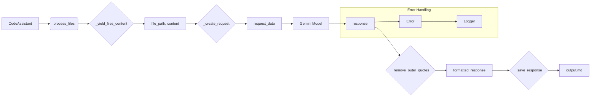

```MD
# <input code>

```python
## \file hypotez/src/endpoints/hypo69/code_assistant/assistant.py
# -*- coding: utf-8 -*-\n#! venv/Scripts/python.exe\n#! venv/bin/python/python3.12\n
"""
.. module: src.endpoints.hypo69.code_assistant 
    :platform: Windows, Unix
    :synopsis: Модуль для работы ассистента программиста
"""

MODE = "dev"


"""
Модуль для работы ассистента программиста
=========================================================================================

:class:`CodeAssistant`, читает файлы кода, отдает код в модели, модель обрабатывет код и возвращает его в класс, класс сохраняет результат
в директории `docs/gemini` В зависимости от роли файлы сохраняются в 
... (остальной текст документации)
```

# <algorithm>

**Шаг 1. Инициализация:**

*   При запуске скрипта создается экземпляр класса `CodeAssistant` с указанными параметрами (роль, язык, модели).
*   Инициализируются модели ИИ (Gemini и/или OpenAI).
*   Загружается конфигурация из файла `code_assistant.json`.
*   Загружаются переводы ролей и языков.
*   Загружается инструкция для кода.

**Шаг 2. Чтение файлов:**

*   Функция `_yield_files_content` итерирует по указанным директориям (`start_dirs`), пропускает исключенные файлы/директории по шаблонам и регулярным выражениям, загружает содержимое файла.
*   При чтении файла, если файл не обрабатывается, происходит пропуск или вывод сообщения об ошибке.

**Шаг 3. Создание запроса:**

*   Функция `_create_request` создает запрос к модели ИИ, используя полученное содержимое файла и дополнительные параметры (роль, язык, путь к файлу, инструкция для кода).
*   Используется переведенный текст, чтобы сформировать запрос.

**Шаг 4. Отправка в модель:**

*   Если выбрана модель Gemini, запрос отправляется к ней.
*   Возвращаемый ответ проверяется на успешность.

**Шаг 5. Обработка и сохранение ответа:**

*   Функция `_remove_outer_quotes` обрабатывает ответ, удаляя лишние кавычки.
*   Если ответ успешный, он сохраняется в файл с соответствующим именем в указанной директории.
*   Функция `_save_response` используется для сохранения ответа.


**Шаг 6. Обработка ошибок:**

*   Логируются ошибки при чтении файлов, отправке запроса к модели и сохранении результата.

**Шаг 7. Цикл обработки файлов:**

*   Цикл `for` обрабатывает каждый файл.
*   Если какой-то шаг завершается с ошибкой, процесс обработки файла приостанавливается, и логгер выводит предупреждение.

**Пример:**

```
input.py -> _yield_files_content -> file_path, content -> _create_request -> request_data -> Gemini -> response -> _remove_outer_quotes -> formatted_response -> _save_response -> output.md
```

# <mermaid>



# <explanation>

**Импорты:**

*   `asyncio`, `argparse`, `sys`: Стандартные модули Python для асинхронного программирования, парсинга аргументов командной строки и работы со стандартным вводом/выводом.
*   `pathlib`, `typing`, `types`: Модули для работы с путями файлов, типов данных и специальных типов.
*   `signal`, `time`, `re`, `fnmatch`: Модули для работы с сигналами, управлением временем, регулярными выражениями и подстановочными символами.
*   `header`: Вероятно, собственный модуль для обработки заголовков файлов.
*   `gs`: Возможно, модуль для работы с глобальными настройками или ресурсами.
*   `src.utils.jjson`: Модуль для работы с JSON (возможно, для обработки конфигурации).
*   `src.ai.gemini`, `src.ai.openai`: Модули для взаимодействия с моделями Gemini и OpenAI.
*   `src.utils.printer`: Модуль для красивого вывода данных в консоль.
*   `src.utils.path`: Модуль для работы с путями.
*   `src.logger`: Модуль для логирования.
*   `src.endpoints.hypo69.code_assistant.make_summary`: Модуль для создания сводки.

**Классы:**

*   `CodeAssistant`: Центральный класс для работы ассистента программиста.
    *   `role`, `lang`, `start_dirs`, `base_path`, `config`, `gemini_model`, `openai_model`, `start_file_number`: Атрибуты класса, хранящие необходимые данные для работы ассистента.
    *   `__init__`: Инициализирует атрибуты класса и модели ИИ.
    *   `_initialize_models`: Инициализирует модели ИИ.
    *   `parse_args`: Парсит аргументы командной строки.
    *   `system_instruction`, `code_instruction`, `translations`: Свойства, загружающие инструкции и переводы из файлов.
    *   `process_files`: Обрабатывает файлы, отправляет запросы к моделям и сохраняет результаты.
    *   `_create_request`: Формирует запрос для моделей ИИ.
    *   `_yield_files_content`: Итерируется по директориям и файлам.
    *   `_save_response`: Сохраняет ответ модели в файл.
    *   `_remove_outer_quotes`: Обрабатывает ответ модели, удаляет внешние кавычки.
    *   `run`: Запускает процесс обработки файлов.
    *   `_signal_handler`: Обрабатывает прерывание (Ctrl+C).


**Функции:**

*   `send_file`: Отправляет файл в модель ИИ.
*   `main`: Точка входа для программы.

**Переменные:**

*   `MODE`: Переменная, хранящая режим работы (вероятно, "dev" или "prod").

**Возможные ошибки и улучшения:**

*   Обработка ошибок при чтении файлов и сохранении результатов могла бы быть более подробной.
*   Можно добавить обработку различных типов ошибок, чтобы программа была более отказоустойчивой.
*   Возможно, стоит добавить кеширование результатов, чтобы уменьшить время обработки.
*   Нет явного указания, что происходит с файлами в исключенной директории.
*   Названия файлов в `_save_response` могли бы быть более информативными (использовать `file_path` для имени файла, а не пересоздавать его).
*   Не хватает документации для методов, особенно для `_yield_files_content`, `_save_response`, и `_remove_outer_quotes`.
*   Можно улучшить логирование, добавляя информацию о времени выполнения и других метриках.
*   `asyncio.run(asyncio.sleep(20))` не оптимальное решение в данном контексте, т.к. блокирует поток. Стоит использовать другие способы асинхронного выполнения.


**Взаимосвязи с другими частями проекта:**

*   `gs`, `src`, `src.utils`, `src.ai`, `src.logger`: Модуль сильно зависит от других модулей проекта, вероятно `gs` (global settings) содержит общую конфигурацию, например, API ключи.
*   `endpoints/hypo69`:  Указывается, что ассистент относится к определенному подпроекту.
*   `make_summary`: Предполагается, что `make_summary` используется для создания сводки файлов, вероятно, для дополнительной обработки.