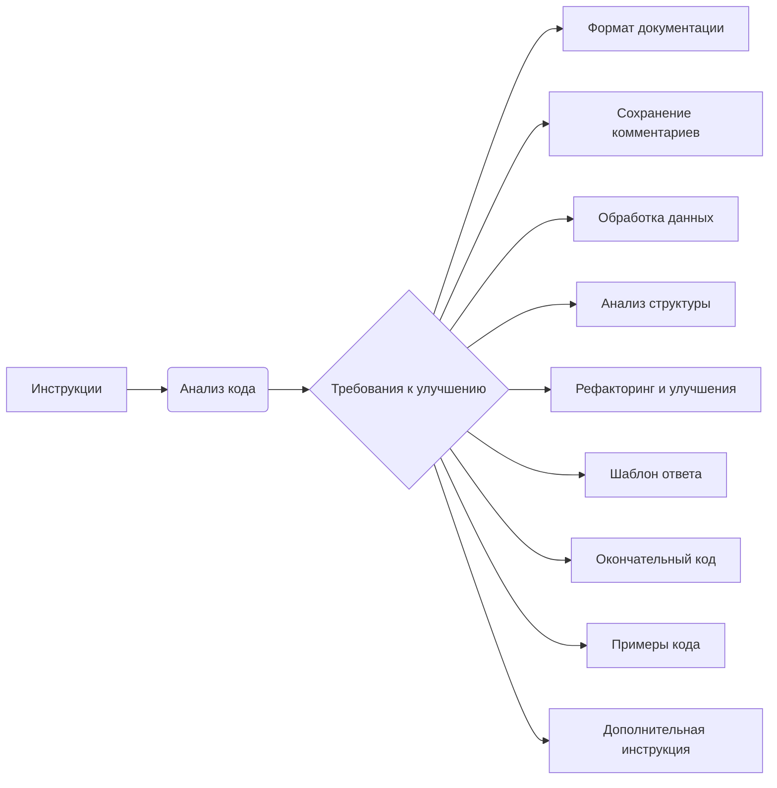

# Анализ кода

## 1. <input code>

```python
# ИНСТРУКЦИЯ
## Основные требования:
## Output Language: RU (Русский)

# ... (остальные инструкции)
```

## 2. <algorithm>

Пошаговая блок-схема алгоритма не применимо, так как предоставленный код представляет собой комментарии и инструкции, а не работающий код.  Он описывает требования к улучшению кода, а не содержит самого кода.

## 3. <mermaid>



**Описание диаграммы:**

Диаграмма отображает структуру инструкций по улучшению кода, показывая взаимосвязь различных требований.  Узел `Инструкции` представляет собой входные данные, а `Анализ кода` - обработку этих данных.  Требования (`Требования к улучшению`) формируют различные направления модификаций.  Все остальные блоки (`Формат документации`, `Сохранение комментариев` и т.д.) представляют собой подзадачи, которые необходимо выполнить для достижения желаемого результата.  Зависимости в данном случае не подразумевают передачу данных, а скорее указывают на то, какие элементы нужно учитывать при улучшении кода.


## 4. <explanation>

Предоставленный текст представляет собой руководство, а не код. Он содержит инструкции по улучшению качества кода, включая использование reStructuredText (RST) для документации, замену `json.load` на специализированные функции из `src.utils.jjson`, добавление комментариев, логирование, а также другие рекомендации по стилю и рефакторингу.

**Отсутствие кода для анализа**:  В представленном тексте нет исходного кода, который можно было бы проанализировать.

**Влияние на проект**:  Правила и инструкции в данном тексте влияют на всю дальнейшую разработку проекта, заставляя следовать стандартам кодирования, улучшать читаемость и поддерживаемость кода.


**Цепочка взаимосвязей с другими частями проекта (если применимо)**:  Наличие инструкции предполагает, что другие части проекта должны соответствовать этим инструкциям.  Например, уже написанный код должен соответствовать описанным требованиям к документации, обработке данных, и т.д.  Отсутствие примера кода не позволяет детально проанализировать конкретные связи с другими частями проекта.
```