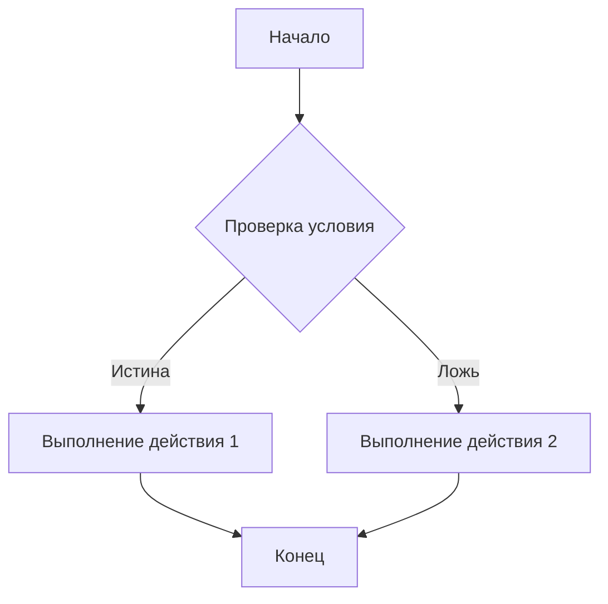

# Анализ кода (резюме промпта)

## <input code>

```python
# (Здесь ожидается код, который необходимо проанализировать)
```

## <algorithm>

(Здесь должна быть пошаговая блок-схема алгоритма работы кода.  Примеры:

* **Если** переменная `x` больше 5, **то** выполнить функцию `calculate_sum`.
* **Для** каждого элемента в списке `items`, **выполнить** функцию `process_item`.
* **Если** условие `is_valid` ложно, **вернуть** ошибку.)

**Пример блок-схемы (в формате, не требующем Mermaid):**

```
[Start] --> [Прочитать входные данные] --> [Проверить условие]
       |                                 |
       |                                 V
       |---------------------------------[Выполнить действие 1]
       |               |
       |               V
       |   [Переменная A = значение 1] -- [Обработать] --> [Выход]
       |               |
       |               |
       |               V
       |------------[Выполнить действие 2]


```

(Вставьте сюда подробную блок-схему с примерами, демонстрирующими перемещение данных.)


## <mermaid>

(Здесь должен быть код диаграммы в формате mermaid.  Пример:)



(Создайте диаграмму, отражающую логику кода, с указанием потоков данных и вызовов функций/методов.  Обязательно опишите зависимости, например, "B -> C: вызов функции `calculate_sum`")


## <explanation>

(Здесь должно быть подробное объяснение кода.)

* **Импорты:** (Если есть импорты, опишите их назначение и связь с другими пакетами, например: `from src.utils import calculate_sum` - импортирует функцию `calculate_sum` из модуля `utils` в папке `src`.)
* **Классы:** (Если есть классы, опишите их роль, атрибуты, методы и взаимодействие с другими компонентами.)
* **Функции:** (Опишите каждую функцию, включая аргументы, возвращаемые значения, назначение и примеры.)
* **Переменные:** (Опишите типы и использование каждой переменной.)
* **Возможные ошибки или области для улучшения:** (Укажите потенциальные проблемы и способы их исправления.)
* **Связь с другими частями проекта:** (Если применимо, опишите взаимосвязи кода с другими частями проекта.)


**ВАЖНО:** Этот шаблон требует вставки реального кода для анализа.  Пока в  `<input code>`  и `<algorithm>`  и `<mermaid>` есть пустые места, так как не предоставлен код для анализа.