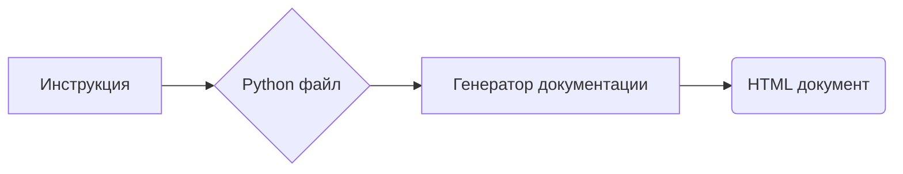

```MD
# Анализ кода инструкции для генерации HTML документации Python

## 1. <input code>

```html
<!-- INSTRUCTION -->

<p>For each input Python file, create documentation in <code>HTML</code> format for subsequent use. The documentation must meet the following requirements:</p>

<ol>
  <li>
    <strong>Documentation Format</strong>:
    <ul>
      <li>Use the <code>HTML</code> standard.</li>
      <li>Each file should begin with a header and a brief description of its contents.</li>
      <li>For all classes and functions, use the following comment format:
        <pre><code>python
def function(param: str, param1: Optional[str | dict | str] = None) -> dict | None:
    """
    Args:
        param (str): Description of the `param` parameter.
        param1 (Optional[str | dict | str], optional): Description of the `param1` parameter. Defaults to `None`.

    Returns:
        dict | None: Description of the return value. Returns a dictionary or `None`.

    Raises:
        SomeError: Description of the situation in which the `SomeError` exception is raised.
    """
</code></pre>
      </li>
      <li>Use <code>ex</code> instead of <code>e</code> in exception handling blocks.</li>
    </ul>
  </li>

  <!-- ... (остальной код) ... -->
</ol>

<p>Generate the corresponding documentation for each input Python file in <code>HTML</code> format.</p>
<h1>## Response format: `.md` (markdown)</h1>
<!-- END OF INSTRUCTION -->
```

## 2. <algorithm>

Этот код представляет собой инструкцию, а не код программы. Он описывает **формат** и **требования** к HTML-документации, которая должна быть сгенерирована для Python-файлов.  Поэтому пошаговая блок-схема не применима.  Алгоритм генерации документации определяется отдельной программой (не предоставленной здесь), которая будет использовать эти инструкции.


## 3. <mermaid>



**Объяснение диаграммы:**

* **A[Инструкция]:**  Это предоставленный документ с инструкциями.
* **B{Python файл}:** Входной файл исходного кода Python.
* **C[Генератор документации]:** Программа, которая обрабатывает инструкцию и Python-файл,  создавая HTML-документацию.
* **D(HTML документ):** Результирующий HTML-файл, содержащий документацию.

Взаимодействия зависят от конкретного генератора документации.

## 4. <explanation>

**Импорты:**

В этом фрагменте кода нет импортов. Это набор инструкций, описывающих требования к формату документации.

**Классы:**

В данном случае нет определения классов, это описание, задающее формат документации.

**Функции:**

Аналогично, нет определений функций.

**Переменные:**

Нет переменных в данном фрагменте.

**Возможные ошибки/улучшения:**

Инструкции не содержат кода реализации, поэтому  нельзя выделить конкретные ошибки или улучшения. В конкретной программе, которая будет реализовывать эти инструкции, могут возникнуть ошибки связанные с:
* **Разбором Python-файлов**: Неправильное парсирование кода Python.
* **Генерацией HTML**: Нарушение HTML-формата, синтаксические ошибки.
* **Обработка исключений**: Недостаточное обращение с исключениями.
* **Сложные структуры данных**: Ошибки при работе с вложенными данными, сложность формата данных, который нужно обработать, чтобы соответствовать инструкциям.


**Взаимосвязь с другими частями проекта:**

Этот фрагмент кода — набор инструкций для какой-то программы (генератора документации), которая будет интегрирована в  больший проект,  в котором хранятся Python-файлы и в дальнейшем будут использоваться сгенерированные HTML-документы.